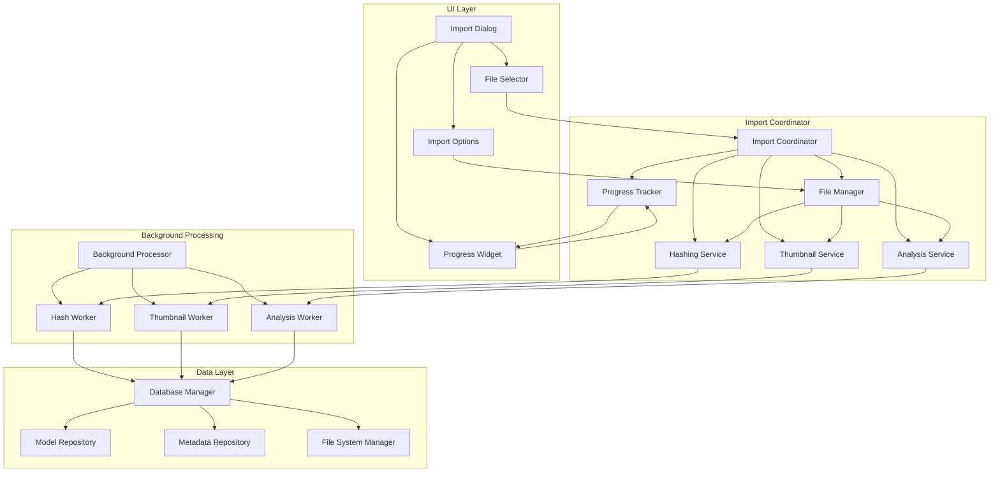
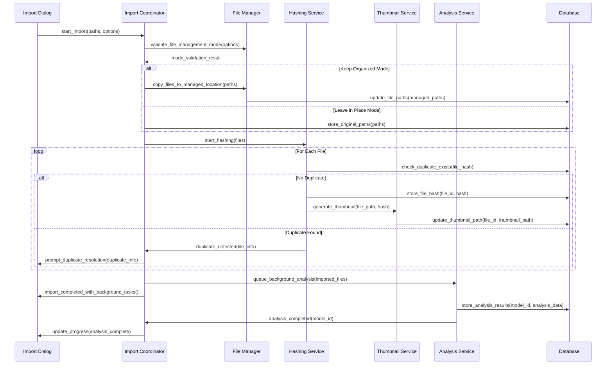

# 3D Model Import Process Architecture Design

## Overview

This document outlines the comprehensive architecture for a 3D model import system that addresses file management preferences, background processing, hashing, thumbnail generation, and model analysis while maintaining performance requirements and UI responsiveness.

## System Architecture



## Core Components

### 1. Import Coordinator
**Purpose**: Central orchestrator for the entire import process
**Responsibilities**:
- Validate import sources and permissions
- Coordinate file discovery and listing
- Manage import workflow state
- Handle cancellation requests
- Orchestrate background tasks
- Aggregate progress from multiple workers

**Key Methods**:
- `start_import(file_paths, options)`
- `cancel_import()`
- `get_import_status()`
- `handle_file_discovery(path)`

### 2. File Manager
**Purpose**: Handle file management based on user preferences
**Responsibilities**:
- Implement "keep organized" vs "leave in place" logic
- Validate root directory requirements for "keep organized" mode
- Handle file copying/moving when needed
- Track file locations and management mode

**File Management Modes**:
- **Keep Organized**: Copy files to managed directory structure
  - Validate source is configured root directory
  - Create organized folder structure (by date, category, or user preference)
  - Copy files with hash-based naming
  - Update database with managed paths
  
- **Leave in Place**: Track original file locations
  - Store original paths in database
  - Monitor for file changes/moves
  - No file copying operations

### 3. Hashing Service
**Purpose**: Fast non-cryptographic hashing for duplicate detection
**Responsibilities**:
- Use xxHash128 for maximum performance
- Process files in background threads
- Detect duplicates during import
- Update database with hash values

**Performance Optimizations**:
- Chunked reading (8KB chunks for memory efficiency)
- Parallel processing for multiple files
- Early duplicate detection to skip unnecessary processing
- Integration with existing `BackgroundHasher` component

### 4. Thumbnail Service
**Purpose**: Generate thumbnails with hash-based filenames
**Responsibilities**:
- Generate thumbnails during import with progress feedback
- Use hash-based filenames for consistency
- Store in user AppData or custom location
- Integrate with existing `ThumbnailGenerator`

**Thumbnail Workflow**:
1. Check if thumbnail exists (hash-based lookup)
2. Generate if missing using VTK offscreen rendering
3. Save with hash filename (e.g., `a1b2c3d4e5f6.png`)
4. Update database with thumbnail path

### 5. Analysis Service
**Purpose**: Extract and analyze model geometry details
**Responsibilities**:
- Analyze triangles, vertices, faces, dimensions
- Calculate model complexity metrics
- Process in background after initial import
- Store detailed geometry metadata

**Analysis Tasks**:
- Triangle count verification
- Vertex count analysis
- Bounding box calculation
- Volume estimation
- Mesh quality assessment
- Format-specific metadata extraction

### 6. Progress Tracker
**Purpose**: Aggregate and report progress from all workers
**Responsibilities**:
- Collect progress from multiple concurrent operations
- Calculate overall progress percentages
- Provide detailed status messages
- Support cancellation propagation

**Progress Stages**:
1. File discovery and validation
2. File copying/moving (if applicable)
3. Hash calculation and duplicate detection
4. Thumbnail generation
5. Initial metadata extraction
6. Background analysis (post-import)

## Database Schema Extensions

### New Tables

#### import_sessions
```sql
CREATE TABLE import_sessions (
    id INTEGER PRIMARY KEY AUTOINCREMENT,
    start_time DATETIME DEFAULT CURRENT_TIMESTAMP,
    end_time DATETIME,
    status TEXT CHECK(status IN ('pending', 'running', 'completed', 'cancelled', 'error')),
    total_files INTEGER DEFAULT 0,
    processed_files INTEGER DEFAULT 0,
    failed_files INTEGER DEFAULT 0,
    file_management_mode TEXT CHECK(file_management_mode IN ('keep_organized', 'leave_in_place')),
    source_directory TEXT,
    options_json TEXT
);
```

#### import_files
```sql
CREATE TABLE import_files (
    id INTEGER PRIMARY KEY AUTOINCREMENT,
    session_id INTEGER REFERENCES import_sessions(id),
    original_path TEXT NOT NULL,
    managed_path TEXT,
    file_hash TEXT,
    file_size INTEGER,
    import_status TEXT CHECK(import_status IN ('pending', 'copying', 'hashing', 'thumbnail', 'analysis', 'completed', 'failed')),
    error_message TEXT,
    progress_percent INTEGER DEFAULT 0,
    start_time DATETIME DEFAULT CURRENT_TIMESTAMP,
    end_time DATETIME
);
```

#### model_analysis
```sql
CREATE TABLE model_analysis (
    id INTEGER PRIMARY KEY AUTOINCREMENT,
    model_id INTEGER REFERENCES models(id),
    triangle_count INTEGER,
    vertex_count INTEGER,
    face_count INTEGER,
    edge_count INTEGER,
    volume REAL,
    surface_area REAL,
    bounding_box_min_x REAL,
    bounding_box_min_y REAL,
    bounding_box_min_z REAL,
    bounding_box_max_x REAL,
    bounding_box_max_y REAL,
    bounding_box_max_z REAL,
    analysis_time_seconds REAL,
    analysis_date DATETIME DEFAULT CURRENT_TIMESTAMP
);
```

### Model Table Extensions
```sql
-- Add file management mode tracking
ALTER TABLE models ADD COLUMN file_management_mode TEXT CHECK(file_management_mode IN ('keep_organized', 'leave_in_place'));

-- Add import session tracking
ALTER TABLE models ADD COLUMN import_session_id INTEGER REFERENCES import_sessions(id);

-- Add analysis completion flag
ALTER TABLE models ADD COLUMN analysis_completed BOOLEAN DEFAULT FALSE;

-- Add thumbnail generation status
ALTER TABLE models ADD COLUMN thumbnail_generated BOOLEAN DEFAULT FALSE;
```

## Component Interactions

### Import Workflow



## Performance Considerations

### Memory Management
- **Chunked Processing**: Process files in chunks to avoid memory spikes
- **Progressive Loading**: Load large models progressively
- **Resource Cleanup**: Explicit cleanup of VTK objects and temporary data
- **Memory Monitoring**: Track memory usage during import operations
- **Adaptive Processing**: Adjust batch sizes based on available RAM

### Responsive UI
- **Background Processing**: All heavy operations in background threads
- **Progress Aggregation**: Combine progress from multiple workers
- **Cancellation Support**: Propagate cancellation through all components
- **Non-blocking Operations**: Never block UI thread during import
- **Progress Feedback**: Detailed status messages for each stage

### Load Time Optimization
- **Parallel Processing**: Multiple files processed simultaneously
- **Early Duplicate Detection**: Skip processing for duplicates
- **Thumbnail Caching**: Avoid regenerating existing thumbnails
- **Incremental Analysis**: Background analysis doesn't block import completion
- **Smart Caching**: Leverage existing model cache

## Error Handling

### Recovery Strategies
1. **File Access Errors**: Retry with different permissions/paths
2. **Hashing Failures**: Mark for retry, continue with other files
3. **Thumbnail Generation Failures**: Use fallback rendering or default thumbnail
4. **Analysis Errors**: Log detailed error, continue without analysis data
5. **Database Errors**: Retry with exponential backoff
6. **Import Session Recovery**: Resume interrupted sessions

### Error Categories
- **File System Errors**: Permission denied, file not found, disk full
- **Parsing Errors**: Corrupted files, unsupported formats
- **Processing Errors**: Memory insufficient, timeout errors
- **Database Errors**: Connection failed, constraint violations
- **System Errors**: Out of memory, resource exhaustion

## Integration Points

### Existing Components
1. **DatabaseManager**: Extend with new repository methods
2. **ThumbnailGenerator**: Integrate with hash-based naming
3. **BackgroundHasher**: Enhance for import-time hashing
4. **ModelLoadWorker**: Adapt for import workflow
5. **PerformanceMonitor**: Track import operation metrics
6. **LoggingConfig**: Structured logging for import operations

### New Components Required
1. **ImportCoordinator**: New central orchestrator
2. **FileManager**: New file management logic
3. **ImportProgressTracker**: Enhanced progress aggregation
4. **ImportDialog**: New UI for import options and progress
5. **BackgroundAnalysisWorker**: New analysis processor

## Configuration

### Import Settings
```python
class ImportSettings:
    file_management_mode: str  # 'keep_organized' | 'leave_in_place'
    organized_directory: str  # Base path for organized files
    thumbnail_directory: str  # Custom thumbnail location
    generate_thumbnails: bool  # Enable/disable thumbnail generation
    background_analysis: bool  # Enable/disable post-import analysis
    parallel_processing: bool  # Enable/disable parallel processing
    max_concurrent_jobs: int  # Maximum concurrent operations
    duplicate_handling: str  # 'skip' | 'replace' | 'prompt'
```

### Performance Tuning
- **Chunk Sizes**: Configurable based on available memory
- **Thread Pool Size**: Adaptive based on CPU cores
- **Progress Update Frequency**: Balance between responsiveness and performance
- **Cache Sizes**: Configurable based on disk space

## Security Considerations

### File Access
- **Path Validation**: Prevent directory traversal attacks
- **Permission Checks**: Validate read/write permissions
- **Sandbox Execution**: Isolate processing from system files
- **Resource Limits**: Prevent resource exhaustion attacks

### Data Integrity
- **Hash Verification**: Verify file integrity during import
- **Transaction Safety**: Atomic database operations
- **Backup Creation**: Before major file operations
- **Rollback Support**: Undo failed import operations

## Testing Strategy

### Unit Tests
- File management logic validation
- Hash calculation accuracy
- Thumbnail generation quality
- Analysis result verification
- Progress tracking accuracy
- Error handling coverage

### Integration Tests
- Complete import workflows
- Multi-file import scenarios
- Cancellation during import
- Error recovery scenarios
- Performance under load

### Performance Tests
- Large file import timing
- Memory usage profiling
- Concurrent import stress testing
- Database performance under load
- UI responsiveness validation

## Deployment Considerations

### Migration Path
1. **Phase 1**: Core import coordinator and file management
2. **Phase 2**: Enhanced hashing and thumbnail integration
3. **Phase 3**: Background analysis system
4. **Phase 4**: UI components and progress tracking
5. **Phase 5**: Performance optimization and error handling

### Backward Compatibility
- **Database Migration**: Schema updates with migration scripts
- **API Compatibility**: Maintain existing import interfaces
- **Configuration Migration**: Upgrade settings format
- **Feature Flags**: Enable/disable new features during transition

## Monitoring and Observability

### Metrics Collection
- Import success/failure rates
- Average import times by file size
- Memory usage patterns
- Duplicate detection rates
- Thumbnail generation performance
- Background analysis completion times

### Logging Strategy
- **Structured JSON Logs**: All operations logged with context
- **Performance Metrics**: Timing and resource usage
- **Error Context**: Detailed error information with stack traces
- **Audit Trail**: Complete import session history