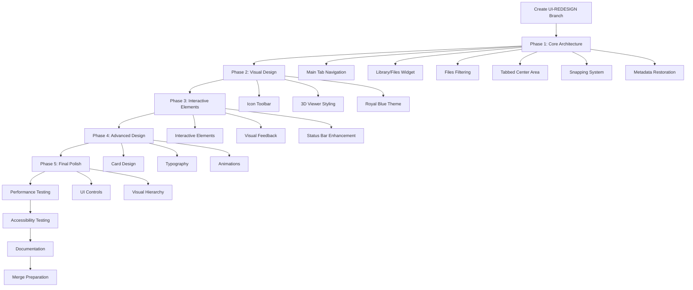

# UI REDESIGN Implementation Plan

## Overview
This document outlines the comprehensive implementation plan for the UI REDESIGN branch, based on the user's specific design vision. The redesign will implement a modern tab-based interface with royal blue color scheme, snapping panels, and enhanced UX while maintaining performance requirements and accessibility standards.

## User's Design Vision
**Key Requirements from Mockup:**
- Royal blue color scheme with silver/gray accents
- Fixed tab navigation at top: Library, Files, 3d Model, Visualize, CLO, CNC F&S, Cost Calc
- Three-panel layout: Left sidebar (Library/Files) | Central tabbed viewer | Right sidebar (Meta + tags)
- Snappable, detachable panels with independent sizing
- Hidden files filtering in Files tab

## Specific Architecture Requirements

### Navigation Structure
- **Main Tabs**: Library, Files, 3d Model, Visualize, CLO, CNC F&S, Cost Calc
- **Left Sidebar**: Combined Library/Files widget with internal tab switching
- **Center Area**: Tabbed interface with Model Viewer as primary tab (expandable for future "hero features")
- **Right Sidebar**: Metadata manager and tags (restorable if closed)

### Panel Management
- All windows must snap to bottom, top, left, and right
- Independent size adjustment for each panel
- Detachable panels that can float
- Metadata manager restoration mechanism (menu option if accidentally closed)

### File Management
- Files tab must hide .files and hidden files by default
- Proper filtering system for file visibility
- Library and Files are two different tabs in the same widget

## Implementation Strategy

### Phase 1: Core Architecture & Navigation System
**Goal**: Establish the fundamental tab-based layout and snapping panel system

#### 1.1 Main Tab Navigation Implementation
**Files**: `src/gui/main_window.py`
**Tasks**:
- Replace current dock-based layout with tab-based navigation system
- Implement 7 main tabs: Library, Files, 3d Model, Visualize, CLO, CNC F&S, Cost Calc
- Create tab switching mechanism with proper state management
- Apply royal blue styling to tab bar
- Ensure tab persistence across sessions

#### 1.2 Library/Files Combined Widget
**Files**: `src/gui/model_library.py`
**Tasks**:
- Create combined widget with internal tab switching
- Implement Library tab with existing model library functionality
- Implement Files tab with file browser capabilities
- Add seamless switching between Library and Files views
- Maintain search functionality across both tabs

#### 1.3 Files Tab Hidden Files Filtering
**Files**: `src/gui/model_library.py`
**Tasks**:
- Implement filtering system to hide .files and hidden files
- Add toggle option to show/hide hidden files
- Ensure proper file type detection and filtering
- Maintain performance with large file lists

#### 1.4 Tabbed Center Area with Model Viewer
**Files**: `src/gui/main_window.py`, `src/gui/viewer_widget_vtk.py`
**Tasks**:
- Create tabbed central area with Model Viewer as primary tab
- Design expandable tab system for future hero features
- Implement proper tab management for central area
- Ensure Model Viewer integration is seamless
- Add tab persistence and state management

#### 1.5 Snapping Window System
**Files**: `src/gui/main_window.py`
**Tasks**:
- Implement snapping system for all panels (top, bottom, left, right)
- Create detachable panels with floating capability
- Add independent size adjustment for each panel
- Implement panel persistence and restoration
- Add visual feedback for snapping zones

#### 1.6 Metadata Manager Restoration
**Files**: `src/gui/main_window.py`
**Tasks**:
- Add menu option to restore metadata manager if closed
- Implement metadata panel state tracking
- Add "View → Show Metadata Manager" menu item
- Create restoration mechanism for accidentally closed panels
- Ensure metadata manager integrates properly with tab system

### Phase 2: Visual Design & Theming
**Goal**: Apply royal blue color scheme and enhance visual design elements

#### 2.1 Icon-based Toolbar
**Files**: `src/gui/main_window.py`, `requirements.txt`
**Tasks**:
- Add QtAwesome dependency to requirements.txt
- Replace text-based toolbar actions with icon-based actions
- Implement royal blue themed icons
- Add icon-only buttons with tooltips
- Ensure icons work with light/dark theme variations

#### 2.2 3D Viewer Styling
**Files**: `src/gui/viewer_widget_vtk.py`
**Tasks**:
- Add modern frame with royal blue accents
- Implement enhanced visual styling for viewer area
- Add proper integration with tab system
- Ensure performance is maintained (30+ FPS)
- Add loading state improvements

#### 2.3 Royal Blue Color Scheme Implementation
**Files**: `src/gui/theme.py`, `src/resources/styles/main_window.css`
**Tasks**:
- Define royal blue primary colors (#1e3a8a, #2563eb, #3b82f6)
- Implement silver/gray accent colors (#e5e7eb, #d1d5db, #9ca3af)
- Update theme variables to match design vision
- Apply color scheme throughout interface
- Ensure proper contrast ratios for accessibility

### Phase 3: Interactive Elements & Feedback
**Goal**: Implement responsive interactions and visual feedback

#### 3.1 Interactive Element Polish
**Files**: `src/gui/theme.py`, all UI widget files
**Tasks**:
- Add smooth hover transitions for tabs and buttons (200ms max)
- Implement focus states with royal blue highlighting
- Add micro-animations for tab switching
- Create consistent interaction patterns across tabs
- Use CSS transitions for optimal performance

#### 3.2 Visual Feedback System
**Files**: `src/gui/theme.py`, `src/gui/metadata_editor.py`, `src/gui/model_library.py`
**Tasks**:
- Implement ripple effects for button clicks with royal blue accents
- Add selection highlighting with smooth transitions
- Create loading states for async operations
- Add success/error feedback indicators
- Implement timeout for feedback states

#### 3.3 Enhanced Status Bar
**Files**: `src/gui/main_window.py`
**Tasks**:
- Redesign status bar with silver/gray styling
- Add progress indicators with royal blue accents
- Implement status message queue with transitions
- Add system resource indicators
- Maintain tab navigation status feedback

### Phase 4: Advanced Design Elements
**Goal**: Implement sophisticated design elements and typography

#### 4.1 Card-based Model Library
**Files**: `src/gui/model_library.py`, `src/gui/theme.py`
**Tasks**:
- Design card-based layout for model items with royal blue borders
- Add hover effects with subtle elevation changes
- Implement card selection states with royal blue highlighting
- Add thumbnail placeholders with loading states
- Optimize card rendering for large model lists
- Implement virtual scrolling for performance

#### 4.2 Typography Hierarchy
**Files**: `src/gui/theme.py`, all UI widget files
**Tasks**:
- Define typography scale optimized for tab interface
- Implement consistent font weights and sizes for tabs
- Add proper line height and spacing for readability
- Create text color hierarchy with royal blue accents
- Use system fonts for performance
- Add font size scaling for accessibility

#### 4.3 Subtle Animations
**Files**: `src/gui/theme.py`, `src/gui/main_window.py`
**Tasks**:
- Implement smooth tab switching animations
- Add fade transitions for mode changes
- Create smooth loading animations for tabs
- Add transition effects for panel snapping
- Use hardware-accelerated animations
- Limit concurrent animations to maintain performance

### Phase 5: Final Polish & Consistency
**Goal**: Ensure visual consistency and complete the design system

#### 5.1 Modern UI Controls
**Files**: `src/gui/theme.py`
**Tasks**:
- Design modern scrollbars with royal blue accents
- Style combo boxes, spin boxes, and other controls
- Add hover and focus states for all controls
- Ensure consistent styling across all UI elements
- Add mouse wheel support for all scrollable areas
- Implement touch-friendly control sizes

#### 5.2 Visual Hierarchy System
**Files**: All UI files
**Tasks**:
- Audit all UI elements for consistency with tab system
- Implement visual weight hierarchy with royal blue emphasis
- Add proper contrast ratios for accessibility
- Create design system documentation for tab interface
- Ensure WCAG 2.1 AA compliance
- Add high contrast mode support

## Performance Requirements

### Memory Management
- No memory leaks during repeated tab switching
- Stable memory usage during panel snapping operations
- Efficient cleanup of unused tab resources
- Resource pooling for frequently used UI elements

### Responsiveness
- Interface remains responsive during tab switching
- Progress feedback for all long operations
- Cancellation support for lengthy operations
- Smooth interaction during model manipulation

### Frame Rate
- Minimum 30 FPS during model interaction in tabbed interface
- Consistent frame rates across different tab layouts
- Adaptive frame rate based on system capabilities
- Ensure UI changes don't impact 3D viewport performance

## Testing Strategy

### Performance Testing
- Monitor memory usage during tab switching
- Test panel snapping performance with multiple panels
- Verify animation performance doesn't impact 3D rendering
- Test on minimum specified hardware requirements

### Accessibility Testing
- Verify WCAG 2.1 AA compliance with automated tests
- Test keyboard navigation through tab system
- Validate screen reader compatibility with tab navigation
- Test color contrast ratios with royal blue scheme

### Visual Regression Testing
- Capture screenshots of all tab states
- Test panel snapping and detachment scenarios
- Validate theme switching across different tabs
- Test metadata manager restoration functionality

## Implementation Workflow

## Dependencies & Requirements

### New Dependencies
- `QtAwesome`: For icon-based toolbar actions with royal blue theming
- No additional performance-heavy dependencies

### Integration Points
- Theme system: Must integrate with existing variable-driven theming
- Performance monitoring: All UI changes must be monitored for performance impact
- Layout persistence: New tab and panel states must work with existing save/restore system
- Metadata manager: Must integrate restoration mechanism with existing dock system

## Success Criteria

1. All architectural requirements implemented (tabs, snapping, detachable panels)
2. Royal blue color scheme applied consistently throughout interface
3. Metadata manager restoration mechanism functional
4. Hidden files filtering working in Files tab
5. Performance requirements maintained (30+ FPS, <2GB memory usage)
6. Accessibility standards met (WCAG 2.1 AA)
7. Visual consistency achieved across all tab states
8. User feedback indicates improved usability and aesthetic appeal

## Timeline Estimate

- **Phase 1**: 4-5 days (core architecture, tabs, snapping system)
- **Phase 2**: 3-4 days (visual design, color scheme)
- **Phase 3**: 2-3 days (interactive elements, feedback)
- **Phase 4**: 3-4 days (advanced design, animations)
- **Phase 5**: 2-3 days (final polish, consistency)
- **Testing & Documentation**: 3-4 days

**Total Estimated Time**: 17-23 days

## Risk Mitigation

### Architecture Risk
- Implement tab system incrementally to avoid breaking existing functionality
- Create backup mechanisms for dock widgets during transition
- Test panel snapping thoroughly to ensure no UI freeze scenarios

### Performance Risk
- Monitor tab switching performance during implementation
- Test panel snapping with multiple panels active
- Optimize animations for smooth performance

### Usability Risk
- Conduct user testing on tab navigation early
- Ensure metadata manager restoration is intuitive
- Test hidden files filtering with various file structures

This comprehensive plan ensures a systematic approach to implementing the user's specific UI redesign vision while maintaining performance, accessibility, and user experience standards.