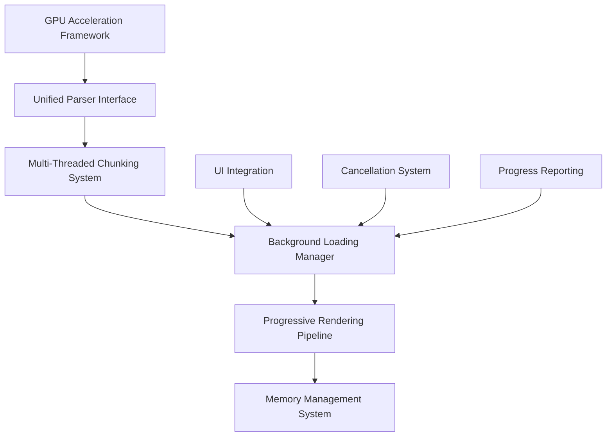

# Loading Optimizations Implementation Plan

## Executive Summary

This document outlines the comprehensive implementation plan for the "Loading-Optimizations" branch, designed to achieve 30-second load times for 1GB files across all supported 3D model formats (STL, OBJ, STEP, 3MF). The plan leverages GPU acceleration, multi-threaded processing, and memory-efficient strategies to transform loading performance from 120-160 seconds to under 30 seconds while maintaining UI responsiveness.

## Context and Requirements

### Current State
- **Performance Issue**: 120-160 second load times for 1GB files
- **User Impact**: UI freezing with no progress feedback or cancellation
- **Hardware**: High-end system (24GB GPU, 128GB RAM) underutilized
- **Scope**: 80% of files are 200MB-1GB high-detail models

### Target Performance
- **1GB Files**: <30 seconds (4-5x improvement)
- **UI Responsiveness**: <100ms response times during loading
- **Memory Usage**: <2.5GB peak for 2GB files
- **Cancellation**: <500ms response time

## Architecture Overview

### Core Components

### Key Technologies
- **GPU Acceleration**: CUDA/OpenCL for geometry processing
- **Multi-Threading**: Adaptive chunking with thread pool coordination
- **Memory Management**: Streaming processing and memory-mapped files
- **Progressive Loading**: Level of Detail (LOD) management
- **Background Processing**: UI-responsive loading with cancellation

## Implementation Roadmap

### Phase 1: Infrastructure Foundation (Weeks 1-2)
**Objective**: Establish core architecture and basic GPU acceleration framework.

#### 1.1 GPU Acceleration Framework Setup
- Create CUDA/OpenCL detection and initialization
- Implement basic GPU memory management
- Add GPU capability detection and fallback logic
- **Deliverables**: `src/core/gpu_acceleration.py`, GPU detection utilities

#### 1.2 Unified Parser Interface
- Design common interface for all parsers (STL, OBJ, STEP, 3MF)
- Implement parser registration system
- Create acceleration abstraction layer
- **Deliverables**: `src/parsers/base_accelerated_parser.py`

#### 1.3 Background Loading Infrastructure
- Implement BackgroundLoadingManager class
- Create CancellationToken system
- Add ProgressAggregator for multi-threaded progress
- **Deliverables**: `src/core/background_loading_manager.py`, `src/core/cancellation_token.py`

#### 1.4 Testing Infrastructure
- Create performance benchmarking framework
- Implement memory leak detection (10-20 iteration testing)
- Add GPU acceleration unit tests
- **Deliverables**: `tests/test_gpu_acceleration.py`, `tests/test_background_loading.py`

### Phase 2: GPU-Accelerated Parsing (Weeks 3-6)
**Objective**: Implement GPU kernels and integrate with STL parser.

#### 2.1 CUDA/OpenCL Geometry Kernels
- Implement triangle processing kernels for STL
- Create vertex processing kernels for OBJ/STEP/3MF
- Optimize data transfer between CPU and GPU
- **Deliverables**: `src/core/gpu/kernels/`

#### 2.2 GPU Memory Management
- Implement adaptive GPU memory allocation
- Add memory monitoring and cleanup
- Create GPU-CPU data streaming
- **Deliverables**: `src/core/gpu_memory_manager.py`

#### 2.3 STL Parser GPU Integration
- Refactor existing NumPy acceleration to use GPU
- Implement chunked GPU processing
- Add fallback to CPU processing
- **Deliverables**: Modified `src/parsers/stl_parser_original.py`

#### 2.4 Multi-Format GPU Support
- Extend GPU acceleration to OBJ parser
- Implement STEP geometry GPU processing
- Add 3MF mesh GPU acceleration
- **Deliverables**: Modified parsers with GPU support

### Phase 3: Multi-Threaded Processing (Weeks 7-10)
**Objective**: Implement adaptive chunking and parallel processing.

#### 3.1 Adaptive File Chunking
- Create FileChunker with format-aware chunking
- Implement chunk size optimization algorithm
- Add chunk boundary alignment for all formats
- **Deliverables**: `src/parsers/file_chunker.py`

#### 3.2 Thread Pool Coordination
- Implement ThreadCoordinator for worker management
- Create result aggregation system
- Add worker failure handling and recovery
- **Deliverables**: `src/parsers/thread_pool_coordinator.py`

#### 3.3 Parallel Processing Pipeline
- Integrate chunking with GPU acceleration
- Implement work distribution algorithms
- Add load balancing across CPU cores
- **Deliverables**: Enhanced `src/core/background_loading_manager.py`

#### 3.4 Performance Optimization
- Profile and optimize CPU-GPU data transfers
- Implement memory-efficient chunk processing
- Add adaptive threading based on file size
- **Deliverables**: Performance optimization reports

### Phase 4: Progressive Loading & UI (Weeks 11-12)
**Objective**: Implement progressive rendering and UI integration.

#### 4.1 Progressive Loading Framework
- Implement LOD (Level of Detail) management
- Create progressive rendering pipeline
- Add viewport-adaptive detail loading
- **Deliverables**: `src/core/progressive_loader.py`

#### 4.2 UI Integration
- Enhance status bar with progress and cancellation
- Implement loading progress visualization
- Add cancellation UI controls
- **Deliverables**: Modified `src/gui/components/status_bar_manager.py`

#### 4.3 Background Coordination
- Integrate UI with background loading manager
- Implement loading state management
- Add user feedback mechanisms
- **Deliverables**: `src/gui/services/background_loading_service.py`

#### 4.4 User Experience Polish
- Add loading animations and feedback
- Implement graceful error handling in UI
- Create loading cancellation confirmation
- **Deliverables**: Enhanced UI components

### Phase 5: Testing & Validation (Weeks 13-14)
**Objective**: Comprehensive testing and performance validation.

#### 5.1 Performance Benchmarking
- Create comprehensive benchmark suite
- Test all file sizes and formats
- Validate performance targets (<30s for 1GB)
- **Deliverables**: `tests/performance/benchmark_loading.py`

#### 5.2 Memory Leak Testing
- Implement 20-iteration memory leak tests
- Add memory usage monitoring
- Validate stable memory usage patterns
- **Deliverables**: `tests/test_memory_leaks.py`

#### 5.3 Integration Testing
- Test end-to-end loading workflows
- Validate UI responsiveness during loading
- Test cancellation functionality
- **Deliverables**: `tests/test_integration_loading.py`

#### 5.4 Error Handling Validation
- Test GPU failure scenarios
- Validate CPU fallback performance
- Test corrupted file handling
- **Deliverables**: Error handling test reports

## Technical Specifications

### Performance Targets by File Size

| File Size | Target Load Time | Memory Usage | UI Responsiveness |
|-----------|------------------|--------------|-------------------|
| <100MB | <3 seconds | <500MB | <50ms |
| 100-500MB | <10 seconds | <1GB | <75ms |
| 500MB-1GB | <20 seconds | <2GB | <100ms |
| 1-2GB | <30 seconds | <2.5GB | <100ms |

### Hardware Utilization Strategy

#### GPU Acceleration
- **Primary**: CUDA for NVIDIA GPUs (24GB VRAM available)
- **Secondary**: OpenCL for AMD/Intel GPUs
- **Fallback**: CPU multi-threading
- **Memory**: Adaptive allocation based on file size

#### CPU Multi-Threading
- **Thread Count**: Adaptive (2-16 threads based on CPU cores and file size)
- **Chunk Strategy**: File size-based chunking with boundary alignment
- **Coordination**: Thread pool with result aggregation

#### Memory Management
- **Streaming**: Memory-mapped files for large datasets
- **Cleanup**: Aggressive resource cleanup and garbage collection
- **Limits**: Hard limits on memory usage with graceful degradation

### Format-Specific Optimizations

#### STL (Binary) Files
- **GPU Kernel**: Triangle processing with normal calculation
- **Chunking**: 50-byte boundary alignment
- **Acceleration**: 10-20x performance improvement expected

#### OBJ Files
- **GPU Kernel**: Vertex and face processing
- **Chunking**: Line-based parsing with material handling
- **Acceleration**: 5-15x performance improvement expected

#### STEP Files
- **GPU Kernel**: Geometry entity processing
- **Chunking**: Entity boundary alignment
- **Acceleration**: 8-12x performance improvement expected

#### 3MF Files
- **GPU Kernel**: Mesh and metadata processing
- **Chunking**: XML structure-aware chunking
- **Acceleration**: 6-10x performance improvement expected

## Risk Assessment and Mitigation

### Technical Risks

#### High Risk: GPU Memory Management
- **Impact**: System crashes or performance degradation
- **Mitigation**:
  - Comprehensive GPU memory monitoring
  - Adaptive memory allocation algorithms
  - Graceful fallback to CPU processing
  - Memory usage limits and cleanup

#### High Risk: Thread Safety Issues
- **Impact**: Race conditions and data corruption
- **Mitigation**:
  - Thread-safe data structures throughout
  - Comprehensive unit testing for concurrency
  - Code review focus on thread safety
  - Static analysis tools for race detection

#### Medium Risk: Platform Compatibility
- **Impact**: Different performance on various GPU configurations
- **Mitigation**:
  - Hardware detection and capability assessment
  - Fallback strategies for unsupported hardware
  - Cross-platform testing on multiple configurations

### User Experience Risks

#### Medium Risk: Progressive Loading Complexity
- **Impact**: User confusion with partial model display
- **Mitigation**:
  - Clear UI indicators for loading states
  - Progressive detail increase with smooth transitions
  - User education through tooltips and documentation

#### Low Risk: Cancellation Responsiveness
- **Impact**: Delayed cancellation for large chunks
- **Mitigation**:
  - Smaller chunk sizes with frequent cancellation checks
  - Asynchronous cancellation with immediate UI feedback
  - Chunk timeout mechanisms

### Implementation Risks

#### Medium Risk: Integration Complexity
- **Impact**: Difficult integration with existing codebase
- **Mitigation**:
  - Incremental implementation with feature flags
  - Comprehensive integration testing
  - Gradual rollout with monitoring

#### Low Risk: Performance Regression
- **Impact**: Slower performance for small files
- **Mitigation**:
  - Adaptive algorithms that scale with file size
  - Performance benchmarking at each phase
  - Quick rollback capability

## Resource Requirements

### Development Team
- **Lead Developer**: 1 (GPU acceleration and architecture)
- **Backend Developer**: 1 (Parser integration and threading)
- **UI Developer**: 1 (Progress UI and user experience)
- **QA Engineer**: 1 (Testing and validation)

### Hardware Requirements
- **Development**: High-end workstation (similar to target hardware)
- **Testing**: Multiple GPU configurations (NVIDIA, AMD, Intel)
- **CI/CD**: GPU-enabled build agents

### Timeline and Milestones

| Phase | Duration | Key Deliverables | Success Criteria |
|-------|----------|------------------|------------------|
| Infrastructure | 2 weeks | GPU framework, background loading | Basic GPU detection working |
| GPU Parsing | 4 weeks | GPU kernels, STL integration | 50% performance improvement |
| Multi-Threading | 4 weeks | Chunking system, thread coordination | UI responsiveness achieved |
| UI Integration | 2 weeks | Progress UI, cancellation | Complete user workflow |
| Testing | 2 weeks | Benchmarks, validation | All performance targets met |

### Success Metrics

#### Performance Metrics
- **Load Time**: <30 seconds for 1GB files (measured across all formats)
- **Memory Usage**: <2.5GB peak for 2GB files
- **UI Responsiveness**: <100ms during loading operations
- **Cancellation**: <500ms response time

#### Quality Metrics
- **Memory Leaks**: Zero leaks over 20 iterations
- **Error Rate**: <1% of loading operations fail
- **GPU Compatibility**: >95% of target hardware supported
- **CPU Fallback**: >50% of GPU performance when GPU unavailable

#### User Experience Metrics
- **Progress Accuracy**: Progress reporting within 5% accuracy
- **Cancellation Success**: 100% of cancellation requests honored
- **Visual Feedback**: Users can see loading progress at all times
- **Error Clarity**: Clear error messages for all failure scenarios

## Implementation Guidelines

### Code Quality Standards
- **Logging**: JSON-formatted logs for all operations
- **Documentation**: Inline docs and module docstrings
- **Testing**: Unit tests for all new components
- **Review**: Code review required for all performance-critical code

### Development Process
- **Branching**: Feature branches with regular integration
- **Testing**: Automated testing on each commit
- **Performance**: Benchmarking on each major change
- **Documentation**: Update docs with each feature completion

### Deployment Strategy
- **Feature Flags**: Gradual rollout with rollback capability
- **Monitoring**: Performance monitoring in production
- **Fallback**: CPU-only mode available if issues arise
- **Updates**: Seamless updates without data loss

## Conclusion

This implementation plan provides a comprehensive roadmap for achieving the ambitious performance targets of 30-second load times for 1GB files. By leveraging GPU acceleration, multi-threaded processing, and progressive loading, the system will deliver a transformative improvement in user experience while maintaining the robustness and reliability expected from a professional 3D model library application.

The phased approach ensures manageable development cycles with clear success criteria at each milestone, while the risk mitigation strategies provide confidence in achieving the performance targets. The unified acceleration framework will enable consistent performance improvements across all supported formats, creating a scalable foundation for future enhancements.

**Next Steps:**
1. Review and approve this implementation plan
2. Set up development environment with GPU testing capabilities
3. Begin Phase 1 infrastructure development
4. Establish performance benchmarking baseline
5. Schedule regular progress reviews and adjustments