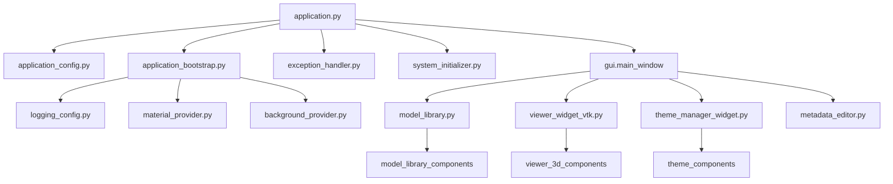
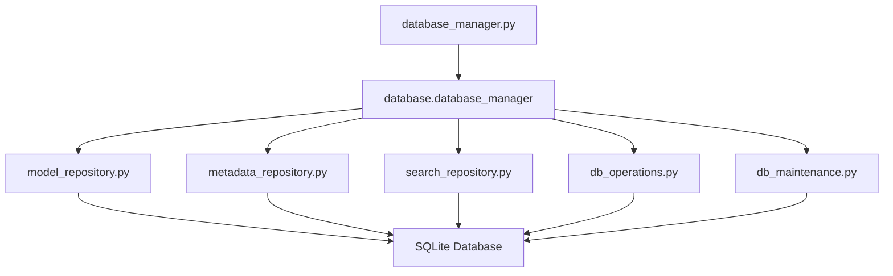
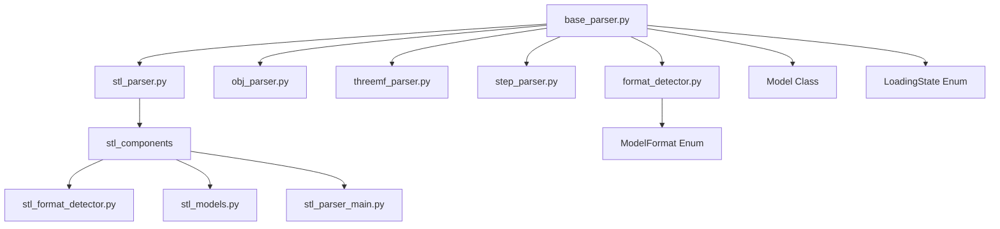
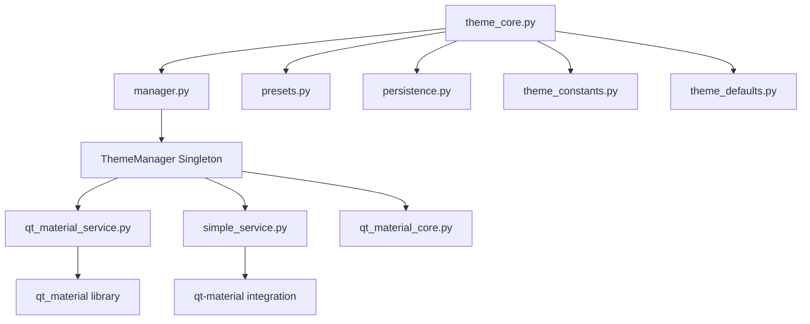
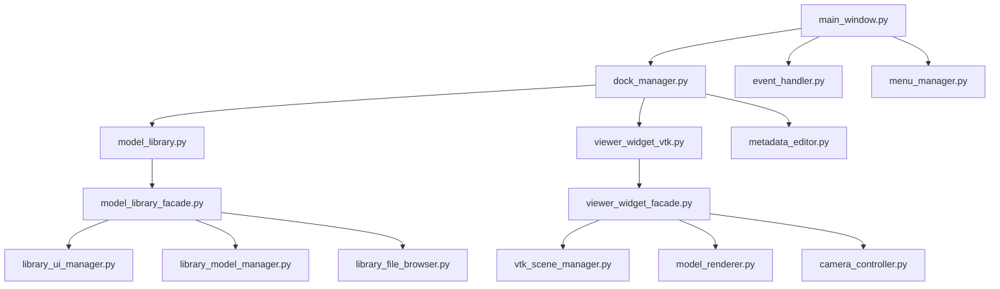
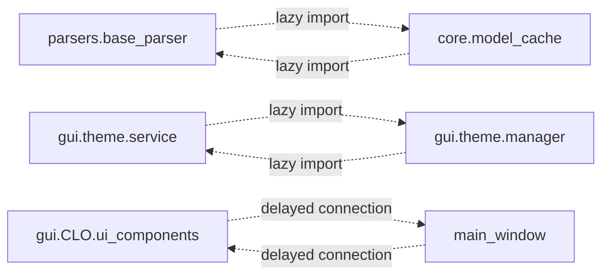
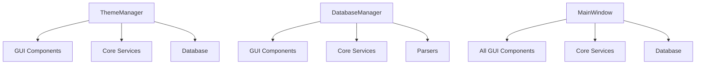
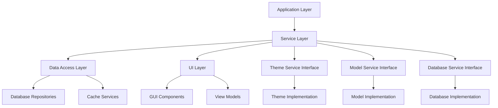
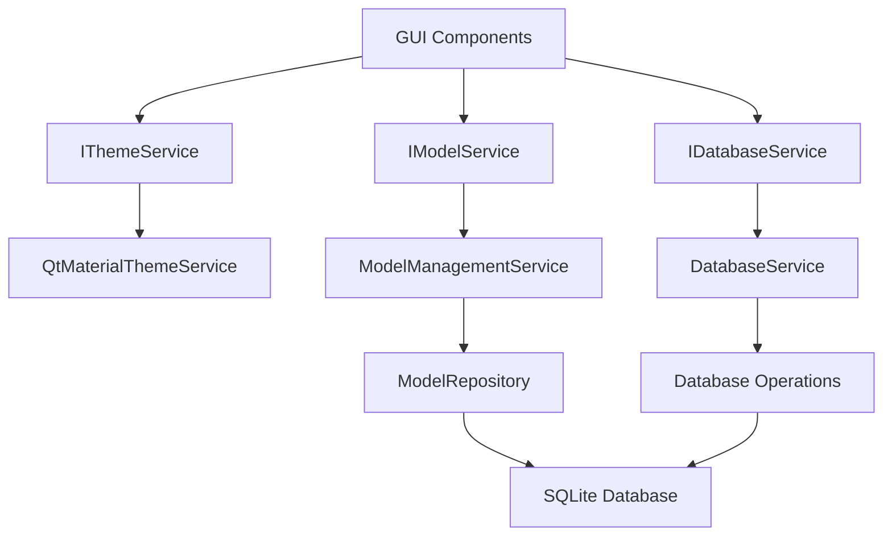

# Module Dependency Diagrams

## Current Architecture Dependencies

### Core Module Dependencies

### Database Architecture

### Parser System Architecture

### Theme System Architecture

### GUI Component Dependencies

## Problematic Dependencies

### Circular Dependencies (Current Issues)

### High Coupling Areas

## Improved Architecture (Target State)

### Reduced Coupling Design

### Interface-Based Architecture

## Dependency Rules

### Allowed Dependencies
- Core → Core (same level)
- Core → Database (data access)
- GUI → Core Services (through interfaces)
- Parsers → Core (data structures)
- GUI → GUI (sibling components)

### Forbidden Dependencies
- GUI → Core (direct implementation)
- Database → GUI
- Parsers → GUI
- Circular imports (any direction)
- Implementation → Interface (reverse dependency)

### Dependency Injection Points
- Service interfaces in constructors
- Repository interfaces in services
- Factory pattern for complex object creation
- Plugin system for extensibility

## Migration Strategy

### Phase 1: Interface Extraction
1. Extract service interfaces
2. Create abstract base classes
3. Implement dependency injection containers

### Phase 2: Refactoring
1. Remove direct dependencies
2. Implement proper abstractions
3. Update import statements

### Phase 3: Testing
1. Add unit tests for interfaces
2. Integration tests for services
3. End-to-end testing

### Phase 4: Cleanup
1. Remove legacy code
2. Update documentation
3. Performance optimization