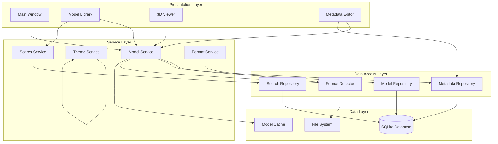
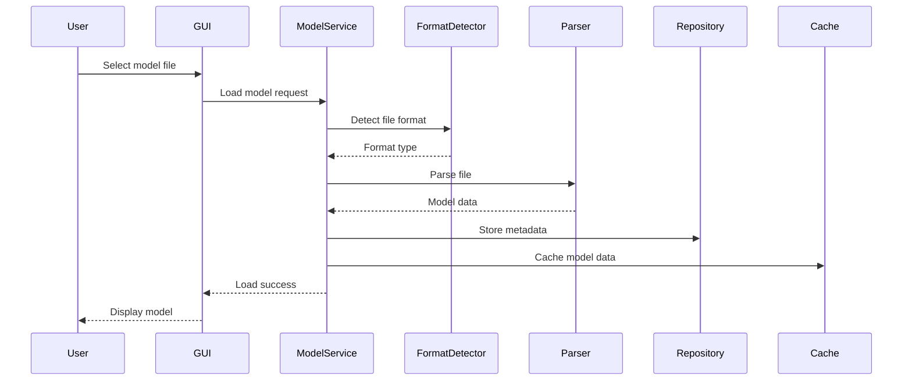
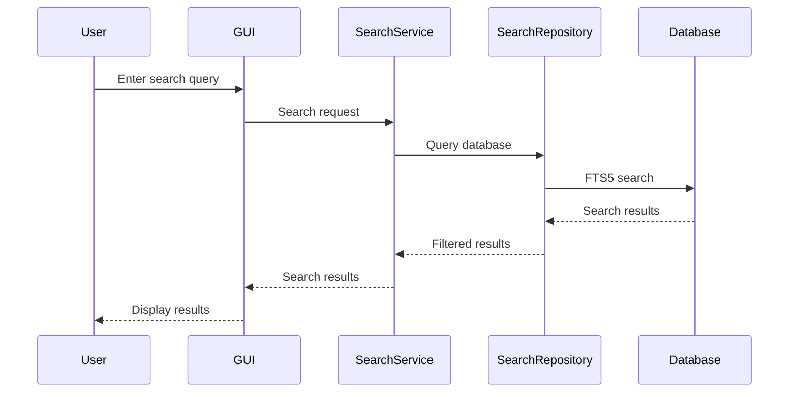
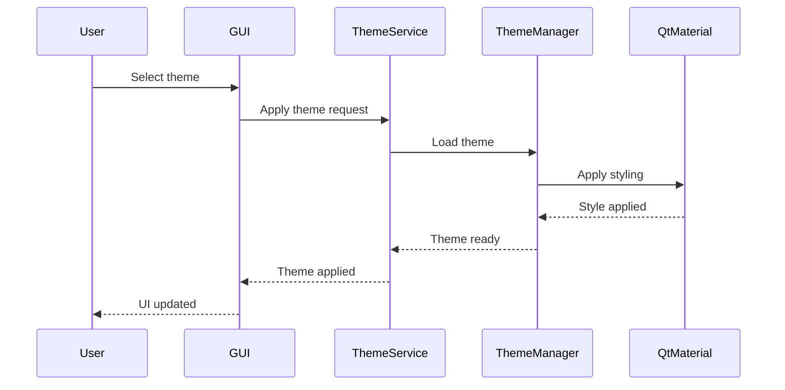

# Candy-Cadence Overall Architecture Documentation

## Executive Summary

Candy-Cadence is a Windows desktop application for organizing and viewing 3D model collections. The application features a modular, interface-based architecture designed for maintainability, scalability, and performance. This document provides a comprehensive overview of the system architecture, component relationships, and design patterns.

## Table of Contents

1. [System Overview](#system-overview)
2. [Architecture Principles](#architecture-principles)
3. [High-Level Architecture](#high-level-architecture)
4. [Core Components](#core-components)
5. [Data Flow](#data-flow)
6. [Design Patterns](#design-patterns)
7. [Technology Stack](#technology-stack)
8. [Performance Architecture](#performance-architecture)
9. [Security Architecture](#security-architecture)
10. [Scalability Considerations](#scalability-considerations)
11. [Future Architecture Roadmap](#future-architecture-roadmap)

## System Overview

### Purpose and Scope

Candy-Cadence serves as a comprehensive 3D model management solution for hobbyists and professionals who need to:
- Organize large collections of 3D models
- View and manipulate 3D models in real-time
- Search and filter models by various criteria
- Edit metadata and manage model properties
- Perform batch operations on model collections

### Key Features

- **Multi-format Support**: STL, OBJ, 3MF, STEP file formats
- **3D Visualization**: Real-time 3D rendering with VTK integration
- **Database Management**: SQLite-based metadata storage with full-text search
- **Theme System**: Customizable UI themes with CSS-based styling
- **Performance Optimization**: Adaptive loading and memory management
- **Batch Operations**: Efficient processing of multiple models
- **Extensible Architecture**: Plugin-based system for new features

## Architecture Principles

### 1. Separation of Concerns
Each module has a single, well-defined responsibility:
- **Core**: Business logic and data management
- **GUI**: User interface components
- **Parsers**: File format handling
- **Database**: Data persistence and retrieval
- **Utils**: Shared utility functions

### 2. Interface-Based Design
All major components communicate through well-defined interfaces:
- Service interfaces for business operations
- Repository interfaces for data access
- Parser interfaces for file handling
- Event interfaces for component communication

### 3. Dependency Injection
Dependencies are injected rather than hard-coded:
- Reduces coupling between components
- Improves testability
- Enables flexible configuration
- Supports multiple implementations

### 4. Single Responsibility Principle
Each class has one reason to change:
- Services handle business logic
- Repositories handle data access
- Parsers handle file parsing
- UI components handle presentation

### 5. Open/Closed Principle
The system is open for extension but closed for modification:
- New parsers can be added without changing existing code
- New themes can be added through configuration
- New services can be integrated through interfaces

## High-Level Architecture

### Layered Architecture

```
┌─────────────────────────────────────────────────────────────┐
│                    Presentation Layer                       │
│  ┌─────────────────┐  ┌─────────────────┐  ┌──────────────┐ │
│  │   Main Window   │  │  Model Library  │  │  3D Viewer   │ │
│  └─────────────────┘  └─────────────────┘  └──────────────┘ │
└─────────────────────────────────────────────────────────────┘
                                │
┌─────────────────────────────────────────────────────────────┐
│                     Service Layer                           │
│  ┌─────────────────┐  ┌─────────────────┐  ┌──────────────┐ │
│  │ Model Service   │  │ Theme Service   │  │ Search Service│ │
│  └─────────────────┘  └─────────────────┘  └──────────────┘ │
└─────────────────────────────────────────────────────────────┘
                                │
┌─────────────────────────────────────────────────────────────┐
│                   Data Access Layer                         │
│  ┌─────────────────┐  ┌─────────────────┐  ┌──────────────┐ │
│  │ Model Repository│  │ Metadata Repo   │  │ Search Repo  │ │
│  └─────────────────┘  └─────────────────┘  └──────────────┘ │
└─────────────────────────────────────────────────────────────┘
                                │
┌─────────────────────────────────────────────────────────────┐
│                     Data Layer                              │
│  ┌─────────────────┐  ┌─────────────────┐  ┌──────────────┐ │
│  │   SQLite DB     │  │   File System   │  │   Cache      │ │
│  └─────────────────┘  └─────────────────┘  └──────────────┘ │
└─────────────────────────────────────────────────────────────┘
```

### Component Interaction Diagram



## Core Components

### 1. Core Module (`src/core/`)

The core module contains the main business logic and data management:

#### Interfaces
- **Service Interfaces**: Define contracts for business operations
- **Repository Interfaces**: Define contracts for data access
- **Parser Interfaces**: Define contracts for file parsing

#### Services
- **ModelService**: Manages 3D model operations (load, unload, cache)
- **ThemeService**: Handles UI theming and styling
- **SearchService**: Provides search and filtering capabilities
- **DatabaseService**: Manages database operations

#### Models
- **Model**: Core 3D model data structure
- **Metadata**: Model metadata and properties
- **LoadingState**: Model loading state tracking

### 2. GUI Module (`src/gui/`)

The GUI module contains all user interface components:

#### Main Components
- **MainWindow**: Primary application window
- **ModelLibrary**: Model browsing and management interface
- **ViewerWidget**: 3D visualization widget
- **MetadataEditor**: Model property editing interface

#### Supporting Components
- **ThemeManager**: UI theming and styling
- **LightingControl**: 3D scene lighting controls
- **BatchOperations**: Bulk model processing interface

### 3. Parsers Module (`src/parsers/`)

The parsers module handles various 3D file formats:

#### Parser Components
- **BaseParser**: Abstract base class for all parsers
- **STLParser**: STL stereolithography file parser
- **OBJParser**: Wavefront OBJ file parser
- **3MFParser**: 3D Manufacturing Format parser
- **STEPParser**: STEP/ISO 10303 file parser
- **FormatDetector**: Automatic file format detection

#### Parser Architecture
```
BaseParser (Abstract)
├── STLParser
├── OBJParser
├── 3MFParser
└── STEPParser
```

### 4. Database Module (`src/database/`)

The database module handles data persistence:

#### Repository Pattern
- **ModelRepository**: Model data CRUD operations
- **MetadataRepository**: Metadata CRUD operations
- **SearchRepository**: Full-text search operations

#### Database Schema
- **Models Table**: Core model information
- **Metadata Table**: Extended model properties
- **Tags Table**: Model categorization
- **Full-Text Search**: SQLite FTS5 for fast searching

### 5. Utils Module (`src/utils/`)

The utils module contains shared utility functions:
- **FileUtils**: File operations and validation
- **GeometryUtils**: 3D geometry calculations
- **HashUtils**: File hashing and deduplication
- **LoggingUtils**: Structured logging utilities

## Data Flow

### Model Loading Flow



### Search Flow



### Theme Application Flow



## Design Patterns

### 1. Repository Pattern
**Purpose**: Abstract data access logic
**Implementation**: 
- `IModelRepository` interface
- `ModelRepository` implementation
- Separation of business logic from data access

### 2. Service Layer Pattern
**Purpose**: Encapsulate business logic
**Implementation**:
- `IModelService` interface
- `ModelService` implementation
- Coordinates multiple repositories

### 3. Strategy Pattern
**Purpose**: Interchangeable algorithms
**Implementation**:
- `IParser` interface
- Multiple parser implementations
- Runtime parser selection

### 4. Observer Pattern
**Purpose**: Event-driven communication
**Implementation**:
- Event publishing/subscribing
- Model loading state changes
- UI update notifications

### 5. Factory Pattern
**Purpose**: Object creation abstraction
**Implementation**:
- Parser factory
- Service factory
- Repository factory

### 6. Singleton Pattern
**Purpose**: Global state management
**Implementation**:
- `ThemeManager` singleton
- `DatabaseManager` singleton
- `Application` singleton

### 7. Facade Pattern
**Purpose**: Simplified subsystem interface
**Implementation**:
- `ModelLibraryFacade`
- `MainWindowFacade`
- `ViewerWidgetFacade`

## Technology Stack

### Core Technologies

#### Programming Language
- **Python 3.8-3.12**: Primary development language
- **Type Hints**: Static type checking support
- **Async/Await**: Asynchronous programming support

#### GUI Framework
- **PySide6 6.0.0+**: Primary GUI framework
- **Qt Designer**: UI design tool
- **Qt Material**: Material Design implementation

#### 3D Graphics
- **VTK 9.2.0+**: 3D visualization and processing
- **OpenGL 3.3+**: Graphics rendering
- **DirectX 11.0+**: Windows graphics fallback

#### Database
- **SQLite 3.0+**: Primary database
- **SQLite FTS5**: Full-text search extension
- **SQLAlchemy**: ORM (optional)

#### File Processing
- **NumPy 1.24.0+**: Numerical operations
- **lxml 4.6.0+**: XML processing
- **Pillow**: Image processing

### Development Tools

#### Testing
- **pytest**: Testing framework
- **pytest-cov**: Coverage reporting
- **pytest-mock**: Mocking utilities

#### Code Quality
- **pylint**: Code analysis
- **mypy**: Type checking
- **black**: Code formatting
- **flake8**: Style checking

#### Build and Packaging
- **PyInstaller**: Executable creation
- **Inno Setup**: Windows installer
- **setuptools**: Package management

## Performance Architecture

### Performance Requirements

| File Size | Load Time Target | Memory Target | Frame Rate |
|-----------|------------------|---------------|------------|
| < 100MB   | < 5 seconds      | < 100MB       | 30+ FPS    |
| 100-500MB | < 15 seconds     | < 500MB       | 30+ FPS    |
| > 500MB   | < 30 seconds     | < 1GB         | 30+ FPS    |

### Performance Optimizations

#### 1. Adaptive Loading
- **Hardware Detection**: Automatically adjust settings based on system capabilities
- **Progressive Loading**: Load models in chunks for large files
- **Background Processing**: Non-blocking file operations

#### 2. Memory Management
- **LRU Caching**: Least Recently Used cache eviction
- **Memory Monitoring**: Real-time memory usage tracking
- **Garbage Collection**: Explicit cleanup of unused resources

#### 3. Rendering Optimization
- **Level of Detail (LOD)**: Reduce geometry complexity for distant objects
- **Frustum Culling**: Only render visible objects
- **Batch Rendering**: Group similar objects for efficient rendering

#### 4. Database Optimization
- **Indexed Searches**: Optimized database indexes
- **Connection Pooling**: Reuse database connections
- **Query Optimization**: Efficient SQL queries

### Performance Monitoring

#### Metrics Collection
- **Load Times**: Track file loading performance
- **Memory Usage**: Monitor memory consumption
- **Frame Rates**: Measure rendering performance
- **Database Performance**: Track query execution times

#### Performance Testing
- **Automated Benchmarks**: Continuous performance testing
- **Regression Detection**: Identify performance degradation
- **Stress Testing**: Test with large datasets

## Security Architecture

### Security Principles

#### 1. Input Validation
- **File Path Validation**: Prevent directory traversal attacks
- **File Type Validation**: Restrict to supported formats
- **Size Limits**: Prevent memory exhaustion attacks

#### 2. Error Handling
- **Sanitized Error Messages**: Prevent information disclosure
- **Secure Logging**: Protect sensitive information in logs
- **Graceful Degradation**: Handle errors without system compromise

#### 3. Data Protection
- **No Hard-coded Secrets**: All credentials externalized
- **Secure File Handling**: Safe file operations
- **Database Security**: Parameterized queries prevent SQL injection

### Security Measures

#### File System Security
- **Path Validation**: Ensure files are within allowed directories
- **File Extension Checking**: Restrict to known safe formats
- **Size Validation**: Prevent oversized file attacks

#### Database Security
- **Parameterized Queries**: Prevent SQL injection
- **Connection Security**: Secure database connections
- **Data Encryption**: Sensitive data encryption at rest

#### Network Security (Future)
- **HTTPS Communication**: Secure network communication
- **Certificate Validation**: Verify SSL certificates
- **API Authentication**: Secure API access

## Scalability Considerations

### Current Scalability Limits

#### File Size Limits
- **Maximum File Size**: 2GB per model file
- **Memory Usage**: 2GB maximum application memory
- **Database Size**: Limited by available disk space

#### Performance Scaling
- **Model Count**: Tested up to 10,000 models
- **Concurrent Operations**: Single-threaded with async support
- **Database Performance**: Optimized for up to 100,000 records

### Scalability Improvements

#### 1. Database Scaling
- **Partitioning**: Split large databases by date/category
- **Read Replicas**: Multiple database instances for read scaling
- **Caching Layer**: Redis/Memcached for frequently accessed data

#### 2. Application Scaling
- **Multi-threading**: Parallel processing for multiple models
- **Distributed Processing**: Split processing across multiple machines
- **Microservices**: Separate services for different functionalities

#### 3. Storage Scaling
- **Cloud Storage**: Integration with cloud storage providers
- **Distributed File System**: Multiple storage locations
- **Compression**: Advanced compression for large datasets

## Future Architecture Roadmap

### Phase 1: Enhanced Modularity (Current)
- ✅ Interface-based architecture
- ✅ Dependency injection
- ✅ Service layer implementation
- ✅ Repository pattern

### Phase 2: Performance Optimization (Next)
- [ ] Async/await throughout the application
- [ ] Advanced caching strategies
- [ ] GPU acceleration for rendering
- [ ] Database query optimization

### Phase 3: Cloud Integration (Future)
- [ ] Cloud storage integration
- [ ] Multi-user support
- [ ] Collaborative features
- [ ] Web-based interface

### Phase 4: Advanced Features (Long-term)
- [ ] Machine learning for model classification
- [ ] Advanced 3D processing algorithms
- [ ] Plugin architecture for extensions
- [ ] Mobile application support

### Architecture Evolution

#### Microservices Migration
```
Current Monolithic → Service-Oriented → Microservices
     ↓                    ↓                    ↓
Single Process    →   Multiple Services   →   Distributed Services
Tight Coupling    →   Loose Coupling      →   Independent Services
```

#### Technology Upgrades
- **Python Version**: Upgrade to Python 3.11+ for performance improvements
- **GUI Framework**: Evaluate Qt 6 and newer PySide versions
- **Database**: Consider PostgreSQL for enterprise deployments
- **3D Graphics**: Evaluate newer VTK versions and alternatives

## Conclusion

The Candy-Cadence architecture provides a solid foundation for a scalable, maintainable 3D model management application. The modular design, interface-based architecture, and performance optimizations ensure the system can grow with user needs while maintaining high performance and reliability.

Key architectural strengths:
- **Modularity**: Clear separation of concerns
- **Extensibility**: Easy to add new features and parsers
- **Maintainability**: Well-defined interfaces and patterns
- **Performance**: Optimized for large datasets and files
- **Testability**: Interface-based design enables comprehensive testing

The architecture is designed to evolve with the project requirements while maintaining backward compatibility and performance standards.