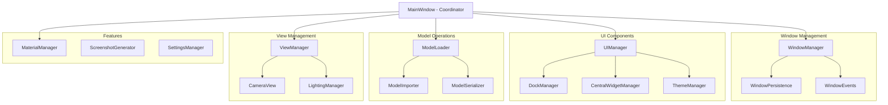
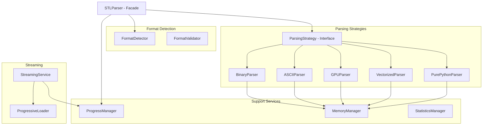

# God Class Refactoring Plan

## Executive Summary

This document outlines a comprehensive refactoring plan for two god classes identified in the Digital Workshop application:
1. **src/gui/main_window.py** - 2,632 lines
2. **src/parsers/stl_parser_original.py** - 1,161 lines

The goal is to improve maintainability, testability, and reduce complexity by applying SOLID principles and proper separation of concerns.

## Current State Analysis

### 1. MainWindow Class (main_window.py)

#### Current Responsibilities (13 major areas):
1. **Window Management** - Window state, geometry, persistence
2. **UI Component Initialization** - Menu, toolbar, status bar, dock widgets
3. **Dock Widget Management** - Creation, layout, snapping, persistence
4. **Central Widget Management** - Tab widget, viewer setup
5. **Model Loading Operations** - File opening, loading coordination
6. **Event Handling** - All UI events and signals
7. **Settings Persistence** - Window state, preferences, lighting
8. **Lighting Control** - Lighting manager integration
9. **Material Management** - Material application and management
10. **Screenshot Generation** - Batch screenshot processing
11. **Theme Management** - Theme switching and updates
12. **View/Camera Management** - 3D view control and persistence
13. **Import/Export Operations** - Model import dialogs and coordination

#### Existing Partial Refactoring:
- `MenuManager` - Menu bar management (extracted)
- `ToolbarManager` - Toolbar management (extracted)
- `StatusBarManager` - Status bar management (extracted)
- Some window components in `src/gui/window/`

#### Key Issues:
- Violates Single Responsibility Principle
- High coupling between different concerns
- Difficult to test individual features
- Complex event flow
- Mixed business logic with UI code

### 2. STLParser Class (stl_parser_original.py)

#### Current Responsibilities (10 major areas):
1. **Format Detection** - Binary vs ASCII detection
2. **Binary Parsing** - Multiple strategies (GPU, vectorized, pure Python)
3. **ASCII Parsing** - Line-by-line parsing
4. **Performance Optimization** - GPU acceleration, NumPy vectorization
5. **Memory Management** - Efficient processing of large files
6. **Progress Reporting** - Callback mechanism for progress updates
7. **Validation** - File format and geometry validation
8. **Streaming Support** - Progressive loading capabilities
9. **Statistics Generation** - Model geometry statistics
10. **Error Handling** - Comprehensive error management

#### Existing Partial Refactoring:
- `RefactoredSTLParser` already exists
- Components in `src/parsers/stl_components/`
- Separate GPU parser (`stl_gpu_parser.py`)
- Progressive loader (`stl_progressive_loader.py`)

#### Key Issues:
- Multiple parsing strategies in single class
- Complex conditional logic for strategy selection
- Tight coupling between parsing and optimization logic
- Difficult to extend with new strategies

## Proposed Architecture

### MainWindow Refactoring



### STLParser Refactoring



## Detailed Class Designs

### MainWindow Refactoring Classes

#### 1. WindowManager
```python
class WindowManager:
    """Manages window state, geometry, and lifecycle"""
    - manage_geometry()
    - save_window_state()
    - restore_window_state()
    - handle_close_event()
```

#### 2. UIManager
```python
class UIManager:
    """Coordinates all UI components"""
    - initialize_ui()
    - get_dock_manager()
    - get_central_widget_manager()
    - get_theme_manager()
```

#### 3. DockManager
```python
class DockManager:
    """Manages dock widgets lifecycle and layout"""
    - create_docks()
    - setup_dock_layout()
    - save_dock_layout()
    - restore_dock_layout()
```

#### 4. ModelOperationsManager
```python
class ModelOperationsManager:
    """Handles all model-related operations"""
    - load_model()
    - import_models()
    - export_model()
    - get_model_info()
```

#### 5. ViewManager
```python
class ViewManager:
    """Manages 3D view and camera"""
    - setup_viewer()
    - zoom_in/out()
    - reset_view()
    - save_camera_state()
```

### STLParser Refactoring Classes

#### 1. STLParserFacade
```python
class STLParserFacade:
    """Main entry point for STL parsing"""
    - parse_file(path, options)
    - validate_file(path)
    - get_file_info(path)
```

#### 2. FormatDetector
```python
class FormatDetector:
    """Detects STL file format"""
    - detect_format(file_path)
    - validate_format(file_path)
```

#### 3. ParsingStrategy (Interface)
```python
class ParsingStrategy(ABC):
    """Base interface for all parsing strategies"""
    @abstractmethod
    - parse(file_path, progress_callback)
    - can_handle(file_path, file_size)
```

#### 4. BinarySTLParser
```python
class BinarySTLParser(ParsingStrategy):
    """Handles binary STL parsing"""
    - parse()
    - _read_header()
    - _read_triangles()
```

#### 5. ParsingStrategySelector
```python
class ParsingStrategySelector:
    """Selects optimal parsing strategy"""
    - select_strategy(file_info, hardware_info)
    - register_strategy(strategy)
```

## Implementation Phases

### Phase 1: Foundation (Low Risk)
1. Create base interfaces and abstract classes
2. Implement WindowManager and WindowPersistence
3. Implement FormatDetector for STL
4. Add comprehensive logging
5. **Duration**: 1 week
6. **Risk**: Low - No breaking changes

### Phase 2: UI Component Extraction (Medium Risk)
1. Extract DockManager from MainWindow
2. Extract CentralWidgetManager
3. Update MainWindow to use new managers
4. Maintain backward compatibility
5. **Duration**: 2 weeks
6. **Risk**: Medium - UI layout changes

### Phase 3: Model Operations (Medium Risk)
1. Extract ModelOperationsManager
2. Implement ModelLoader improvements
3. Update import/export functionality
4. **Duration**: 1.5 weeks
5. **Risk**: Medium - Core functionality

### Phase 4: STL Parser Strategies (Low Risk)
1. Implement ParsingStrategy interface
2. Extract individual parsing strategies
3. Implement ParsingStrategySelector
4. Update STLParserFacade
5. **Duration**: 2 weeks
6. **Risk**: Low - Already partially done

### Phase 5: Integration and Testing (High Risk)
1. Integrate all components
2. Update all references
3. Comprehensive testing
4. Performance validation
5. **Duration**: 1 week
6. **Risk**: High - Full integration

## Backward Compatibility Strategy

### 1. Facade Pattern
- Keep existing class names as facades
- Delegate to new implementations
- Deprecate old methods gradually

### 2. Configuration Migration
```python
class ConfigMigrator:
    def migrate_settings(old_config, new_config):
        # Map old settings to new structure
        pass
```

### 3. API Compatibility Layer
```python
class MainWindowCompat(MainWindow):
    """Compatibility layer for old API"""
    def old_method(self):
        warnings.warn("Deprecated", DeprecationWarning)
        return self.new_method()
```

## Testing Strategy

### 1. Unit Tests
- Test each new component in isolation
- Mock dependencies
- Achieve >80% coverage per component

### 2. Integration Tests
```python
class TestMainWindowIntegration:
    def test_window_manager_integration()
    def test_dock_manager_integration()
    def test_model_operations_integration()
```

### 3. Regression Tests
- Capture current behavior
- Ensure no functionality is lost
- Test UI workflows end-to-end

### 4. Performance Tests
```python
class TestSTLParserPerformance:
    def test_large_file_parsing()
    def test_memory_usage()
    def test_parsing_speed()
```

## Risk Assessment and Mitigation

### High Risk Areas
1. **UI Layout Breaking**
   - Mitigation: Incremental changes, extensive UI testing
   
2. **Performance Regression**
   - Mitigation: Benchmark before/after, profile critical paths

3. **Data Loss**
   - Mitigation: Backup mechanisms, careful migration

### Medium Risk Areas
1. **Plugin Compatibility**
   - Mitigation: Maintain old interfaces temporarily

2. **User Workflow Changes**
   - Mitigation: Clear migration guides, minimal UX changes

## Success Metrics

1. **Code Quality**
   - Reduce class sizes to <500 lines
   - Cyclomatic complexity <10 per method
   - Clear single responsibility per class

2. **Maintainability**
   - Easier to add new features
   - Reduced coupling (measure with tools)
   - Improved testability

3. **Performance**
   - No regression in parsing speed
   - Improved memory usage for large files
   - Faster UI response times

## Estimated Effort

| Phase | Duration | Resources | Risk |
|-------|----------|-----------|------|
| Phase 1 | 1 week | 1 dev | Low |
| Phase 2 | 2 weeks | 2 devs | Medium |
| Phase 3 | 1.5 weeks | 2 devs | Medium |
| Phase 4 | 2 weeks | 1 dev | Low |
| Phase 5 | 1 week | 2 devs | High |
| **Total** | **7.5 weeks** | **1-2 devs** | **Medium** |

## Conclusion

This refactoring plan provides a structured approach to breaking down two god classes into manageable, testable components. The phased approach minimizes risk while ensuring continuous deliverability. The use of established design patterns (Facade, Strategy, Factory) ensures a maintainable and extensible architecture.

The investment in refactoring will pay dividends in:
- Reduced debugging time
- Faster feature development
- Improved code quality
- Better team productivity
- Easier onboarding of new developers