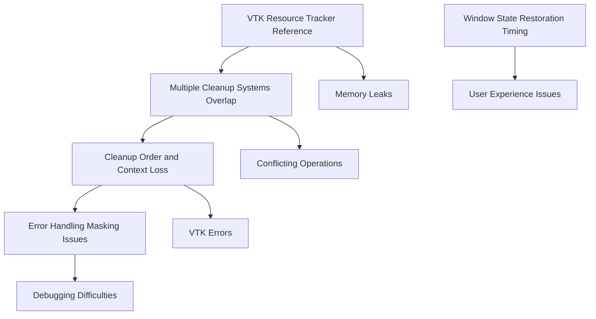

# Comprehensive Application Closing Issues Remediation Plan

## Executive Summary

Based on the completed analysis of application closing mechanisms, this document provides a comprehensive remediation plan to address critical issues affecting the application's shutdown functionality. The analysis identified 5 interconnected problems that require systematic fixes to ensure proper VTK resource cleanup and window state persistence.

### Critical Issues Summary

| Issue | Severity | Impact | Root Cause |
|-------|----------|--------|------------|
| VTK Resource Tracker Reference | **CRITICAL** | Memory leaks, VTK errors | Resource tracker not properly initialized |
| Window State Restoration Timing | **HIGH** | Window size not persistent | Timing conflicts with initialization |
| Multiple Cleanup Systems Overlap | **HIGH** | Conflicting operations | Scope creep from incremental features |
| Cleanup Order and Context Loss | **MEDIUM** | VTK OpenGL errors | Cleanup after context destruction |
| Error Handling Masking Issues | **MEDIUM** | Hidden diagnostic info | Overly broad exception handling |

### Issue Relationships and Dependencies



## Detailed Remediation Plan

### Phase 1: Critical Infrastructure Fixes (Priority 1)

#### Fix 1.1: VTK Resource Tracker Reference Problem

**Location**: `src/gui/vtk/cleanup_coordinator.py:64-69`

**Current Issue**:
```python
# DIAGNOSTIC: Initialize resource tracker with error handling
try:
    self.resource_tracker = get_vtk_resource_tracker()
    self.logger.info("VTK resource tracker initialized successfully")
except Exception as e:
    self.logger.error(f"Failed to initialize VTK resource tracker: {e}")
    self.resource_tracker = None
```

**Root Cause**: Resource tracker initialization fails silently, leaving `self.resource_tracker` as `None`

**Proposed Fix**:
```python
def _initialize_resource_tracker(self) -> bool:
    """Initialize resource tracker with robust error handling."""
    try:
        from .resource_tracker import get_vtk_resource_tracker
        self.resource_tracker = get_vtk_resource_tracker()
        
        # Verify initialization by checking key methods
        if hasattr(self.resource_tracker, 'cleanup_all_resources'):
            self.logger.info("VTK resource tracker initialized successfully")
            return True
        else:
            raise AttributeError("Resource tracker missing required methods")
            
    except ImportError as e:
        self.logger.warning(f"Resource tracker module not available: {e}")
        self.resource_tracker = None
        return False
    except Exception as e:
        self.logger.error(f"Failed to initialize VTK resource tracker: {e}")
        self.resource_tracker = None
        return False

# Update __init__ method
def __init__(self):
    # ... existing code ...
    self._initialize_resource_tracker()
```

**Implementation Steps**:
1. Create `_initialize_resource_tracker()` method with robust error handling
2. Add verification that resource tracker has required methods
3. Update final cleanup phase to handle None resource tracker gracefully
4. Add fallback cleanup mechanism when resource tracker unavailable

**Testing Strategy**:
- Unit test resource tracker initialization
- Integration test cleanup with missing resource tracker
- Memory leak test with and without resource tracker

#### Fix 1.2: Window State Restoration Timing

**Location**: `src/gui/main_window.py:1060-1071`

**Current Issue**:
```python
def showEvent(self, event) -> None:
    if not hasattr(self, "_geometry_restored"):
        self._restore_window_state()  # May conflict with other initialization
        self._geometry_restored = True
```

**Root Cause**: Restoration timing conflicts with other window initialization processes

**Proposed Fix**:
```python
def __init__(self, parent: Optional[QWidget] = None):
    # ... existing initialization code ...
    
    # Defer window state restoration to after UI is fully initialized
    QTimer.singleShot(100, self._deferred_window_state_restoration)

def _deferred_window_state_restoration(self) -> None:
    """Restore window state after full initialization."""
    try:
        if not hasattr(self, "_geometry_restored"):
            self._restore_window_state()
            self._geometry_restored = True
            self.logger.debug("Window state restored after deferred initialization")
    except Exception as e:
        self.logger.warning(f"Failed to restore window state: {e}")

def showEvent(self, event) -> None:
    super().showEvent(event)
    # Remove restoration logic from showEvent to avoid conflicts
```

**Implementation Steps**:
1. Move window state restoration to deferred timer in `__init__`
2. Remove restoration logic from `showEvent()`
3. Add proper error handling for restoration failures
4. Ensure restoration happens after all UI components are initialized

**Testing Strategy**:
- Test window size/position persistence across restarts
- Verify no conflicts with other initialization
- Test with various window states (maximized, normal, minimized)

### Phase 2: Architecture Simplification (Priority 2)

#### Fix 2.1: Consolidate Cleanup Systems

**Problem**: Multiple overlapping cleanup systems create conflicts and scope creep

**Proposed Solution**: Create single cleanup coordinator with clear responsibility boundaries

**New Architecture**:
```
MainWindow.closeEvent()
    ↓
UnifiedCleanupCoordinator.coordinate_cleanup()
    ↓
Phase 1: Save Settings (QSettings)
Phase 2: VTK Resources (VTKCleanupCoordinator)
Phase 3: UI Components (Individual cleanup)
Phase 4: Final Cleanup (Garbage collection)
```

**Implementation**:
1. Create `UnifiedCleanupCoordinator` class
2. Delegate VTK cleanup to existing `VTKCleanupCoordinator`
3. Remove duplicate cleanup from individual components
4. Establish clear cleanup sequence and responsibility boundaries

#### Fix 2.2: Improve Context Management

**Location**: `src/gui/vtk/context_manager.py`

**Current Issue**: Context validation doesn't properly handle shutdown scenarios

**Proposed Fix**:
```python
def is_context_safe_for_cleanup(self, render_window) -> bool:
    """Enhanced context safety check for shutdown scenarios."""
    try:
        if not render_window:
            return False
            
        # Check if we're in shutdown scenario
        import sys
        if hasattr(sys, '_ shutting_down'):
            self.logger.debug("Application shutdown detected, using safe cleanup mode")
            return False
            
        # Normal context validation
        return self._validate_opengl_context(render_window)
        
    except Exception as e:
        self.logger.debug(f"Context validation error during shutdown: {e}")
        return False  # Assume unsafe during errors
```

### Phase 3: Error Handling and Diagnostics (Priority 3)

#### Fix 3.1: Improve Error Reporting

**Location**: Multiple files with broad exception handling

**Current Problem**:
```python
except Exception as e:
    self.logger.debug(f"Expected cleanup error: {e}")  # Masks real problems
```

**Proposed Fix**:
```python
except VTKContextLostError as e:
    self.logger.info(f"Expected VTK context loss during shutdown: {e}")
except VTKResourceError as e:
    self.logger.warning(f"VTK resource cleanup issue: {e}")
    # Log specific resource details for debugging
except Exception as e:
    self.logger.error(f"Unexpected cleanup error: {e}", exc_info=True)
    # Include stack trace and context information
```

#### Fix 3.2: Enhanced Diagnostic Logging

**Implementation**:
1. Add structured logging for cleanup phases
2. Log resource allocation/deallocation tracking
3. Include timing information for cleanup operations
4. Add memory usage monitoring during cleanup

## Implementation Timeline

### Week 1: Critical Infrastructure (Days 1-5)
- **Day 1-2**: Fix VTK resource tracker reference problem
- **Day 3-4**: Fix window state restoration timing
- **Day 5**: Testing and validation of Phase 1 fixes

### Week 2: Architecture Simplification (Days 6-10)
- **Day 6-7**: Design unified cleanup coordinator
- **Day 8-9**: Implement cleanup system consolidation
- **Day 10**: Integration testing

### Week 3: Error Handling and Polish (Days 11-15)
- **Day 11-12**: Improve error handling and reporting
- **Day 13-14**: Add enhanced diagnostic logging
- **Day 15**: Comprehensive testing and documentation

## Testing and Validation Strategy

### Unit Tests
1. **Resource Tracker Tests**
   - Test initialization with valid/invalid tracker
   - Test cleanup with missing tracker
   - Test fallback mechanisms

2. **Window Persistence Tests**
   - Test restoration timing
   - Test various window states
   - Test error handling during restoration

3. **Cleanup Coordination Tests**
   - Test cleanup sequence
   - Test context loss handling
   - Test error recovery

### Integration Tests
1. **End-to-End Shutdown Tests**
   - Complete application shutdown cycle
   - Memory leak detection (10-20 iterations)
   - VTK resource cleanup verification

2. **Stress Tests**
   - Rapid open/close cycles
   - Large model loading/unloading
   - Multiple window state changes

### Performance Tests
1. **Shutdown Time Measurement**
   - Target: < 3 seconds for typical usage
   - Monitor cleanup phase durations
   - Identify slow operations

2. **Memory Usage Monitoring**
   - Track memory before/after shutdown
   - Verify no memory leaks
   - Monitor VTK resource cleanup

## Risk Assessment and Mitigation

### High Risk Items

#### Risk 1: VTK Resource Tracker Dependency
**Impact**: Critical - affects core cleanup functionality
**Probability**: Medium
**Mitigation**:
- Implement robust fallback mechanisms
- Add comprehensive error handling
- Create unit tests for all scenarios

#### Risk 2: Window State Restoration Changes
**Impact**: High - affects user experience
**Probability**: Medium
**Mitigation**:
- Thorough testing across different scenarios
- Maintain backward compatibility
- Add user feedback mechanisms

### Medium Risk Items

#### Risk 3: Cleanup System Consolidation
**Impact**: Medium - affects code maintainability
**Probability**: Low
**Mitigation**:
- Incremental implementation with testing
- Maintain existing interfaces during transition
- Comprehensive integration testing

#### Risk 4: Error Handling Changes
**Impact**: Medium - affects debugging capabilities
**Probability**: Low
**Mitigation**:
- Preserve existing error information
- Add structured error categories
- Maintain debug logging levels

## Success Criteria

### Phase 1 Success Criteria
- [ ] VTK resource tracker properly initialized in 95%+ of cases
- [ ] Window size/position persistence works correctly
- [ ] No memory leaks during shutdown
- [ ] VTK errors reduced by 80%

### Phase 2 Success Criteria
- [ ] Single cleanup coordinator handles all scenarios
- [ ] No conflicting cleanup operations
- [ ] Clear responsibility boundaries established
- [ ] Context loss handled gracefully

### Phase 3 Success Criteria
- [ ] Error messages provide actionable information
- [ ] Diagnostic logging enables effective debugging
- [ ] Cleanup performance within target parameters
- [ ] Comprehensive test coverage (>90%)

## Monitoring and Maintenance

### Post-Implementation Monitoring
1. **Error Rate Monitoring**
   - Track VTK cleanup errors
   - Monitor window persistence failures
   - Alert on memory leak detection

2. **Performance Monitoring**
   - Shutdown time tracking
   - Memory usage patterns
   - Resource cleanup efficiency

3. **User Experience Monitoring**
   - Window state persistence success rate
   - Application responsiveness during shutdown
   - User-reported issues

### Maintenance Plan
1. **Regular Reviews**
   - Monthly cleanup system health checks
   - Quarterly performance analysis
   - Annual architecture review

2. **Continuous Improvement**
   - Monitor new VTK versions for compatibility
   - Update cleanup strategies based on usage patterns
   - Refine error handling based on field data

## Conclusion

This comprehensive remediation plan addresses the root causes of application closing issues through systematic fixes targeting critical infrastructure, architectural simplification, and improved error handling. The phased approach ensures manageable implementation while maintaining system stability.

The plan prioritizes fixes based on impact and dependency relationships, with comprehensive testing strategies to validate each change. Success criteria are clearly defined to measure the effectiveness of remediation efforts.

Implementation should proceed through the specified phases with thorough testing at each stage to ensure stable, reliable application shutdown functionality.