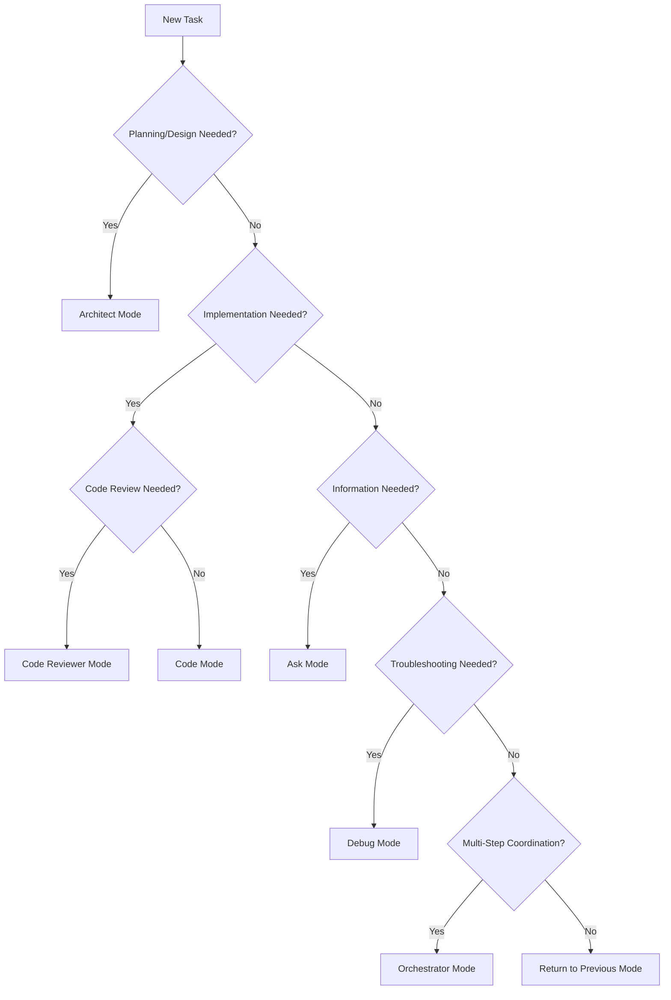
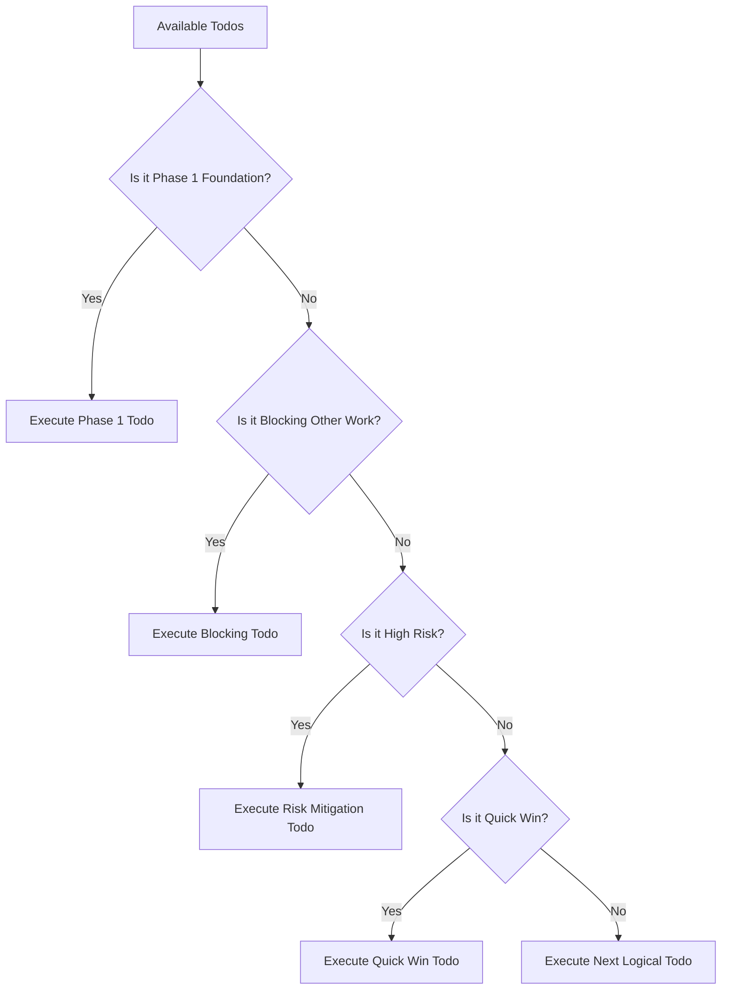

# 🎼 3D-MM Development Script: Mode Orchestration Guide

## 📋 Document Purpose

This document serves as the **Script** for consistent 3D-MM development across all modes. It defines:
- **Mode selection criteria** and usage patterns
- **Todo execution workflows** and quality gates
- **Progress management** and decision trees
- **Quality assurance** integration points

---

## 🎯 Mode Usage Strategy

### **1. ARCHITECT Mode** 🏗️
**When to Use:** Planning, design decisions, architecture choices
**Trigger Conditions:**
- New feature planning
- Architecture decisions
- Technical research and evaluation
- Risk assessment and mitigation

**Operations:**
- Research technical options using available tools
- Design system architecture and data flow
- Create detailed implementation plans
- Evaluate framework and library choices
- Plan testing strategies

### **2. CODE Mode** 💻
**When to Use:** Implementation, file creation, modifications
**Trigger Conditions:**
- After Architect approval of design
- Bug fixes and feature implementation
- File creation and structural changes

**Operations:**
- Create new files and directories
- Implement features according to Architect specifications
- Modify existing code for improvements
- Apply search and replace operations
- Execute terminal commands for builds/tests

### **3. ASK Mode** ❓
**When to Use:** Information gathering, clarification, external resources
**Trigger Conditions:**
- Need external documentation or examples
- Clarification on requirements
- Research into libraries or APIs
- Error troubleshooting information

**Operations:**
- Query MCP servers for library documentation
- Search external resources and examples
- Get clarification on complex topics
- Research best practices and patterns

### **4. DEBUG Mode** 🔍
**When to Use:** Troubleshooting, error analysis, performance investigation
**Trigger Conditions:**
- Application crashes or errors
- Performance issues identified
- Test failures need investigation
- Unexpected behavior in implemented features

**Operations:**
- Analyze error logs and stack traces
- Step through code execution
- Identify root causes of issues
- Propose fixes for identified problems

### **5. ORCHESTRATOR Mode** 🎼
**When to Use:** Multi-step coordination, complex workflows, cross-component integration
**Trigger Conditions:**
- Complex features requiring multiple components
- Integration between different systems
- Large refactoring operations
- Multi-phase implementation tasks

**Operations:**
- Coordinate between different modes
- Manage complex, multi-step workflows
- Track progress across multiple components
- Ensure consistency across the application

---

## 🎭 Mode Selection Decision Tree



---

## ⚡ Task Execution Workflow

### **Standard Implementation Pattern**
```python
def execute_todo(todo_item):
    """
    Standard workflow for todo execution
    """
    # 1. Mode Selection
    appropriate_mode = select_mode_for_todo(todo_item)

    # 2. Pre-Execution Checks
    verify_prerequisites(todo_item)
    check_dependencies(todo_item)

    # 3. Execution
    switch_to_mode(appropriate_mode)
    implement_todo(todo_item)

    # 4. Quality Gates
    run_tests(todo_item)
    update_progress(todo_item)

    # 5. Next Todo Selection
    select_next_todo()
```

### **Todo Execution Checklist**
- [ ] **Prerequisites Met**: Required components exist
- [ ] **Dependencies Available**: All needed tools/resources ready
- [ ] **Mode Appropriate**: Right mode for the task
- [ ] **Success Criteria Clear**: Know when todo is complete
- [ ] **Testing Plan**: How to verify completion

---

## 🎯 Todo Selection Algorithm

### **Priority Matrix**


### **Phase-Based Progression**
1. **Complete Phase 1** before Phase 2
2. **Complete Phase 2** before Phase 3
3. **Complete Phase 3** before Phase 4
4. **No phase skipping** unless explicitly approved

---

## 🚨 Exception Handling

### **When Things Go Wrong**
```python
def handle_todo_failure(todo_item, error):
    """
    Handle failed todo execution
    """
    # 1. Log the failure
    logger.error(f"Todo {todo_item} failed: {error}")

    # 2. Determine root cause
    switch_to_debug_mode()
    analyze_error(error)

    # 3. Fix or get clarification
    if technical_issue:
        switch_to_code_mode()
        implement_fix()
    else:
        switch_to_ask_mode()
        get_clarification()

    # 4. Retry or adjust
    retry_todo_or_adjust_plan()
```

### **Blocking Issue Resolution**
1. **Identify blocking todo**
2. **Switch to appropriate mode**
3. **Resolve blocking issue**
4. **Return to original task**
5. **Continue progression**

---

## 📊 Progress Management

### **Todo Status Tracking**
```python
TODO_STATUS = {
    "pending": "Not yet started",
    "in_progress": "Currently working",
    "completed": "Successfully finished",
    "blocked": "Waiting for dependencies",
    "cancelled": "No longer needed"
}
```

### **Phase Gate Criteria**
**Phase 1 Gate:**
- [ ] Logging system implemented and tested
- [ ] Basic PySide5 application structure works
- [ ] Database operations functional

**Phase 2 Gate:**
- [ ] 3D viewer displays STL files
- [ ] Model library interface operational
- [ ] Basic metadata editing works

**Phase 3 Gate:**
- [ ] All format parsers implemented
- [ ] Search functionality complete
- [ ] Performance targets met

---

## 🔧 Quality Assurance Integration

### **Code Quality Checks**
- **Code Reviewer Mode**: After major component completion
- **Code Skeptic Mode**: For critical path components
- **Test Engineer Mode**: Before phase transitions

### **Consistency Enforcement**
- **Logging Standards**: All components use consistent logging
- **Error Handling**: Uniform error handling patterns
- **UI Patterns**: Consistent user interface elements

---

## 🎯 Next Steps for 3D-MM

### **Immediate Action Plan**
1. **Current Mode**: Architect ✅
2. **Next Todo**: Implement logging system
3. **Mode Transition**: Architect → Code
4. **Success Criteria**: JSON logging with rotation working

### **Implementation Sequence**
```python
# Phase 1 Execution Plan
todos_to_execute = [
    "Design and implement rotatable logging system",
    "Create log file naming with timestamp and level",
    "Integrate logging throughout application",
    "Basic PySide5 application structure",
    "Database foundation implementation"
]

for todo in todos_to_execute:
    execute_todo_with_quality_gates(todo)
```

---

## 📈 Success Measurement

### **Per-Todo Success**
- [ ] **Functionality**: Todo requirements met
- [ ] **Quality**: Code review standards passed
- [ ] **Testing**: Unit tests created and passing
- [ ] **Documentation**: Implementation documented

### **Phase Success**
- [ ] **All todos completed**
- [ ] **Quality gates passed**
- [ ] **Integration tested**
- [ ] **Performance benchmarks met**

---

## 🎵 Script Execution

**To Start Implementation:**
1. **Begin in Architect mode** (current mode) ✅
2. **Switch to Code mode** for logging system implementation
3. **Use Ask mode** for PySide5/PyQt3D documentation research
4. **Switch to Code mode** for core implementation
5. **Use Debug mode** for any issues encountered
6. **Return to Architect mode** for major design decisions

**Mode Switching Guidelines:**
- **Stay in Code mode** for implementation sprints
- **Switch to Ask mode** when needing external information
- **Use Debug mode** immediately when issues arise
- **Return to Architect mode** for planning adjustments

---

## 📋 Mode Transition Rules

### **From Architect:**
- ✅ **To Code**: After design approval
- ✅ **To Ask**: When research needed
- ❌ **To Debug**: Only if design issues found

### **From Code:**
- ✅ **To Ask**: When technical clarification needed
- ✅ **To Debug**: When implementation issues found
- ✅ **To Architect**: When design changes needed
- ✅ **To Code Reviewer**: For quality checkpoints

### **From Ask:**
- ✅ **To Architect**: After gathering information
- ✅ **To Code**: With clear implementation path
- ✅ **To Debug**: When issue research complete

### **From Debug:**
- ✅ **To Code**: After issue resolution
- ✅ **To Ask**: When more information needed
- ✅ **To Architect**: When systemic issues found

---

*This Script ensures systematic, high-quality development of the 3D-MM application. All mode transitions and todo executions should follow this guide to maintain consistency and quality.*