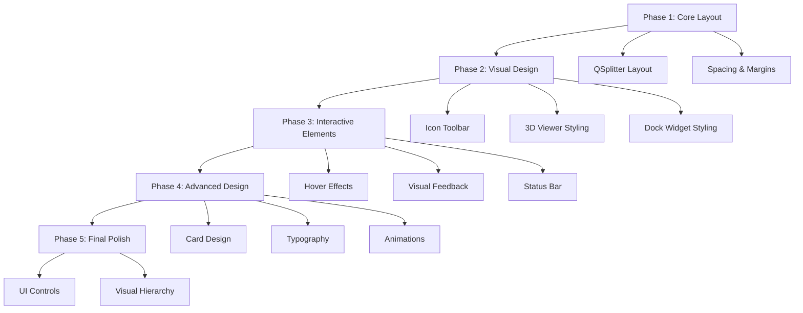

# UI Aesthetic Improvement Implementation Plan

## Overview
This document outlines the detailed implementation plan for completing the remaining 13 UI aesthetic improvements for the 3D-MM application. The plan prioritizes performance requirements while implementing modern Fluent Design principles.

## Current State Analysis
- ✅ Completed: Fluent Design color palette, variable-driven theming, tabbed metadata panel
- 🔄 Remaining: 13 UI improvement tasks focusing on layout, visual design, and interaction polish

## Implementation Priority Order

### Phase 1: Core Layout & Structure (Foundation)

#### 1. Implement QSplitter-based resizable panels layout for main window
**Files to modify:** `src/gui/main_window.py`
**Implementation approach:**
- Replace static dock widget layout with QSplitter-based central widget
- Create three-panel layout: Model Library | 3D Viewer | Properties/Metadata
- Implement collapsible panels with minimum size constraints
- Add splitter handles with modern styling

**Technical considerations:**
- Maintain existing dock widget functionality for floating panels
- Preserve layout persistence system
- Ensure splitter state is saved/restored with layout
- Add performance monitoring for layout changes

**Dependencies:** None (foundation for other improvements)

#### 2. Add proper spacing and margins following Fluent Design guidelines
**Files to modify:** `src/gui/theme.py`, all UI widget files
**Implementation approach:**
- Define spacing constants in theme.py (4px base unit, 8px, 16px, 24px)
- Create margin/padding utility functions
- Update all layouts to use consistent spacing
- Implement responsive spacing based on DPI

**Technical considerations:**
- Maintain performance with CSS-based spacing where possible
- Ensure spacing scales properly on high-DPI displays
- Add spacing validation in UI tests

**Dependencies:** QSplitter layout (for proper spacing application)

### Phase 2: Visual Design Elements

#### 3. Create custom toolbar with icon-based actions using QtAwesome
**Files to modify:** `src/gui/main_window.py`, `requirements.txt`
**Implementation approach:**
- Add QtAwesome dependency to requirements.txt
- Replace text-based toolbar actions with icon-based actions
- Implement icon-only buttons with tooltips
- Add icon theming support (light/dark mode)

**Technical considerations:**
- Cache icons to improve performance
- Implement fallback for missing icons
- Ensure icons scale properly on high-DPI displays
- Add icon loading progress feedback

**Dependencies:** Theme system (for icon colors)

#### 4. Enhance 3D viewer styling with modern frame and visual improvements
**Files to modify:** `src/gui/viewer_widget_vtk.py`
**Implementation approach:**
- Add modern frame with rounded corners and subtle border
- Implement gradient background for viewer area
- Add control panel styling improvements
- Enhance loading indicator design

**Technical considerations:**
- Maintain 30+ FPS performance requirement
- Ensure frame doesn't interfere with VTK rendering
- Add performance monitoring for styling changes
- Implement graceful degradation for older hardware

**Dependencies:** Spacing/margins system

#### 5. Improve dock widget styling with modern headers and better visual separation
**Files to modify:** `src/gui/main_window.py`, `src/gui/theme.py`
**Implementation approach:**
- Redesign dock widget headers with modern styling
- Add subtle shadows and borders for depth
- Implement collapse/expand animations
- Add drag handle indicators

**Technical considerations:**
- Maintain dock widget functionality
- Ensure styling doesn't impact performance
- Add hover states for interactive elements
- Preserve accessibility features

**Dependencies:** Theme system, spacing guidelines

### Phase 3: Interactive Elements & Feedback

#### 6. Implement interactive element polish with hover effects and transitions
**Files to modify:** `src/gui/theme.py`, all UI widget files
**Implementation approach:**
- Add smooth hover transitions for buttons
- Implement focus states with visual indicators
- Add micro-animations for interactive elements
- Create consistent interaction patterns

**Technical considerations:**
- Use CSS transitions for performance
- Limit animation duration to 200ms max
- Ensure animations don't impact 3D rendering performance
- Add option to disable animations for accessibility

**Dependencies:** Theme system, dock widget styling

#### 7. Add visual feedback for user interactions (buttons, selections, etc.)
**Files to modify:** `src/gui/theme.py`, `src/gui/metadata_editor.py`, `src/gui/model_library.py`
**Implementation approach:**
- Implement ripple effects for button clicks
- Add selection highlighting with smooth transitions
- Create loading states for async operations
- Add success/error feedback indicators

**Technical considerations:**
- Use lightweight animations for feedback
- Ensure feedback doesn't block UI operations
- Add performance monitoring for feedback systems
- Implement timeout for feedback states

**Dependencies:** Interactive element polish

#### 8. Enhance status bar with modern styling and better information display
**Files to modify:** `src/gui/main_window.py`
**Implementation approach:**
- Redesign status bar with modern styling
- Add progress indicators with smooth animations
- Implement status message queue with transitions
- Add system resource indicators

**Technical considerations:**
- Maintain status bar functionality
- Ensure updates don't impact performance
- Add filtering for status messages
- Implement status message priority system

**Dependencies:** Visual feedback system

### Phase 4: Advanced Design Elements

#### 9. Create card-based design elements for model library items
**Files to modify:** `src/gui/model_library.py`, `src/gui/theme.py`
**Implementation approach:**
- Design card-based layout for model items
- Add hover effects with elevation changes
- Implement card selection states
- Add thumbnail placeholders with loading states

**Technical considerations:**
- Optimize card rendering for large model lists
- Implement virtual scrolling for performance
- Add lazy loading for card thumbnails
- Ensure cards scale properly on different screen sizes

**Dependencies:** Spacing guidelines, interactive elements

#### 10. Implement typography hierarchy improvements across all UI elements
**Files to modify:** `src/gui/theme.py`, all UI widget files
**Implementation approach:**
- Define typography scale (H1, H2, H3, Body, Caption)
- Implement consistent font weights and sizes
- Add proper line height and spacing
- Create text color hierarchy

**Technical considerations:**
- Use system fonts for performance
- Ensure text remains readable on all backgrounds
- Add font size scaling for accessibility
- Implement text truncation with ellipsis

**Dependencies:** Theme system

#### 11. Add subtle animations and transitions for UI state changes
**Files to modify:** `src/gui/theme.py`, `src/gui/main_window.py`
**Implementation approach:**
- Implement panel slide animations
- Add fade transitions for mode changes
- Create smooth loading animations
- Add transition effects for theme changes

**Technical considerations:**
- Use hardware-accelerated animations
- Limit concurrent animations to maintain performance
- Add animation performance monitoring
- Implement animation quality settings based on hardware

**Dependencies:** All previous improvements

### Phase 5: Final Polish & Consistency

#### 12. Implement modern scrollbars and other UI controls styling
**Files to modify:** `src/gui/theme.py`
**Implementation approach:**
- Design modern scrollbar styling
- Style combo boxes, spin boxes, and other controls
- Add hover and focus states for all controls
- Ensure consistent styling across all UI elements

**Technical considerations:**
- Maintain control functionality
- Ensure custom scrollbars perform well
- Add proper mouse wheel support
- Implement touch-friendly control sizes

**Dependencies:** Typography hierarchy, visual feedback

#### 13. Create consistent visual hierarchy throughout the application
**Files to modify:** All UI files
**Implementation approach:**
- Audit all UI elements for consistency
- Implement visual weight hierarchy
- Add proper contrast ratios for accessibility
- Create design system documentation

**Technical considerations:**
- Ensure WCAG 2.1 AA compliance
- Add high contrast mode support
- Implement color blindness friendly palette
- Add visual hierarchy validation tests

**Dependencies:** All previous improvements

## Implementation Workflow

## Performance Considerations

1. **Animation Performance**: All animations will be limited to 200ms duration and use hardware acceleration where available
2. **Memory Usage**: Implement resource pooling for frequently used UI elements
3. **Rendering Impact**: Ensure UI changes don't impact 3D viewport performance (maintain 30+ FPS)
4. **Loading Times**: Implement progressive loading for complex UI elements

## Testing Strategy

1. **Performance Testing**: Monitor memory usage and frame rates during UI interactions
2. **Accessibility Testing**: Verify WCAG 2.1 AA compliance with automated and manual tests
3. **Visual Regression Testing**: Capture screenshots before/after changes to detect unintended modifications
4. **User Testing**: Conduct usability testing for major UI changes

## Dependencies & Requirements

### New Dependencies
- `QtAwesome`: For icon-based toolbar actions
- No additional performance-heavy dependencies

### Integration Points
- Theme system: All improvements must integrate with existing variable-driven theming
- Performance monitoring: All UI changes must be monitored for performance impact
- Layout persistence: New layout elements must work with existing save/restore system

## Success Criteria

1. All 13 improvements implemented without breaking existing functionality
2. Performance requirements maintained (30+ FPS, <2GB memory usage)
3. Accessibility standards met (WCAG 2.1 AA)
4. Visual consistency achieved across all UI elements
5. User feedback indicates improved usability and aesthetic appeal

## Timeline Estimate

- **Phase 1**: 2-3 days (foundation work)
- **Phase 2**: 3-4 days (visual design elements)
- **Phase 3**: 2-3 days (interactive elements)
- **Phase 4**: 3-4 days (advanced design)
- **Phase 5**: 2-3 days (final polish)

**Total Estimated Time**: 12-17 days

## Risk Mitigation

1. **Performance Risk**: Implement performance monitoring after each phase
2. **Compatibility Risk**: Test on minimum specified hardware requirements
3. **Accessibility Risk**: Conduct accessibility testing throughout implementation
4. **User Acceptance Risk**: Gather feedback on key changes during implementation