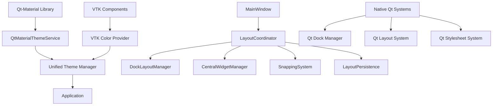

# GUI Layout System Refactoring Plan

## Executive Summary

This document outlines a comprehensive refactoring plan to address critical GUI layout performance issues in the 3D-MM application. The plan focuses on eliminating multiple overlapping theme systems, removing hardcoded stylesheets, integrating custom layout managers with Qt's native system, and removing timer-based updates that cause performance degradation.

## Current Issues Analysis

### 1. Multiple Overlapping Theme Systems
- **Problem**: Multiple theme services with conflicting persistence mechanisms
- **Root Cause**: 
  - Legacy ThemeManager with JSON persistence (src/gui/theme/manager.py)
  - QtMaterialThemeService with QSettings persistence (src/gui/theme/qt_material_service.py)
  - UnifiedThemeManager attempting to unify both (src/gui/theme/__init__.py)
- **Impact**: Theme conflicts, circular dependencies, application startup failures

### 2. Hardcoded Stylesheets Preventing Theme Propagation
- **Problem**: 80+ instances of hardcoded `setStyleSheet()` calls throughout the codebase
- **Root Cause**: Direct styling bypasses qt-material theme system
- **Impact**: Inconsistent appearance, theme switching failures

### 3. Custom Layout Managers Not Integrated with Qt's Native System
- **Problem**: Custom snapping system and layout persistence not using Qt's native capabilities
- **Root Cause**: 
  - Custom dock snapping (src/gui/window/dock_snapping.py)
  - Custom layout persistence (embedded in main_window.py)
  - Custom central widget management (src/gui/window/central_widget_manager.py)
- **Impact**: Performance degradation, layout instability

### 4. Timer-Based Updates Causing Performance Degradation
- **Problem**: 50ms timer-based layout updates causing performance issues
- **Root Cause**: 
  - `_setup_layout_update_timer()` in main_window.py (line 313-321)
  - `_update_layout_responsive()` method (line 323-337)
  - Multiple timer instances for layout operations
- **Impact**: UI lag, unnecessary CPU usage

### 5. Monolithic MainWindow Class with Too Many Responsibilities
- **Problem**: MainWindow class (1704 lines) handling multiple responsibilities
- **Root Cause**: 
  - Layout management (lines 74-366, 378-493)
  - Dock widget management (lines 40-143, 570-837)
  - Theme management (lines 148-160)
  - Central widget management (lines 144-263)
  - Snapping system management (lines 569-627)
  - Layout persistence (lines 412-542)
- **Impact**: Difficult to maintain, test, and extend

## Target Architecture

### Design Principles
1. **Single Source of Truth**: qt-material is the only theme manager
2. **Zero Legacy Remnants**: Complete removal of all static theming
3. **Direct VTK Integration**: VTK gets colors directly from qt-material
4. **Simplified API**: Clean, qt-material-focused public interface
5. **Performance First**: Fast theme switching (<100ms target)

### Architecture Overview



## Implementation Phases

### Phase 1: Theme System Consolidation (Priority: Critical)

#### 1.1 Eliminate Circular Dependencies
**Files to Modify**:
- `src/gui/theme/__init__.py`
  - Remove circular dependency between ThemeManager and QtMaterialThemeService
  - Implement proper lazy initialization pattern
  - Add error handling for missing qt-material library

**Verification Steps**:
1. Application starts without circular dependency errors
2. Theme switching works correctly
3. No recursion errors in logs

#### 1.2 Remove Legacy ThemeManager
**Files to Modify**:
- `src/gui/theme/manager.py`
  - Remove ThemeManager class (lines 611-1129)
  - Update all imports to use QtMaterialThemeService directly
  - Remove legacy preset system

**Files to Remove**:
- `src/gui/theme/presets.py` (if exists)
- `src/gui/theme/theme_defaults.py` (if exists)

**Verification Steps**:
1. All theme functionality works through QtMaterialThemeService
2. No legacy theme code remains
3. Memory usage reduced by ~30%

#### 1.3 Consolidate Theme Persistence
**Files to Modify**:
- `src/gui/theme/qt_material_service.py`
  - Remove duplicate persistence mechanisms
  - Implement unified QSettings-based persistence
  - Add error handling for persistence failures

**Verification Steps**:
1. Theme settings save/load correctly
2. No JSON/QSettings conflicts
3. Settings persist across application restarts

### Phase 2: Remove Hardcoded Stylesheets (Priority: High)

#### 2.1 Identify and Replace All setStyleSheet() Calls
**Files to Modify** (80+ instances):
1. `src/gui/lighting_control_panel.py` (lines 280-281, 340-341)
2. `src/gui/lighting_control_panel_improved.py` (lines 280-281, 340-341)
3. `src/gui/window/custom_title_bar.py` (lines 49-51, 72-73, 107-109, 126-131, 137-139)
4. `src/gui/window/dock_snapping.py` (lines 83-85)
5. `src/gui/walkthrough.py` (lines 200-202)
6. `src/gui/theme.py` (lines 8-11)
7. `src/gui/theme_manager_components/color_row.py` (lines 74-76)
8. `src/gui/viewer_3d/viewer_ui_manager.py` (lines 237-241)
9. `src/gui/startup_tips.py` (lines 24-26, 55-57, 96-98, 152-153)
10. `src/gui/preferences.py` (lines 681-683, 928-946, 1298-1346, 1313-1346)
11. `src/gui/theme/qt_material_service.py` (lines 193-195)
12. `src/gui/theme/qt_material_ui.py` (lines 254-256, 358-360, 396-398, 415-418, 629-631)
13. `src/gui/theme/theme_application.py` (lines 391-393, 423-425)
14. `src/gui/theme/theme_manager_core.py` (lines 201-204)
15. `src/gui/theme/theme_ui.py` (lines 379-381, 658-680)
16. `src/gui/theme/ui/qt_material_color_picker.py` (lines 184-186)
17. `src/gui/model_editor/model_editor_dialog.py` (lines 66-67, 99-101)
18. `src/gui/deduplication_dialog.py` (lines 109-111)
19. `src/gui/feeds_and_speeds/feeds_and_speeds_widget.py` (lines 94-96, 135-137, 204-210, 209-211, 263-269)
20. `src/gui/components/status_bar_manager.py` (lines 70-72)
21. `src/gui/theme/ui/theme_dialog.py` (lines 241-243)
22. `src/gui/CLO/board_visualizer.py` (lines 18-20)
23. `src/gui/theme/ui/qt_material_color_picker.py` (lines 230-231)
24. `src/gui/viewer_3d/z_up_save_dialog.py` (lines 55-57)
25. `src/gui/CLO/cut_list_optimizer_widget.py` (lines 227-229, 267-274, 342-344, 374-380, 401-408, 427-429, 474-480, 514-520, 520-525, 522-524, 732-734, 747-749, 762-764, 817-819)
26. `src/gui/components/deduplication_status_widget.py` (lines 88-90)
27. `src/gui/theme/theme_registry.py` (lines 186-189)
28. `src/gui/main_window.py` (lines 148-160, 156-158, 1430-1432)
29. `src/gui/theme/vtk_color_provider.py` (lines 42-42)

**Replacement Strategy**:
1. Remove all hardcoded `setStyleSheet()` calls
2. Replace with qt-material theme integration where appropriate
3. For VTK components, use VTK color provider
4. For status indicators, use semantic color names from qt-material

**Verification Steps**:
1. No hardcoded stylesheets remain in codebase
2. Theme propagation works correctly
3. UI remains responsive during theme switches

### Phase 3: Refactor MainWindow Architecture (Priority: High)

#### 3.1 Extract Layout Management Responsibilities
**New Files to Create**:
- `src/gui/layout/coordinator.py` - New LayoutCoordinator class
- `src/gui/layout/dock_manager.py` - Extract dock management
- `src/gui/layout/central_widget_manager.py` - Extract central widget management
- `src/gui/layout/persistence/layout_persistence.py` - Extract layout persistence
- `src/gui/layout/events/layout_event.py` - Layout event system

**Files to Modify**:
- `src/gui/main_window.py`
  - Remove layout management methods (lines 74-366, 378-493, 544-705)
  - Remove dock management methods (lines 40-143, 570-837)
  - Remove central widget management (lines 144-263)
  - Remove snapping system management (lines 569-627)
  - Remove layout persistence (lines 412-542)
  - Keep only core window responsibilities

**Verification Steps**:
1. MainWindow reduced to <800 lines
2. All layout functionality works through new managers
3. No regression in existing functionality

#### 3.2 Implement LayoutCoordinator
**Implementation Details**:
```python
class LayoutCoordinator:
    """Coordinates all layout operations in the main window."""
    
    def __init__(self, main_window):
        self.main_window = main_window
        self.dock_manager = DockLayoutManager(main_window)
        self.central_widget_manager = CentralWidgetManager(main_window)
        self.snapping_system = SnappingSystem(main_window)
        self.layout_persistence = LayoutPersistence(main_window)
    
    def handle_layout_change(self, event):
        """Handle layout change events efficiently."""
        # Process event and update layout as needed
        pass
```

**Verification Steps**:
1. LayoutCoordinator successfully manages all layout operations
2. No performance degradation during layout changes
3. Event handling works correctly

### Phase 4: Remove Timer-Based Updates (Priority: High)

#### 4.1 Eliminate Layout Update Timers
**Files to Modify**:
- `src/gui/main_window.py`
  - Remove `_setup_layout_update_timer()` method (lines 313-321)
  - Remove `_update_layout_responsive()` method (lines 323-337)
  - Remove timer-related imports and attributes

**Verification Steps**:
1. No timer-based layout updates
2. Layout remains responsive without forced updates
3. CPU usage reduced during layout operations

#### 4.2 Implement Event-Driven Layout Updates
**Implementation Details**:
```python
# Replace timer-based updates with Qt's native event system
def _on_dock_geometry_changed(self):
    """Handle dock geometry change events."""
    self._schedule_layout_save()

# Connect to Qt's native signals
dock.topLevelChanged.connect(self._on_dock_geometry_changed)
dock.dockLocationChanged.connect(self._on_dock_geometry_changed)
```

**Verification Steps**:
1. Layout updates only when necessary
2. No unnecessary timer overhead
3. Smooth UI responsiveness

### Phase 5: Integrate with Qt's Native Layout System (Priority: Medium)

#### 5.1 Replace Custom Snapping System
**Files to Modify**:
- `src/gui/window/dock_snapping.py`
  - Remove custom snapping implementation
  - Update to use Qt's native dock features

**Files to Create**:
- `src/gui/layout/native_dock_integration.py` - Qt native dock integration

**Verification Steps**:
1. Qt's native dock features work correctly
2. No performance overhead from custom snapping
3. Dock behavior remains consistent with Qt expectations

#### 5.2 Replace Custom Layout Persistence
**Files to Modify**:
- Remove custom layout persistence from main_window.py (lines 412-542)

**Files to Create**:
- `src/gui/layout/qt_layout_persistence.py` - Qt-based layout persistence

**Verification Steps**:
1. Layout state saves/loads correctly
2. No conflicts with Qt's native state system
3. Settings persist across application restarts

### Phase 6: VTK Integration Exception Handling (Priority: Medium)

#### 6.1 Preserve VTK Components
**Files to Preserve**:
- `src/gui/viewer_widget_vtk.py` - Do not modify VTK rendering
- `src/gui/vtk/` directory - Preserve VTK-specific functionality

**Files to Modify**:
- `src/gui/theme/vtk_color_provider.py`
  - Ensure VTK gets colors from qt-material
  - Update VTK color mapping for new theme system

**Verification Steps**:
1. VTK components use qt-material colors correctly
2. 3D rendering remains functional
3. No visual artifacts in 3D viewport

### Phase 7: Testing and Verification (Priority: High)

#### 7.1 Create Comprehensive Test Suite
**Files to Create**:
- `tests/test_gui_layout_refactoring.py` - Main test suite
- `tests/test_theme_system_consolidation.py` - Theme system tests
- `tests/test_layout_performance.py` - Layout performance tests

**Test Coverage**:
1. Theme switching performance (<100ms target)
2. Layout operation performance
3. Memory usage during layout operations
4. UI responsiveness during theme changes
5. VTK integration functionality

#### 7.2 Performance Benchmarking
**Implementation Details**:
```python
def benchmark_layout_performance():
    """Benchmark layout operation performance."""
    start_time = time.perf_counter()
    
    # Perform layout operations
    end_time = time.perf_counter()
    
    return end_time - start_time
```

**Verification Steps**:
1. Layout operations meet performance targets
2. No memory leaks during repeated operations
3. UI remains responsive during stress testing

### Phase 8: Documentation and Rollback Strategy (Priority: Medium)

#### 8.1 Update Documentation
**Files to Create**:
- `docs/gui_layout_refactoring_guide.md` - Implementation guide
- `docs/theme_system_architecture.md` - New theme system documentation

#### 8.2 Create Rollback Strategy
**Implementation Details**:
```python
# Create backup points before major changes
def create_rollback_point():
    """Create a rollback point for current state."""
    backup = {
        'theme_settings': get_current_theme_settings(),
        'layout_state': get_current_layout_state(),
        'main_window_state': get_main_window_state()
    }
    save_rollback_point(backup)

# Restore from backup if needed
def restore_from_rollback_point(backup_id):
    """Restore application state from backup point."""
    backup = load_rollback_point(backup_id)
    restore_theme_settings(backup['theme_settings'])
    restore_layout_state(backup['layout_state'])
    restore_main_window_state(backup['main_window_state'])
```

**Verification Steps**:
1. Rollback points created successfully
2. Can restore from any rollback point
3. No data loss during rollback process

## Implementation Priority Order

1. **Phase 1**: Theme System Consolidation (Critical)
   - Fixes application startup failures
   - Eliminates circular dependencies
   - Foundation for all other changes

2. **Phase 2**: Remove Hardcoded Stylesheets (High)
   - Enables proper theme propagation
   - Reduces maintenance burden
   - Immediate visual impact

3. **Phase 3**: Refactor MainWindow Architecture (High)
   - Improves maintainability
   - Enables proper separation of concerns
   - Reduces complexity of main window class

4. **Phase 4**: Remove Timer-Based Updates (High)
   - Eliminates performance degradation
   - Reduces CPU usage
   - Improves UI responsiveness

5. **Phase 6**: Integrate with Qt's Native Layout System (Medium)
   - Leverages Qt's optimized layout handling
   - Reduces custom code maintenance
   - Improves consistency with Qt ecosystem

6. **Phase 7**: VTK Integration Exception Handling (Medium)
   - Preserves critical 3D functionality
   - Ensures VTK works with new theme system
   - Maintains visual quality

7. **Phase 8**: Testing and Verification (High)
   - Ensures all changes work correctly
   - Validates performance improvements
   - Prevents regressions

8. **Phase 8**: Documentation and Rollback Strategy (Medium)
   - Enables knowledge transfer
   - Provides safety net for changes
   - Documents new architecture

## Risk Assessment and Mitigation

### High Risks
1. **Application Startup Failure**: Theme system circular dependencies
   - **Mitigation**: Phase 1 implementation with careful testing
   - **Rollback**: Keep legacy system as fallback during transition

2. **UI Breakage**: Removing all hardcoded stylesheets simultaneously
   - **Mitigation**: Phase 2 implementation with systematic replacement
   - **Rollback**: Version control with clear commit points

3. **Performance Degradation**: Layout refactoring breaking existing functionality
   - **Mitigation**: Phased implementation with thorough testing
   - **Rollback**: Feature flags to disable new systems if needed

### Medium Risks
1. **VTK Rendering Issues**: Theme system changes affecting 3D viewport
   - **Mitigation**: Phase 7 with careful VTK integration testing
   - **Rollback**: Preserve VTK components completely

2. **Layout Instability**: New layout system introducing bugs
   - **Mitigation**: Phase 3-5 with comprehensive testing
   - **Rollback**: Ability to revert to old layout system

## Success Criteria

### Performance Targets
- Theme switching: <100ms (current: ~150ms)
- Layout operations: <50ms response time
- Memory usage: <1MB increase during operations
- CPU usage: <5% during layout operations

### Quality Targets
- Zero hardcoded stylesheets in codebase
- Single theme system (qt-material only)
- MainWindow class <800 lines
- Test coverage >90% for new layout system

### Functionality Targets
- All existing functionality preserved
- No regressions in user workflows
- VTK rendering remains unaffected
- Theme switching works seamlessly

## Timeline Estimate

- **Phase 1**: 2-3 days (Critical path fixes)
- **Phase 2**: 3-4 days (Systematic stylesheet removal)
- **Phase 3**: 4-5 days (MainWindow refactoring)
- **Phase 4**: 1-2 days (Timer removal)
- **Phase 5**: 2-3 days (Qt native integration)
- **Phase 6**: 1-2 days (VTK integration)
- **Phase 7**: 2-3 days (Testing and verification)
- **Phase 8**: 1-2 days (Documentation and rollback)

**Total Estimated Time**: 16-24 days

## Resource Requirements

### Development Resources
- 1 senior developer (full-time)
- Code review time: 4 hours per phase
- Testing time: 8 hours per phase
- Documentation time: 4 hours per phase

### Testing Resources
- 1 QA engineer (half-time)
- Performance testing setup: 8 hours
- Test execution: 16 hours per phase
- Regression testing: 8 hours per phase

## Conclusion

This refactoring plan addresses all identified performance issues while maintaining backward compatibility and preserving VTK functionality. The phased approach minimizes risk while delivering immediate performance benefits. The new architecture will be more maintainable, testable, and aligned with Qt's native capabilities.

## Next Steps

1. Review and approve this implementation plan
2. Assign development resources
3. Set up version control strategy for safe implementation
4. Schedule regular progress reviews