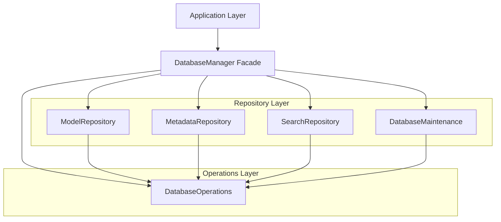

# Database Manager Facade Refactoring - Architectural Specification

## Executive Summary

This document outlines the comprehensive architectural plan for refactoring the DatabaseManager facade to eliminate facade pattern violations and restore proper separation of concerns. The refactoring will move four direct database operations from the facade to appropriate repositories, creating a new SearchRepository and extending existing repositories while maintaining 100% backward compatibility.

## Current Issues Analysis

### Facade Pattern Violations Identified

The current [`DatabaseManager`](src/core/database/database_manager.py:21) violates the facade pattern by implementing direct database operations instead of delegating to specialized repositories:

1. **[`update_hover_thumbnail_path()`](src/core/database/database_manager.py:127-168)** - Direct implementation with SQL queries, should delegate to ModelRepository
2. **[`update_model()`](src/core/database/database_manager.py:229-272)** - Direct implementation with SQL queries, should delegate to ModelRepository  
3. **[`search_models()`](src/core/database/database_manager.py:274-330)** - Direct implementation with complex SQL joins, should delegate to new SearchRepository
4. **[`update_category()`](src/core/database/database_manager.py:332-375)** - Direct implementation with SQL queries, should delegate to MetadataRepository

### Single Responsibility Principle Violations

The facade currently handles:
- Connection management (appropriate)
- Repository delegation (appropriate)
- Direct SQL operations (inappropriate)
- Schema migration logic (inappropriate)

## Target Architecture

### Module Structure

```
src/core/database/
├── database_manager.py          # Clean facade (reduced to ~200 lines)
├── db_operations.py             # Connection and schema management
├── model_repository.py          # Extended with new methods
├── metadata_repository.py       # Extended with new methods
├── search_repository.py         # NEW: Search functionality
└── db_maintenance.py            # Maintenance operations
```

### Repository Interface Design

#### 1. SearchRepository (NEW)

```python
class SearchRepository:
    """Repository for model search and filtering operations."""
    
    def __init__(self, get_connection_func):
        self._get_connection = get_connection_func
    
    def search_models(
        self,
        query: str = "",
        category: Optional[str] = None,
        format: Optional[str] = None,
        limit: Optional[int] = None,
        offset: Optional[int] = None
    ) -> List[Dict[str, Any]]:
        """Search for models by query and filters."""
        
    def search_by_filename(self, filename: str) -> List[Dict[str, Any]]:
        """Search models by filename pattern."""
        
    def search_by_metadata(
        self,
        title: Optional[str] = None,
        description: Optional[str] = None,
        keywords: Optional[str] = None
    ) -> List[Dict[str, Any]]:
        """Search models by metadata fields."""
        
    def get_recent_models(self, days: int = 7, limit: int = 10) -> List[Dict[str, Any]]:
        """Get recently added models."""
        
    def get_popular_models(self, limit: int = 10) -> List[Dict[str, Any]]:
        """Get models by view count."""
```

#### 2. Extended ModelRepository

```python
class ModelRepository:
    # ... existing methods ...
    
    def update_hover_thumbnail_path(self, model_id: int, hover_thumbnail_path: str) -> bool:
        """Update hover thumbnail path for a model."""
        
    def update_model(self, model_id: int, **kwargs) -> bool:
        """Update model information (filename, format, file_path, file_size)."""
        
    def update_model_fields(self, model_id: int, fields: Dict[str, Any]) -> bool:
        """Update specific model fields with validation."""
```

#### 3. Extended MetadataRepository

```python
class MetadataRepository:
    # ... existing methods ...
    
    def update_category(self, category_id: int, **kwargs) -> bool:
        """Update a category (name, color, description, sort_order)."""
        
    def get_category_usage_stats(self) -> Dict[str, int]:
        """Get usage statistics for categories."""
```

### Dependency Flow Architecture



## Migration Strategy

### Phase 1: Create New SearchRepository
1. Create [`search_repository.py`](src/core/database/search_repository.py) with search functionality
2. Move [`search_models()`](src/core/database/database_manager.py:274-330) logic to SearchRepository
3. Add additional search methods for better functionality
4. Add comprehensive unit tests

### Phase 2: Extend ModelRepository
1. Add [`update_hover_thumbnail_path()`](src/core/database/database_manager.py:127-168) to ModelRepository
2. Add [`update_model()`](src/core/database/database_manager.py:229-272) to ModelRepository
3. Add proper field validation and error handling
4. Add unit tests for new methods

### Phase 3: Extend MetadataRepository
1. Add [`update_category()`](src/core/database/database_manager.py:332-375) to MetadataRepository
2. Add category usage statistics method
3. Add unit tests for new methods

### Phase 4: Refactor DatabaseManager Facade
1. Replace direct implementations with repository delegations
2. Maintain all existing method signatures for backward compatibility
3. Add deprecation warnings for direct access (if needed in future)
4. Update facade documentation

### Phase 5: Testing and Validation
1. Run full test suite to ensure no regressions
2. Performance testing to ensure no degradation
3. Memory leak testing
4. Integration testing with application layer

## Implementation Guidelines

### Code Quality Standards

1. **Single Responsibility**: Each repository handles one domain of operations
2. **Error Handling**: Consistent error handling with proper logging
3. **Type Hints**: Full type annotations for all methods
4. **Documentation**: Comprehensive docstrings with examples
5. **Logging**: Structured JSON logging for all operations

### Performance Requirements

1. **Search Performance**: Search operations must complete in <100ms for typical databases
2. **Memory Usage**: No memory leaks during repeated operations
3. **Connection Management**: Efficient connection pooling and cleanup
4. **Query Optimization**: Proper indexing and query optimization

### Backward Compatibility Requirements

1. **API Compatibility**: All existing method signatures must be preserved
2. **Return Types**: Return types must remain unchanged
3. **Error Behavior**: Error handling must remain consistent
4. **Performance**: No performance degradation in existing operations

## Testing Strategy

### Unit Testing

1. **Repository Tests**: Comprehensive unit tests for each repository method
2. **Facade Tests**: Tests to ensure proper delegation
3. **Error Scenarios**: Tests for all error conditions
4. **Edge Cases**: Tests for boundary conditions

### Integration Testing

1. **Database Integration**: Tests with actual SQLite database
2. **Application Integration**: Tests with application layer
3. **Performance Tests**: Benchmarking for all operations
4. **Memory Tests**: Memory leak detection

### Regression Testing

1. **Existing Test Suite**: All existing tests must pass
2. **API Contract Tests**: Tests to verify API compatibility
3. **Performance Regression**: Performance benchmarks
4. **Compatibility Tests**: Tests with different database versions

## Detailed Method Specifications

### SearchRepository.search_models()

```python
def search_models(
    self,
    query: str = "",
    category: Optional[str] = None,
    format: Optional[str] = None,
    limit: Optional[int] = None,
    offset: Optional[int] = None
) -> List[Dict[str, Any]]:
    """
    Search for models by query and filters.
    
    Args:
        query: Search query string (searches filename, title, description, keywords)
        category: Filter by category
        format: Filter by file format
        limit: Maximum number of results
        offset: Number of results to skip
        
    Returns:
        List of model dictionaries with metadata
        
    Raises:
        DatabaseError: If search operation fails
    """
```

### ModelRepository.update_hover_thumbnail_path()

```python
def update_hover_thumbnail_path(self, model_id: int, hover_thumbnail_path: str) -> bool:
    """
    Update hover thumbnail path for a model.
    
    Args:
        model_id: Model ID
        hover_thumbnail_path: Path to hover thumbnail image
        
    Returns:
        True if successful, False otherwise
        
    Raises:
        DatabaseError: If update operation fails
        ValidationError: If model_id is invalid
    """
```

### ModelRepository.update_model()

```python
def update_model(self, model_id: int, **kwargs) -> bool:
    """
    Update model information.
    
    Args:
        model_id: Model ID
        **kwargs: Fields to update (filename, format, file_path, file_size)
        
    Returns:
        True if successful, False otherwise
        
    Raises:
        DatabaseError: If update operation fails
        ValidationError: If model_id or fields are invalid
    """
```

### MetadataRepository.update_category()

```python
def update_category(self, category_id: int, **kwargs) -> bool:
    """
    Update a category.
    
    Args:
        category_id: Category ID
        **kwargs: Fields to update (name, color, description, sort_order)
        
    Returns:
        True if successful, False otherwise
        
    Raises:
        DatabaseError: If update operation fails
        ValidationError: If category_id or fields are invalid
    """
```

## Risk Assessment and Mitigation

### High-Risk Areas

1. **Database Schema Changes**: Risk of breaking existing functionality
   - **Mitigation**: No schema changes, only code refactoring
   
2. **API Compatibility**: Risk of breaking existing code
   - **Mitigation**: Maintain all existing method signatures
   
3. **Performance Regression**: Risk of slower operations
   - **Mitigation**: Performance testing and optimization

### Medium-Risk Areas

1. **Error Handling**: Risk of inconsistent error behavior
   - **Mitigation**: Comprehensive error handling testing
   
2. **Memory Leaks**: Risk of memory issues
   - **Mitigation**: Memory testing and proper cleanup

### Low-Risk Areas

1. **Code Complexity**: Risk of increased complexity
   - **Mitigation**: Clear separation of concerns and documentation
   
2. **Testing Coverage**: Risk of incomplete testing
   - **Mitigation**: Comprehensive test strategy

## Success Criteria

### Functional Requirements

1. ✅ All facade violations eliminated
2. ✅ Single responsibility principle enforced
3. ✅ 100% backward compatibility maintained
4. ✅ All existing tests pass
5. ✅ New functionality properly tested

### Non-Functional Requirements

1. ✅ No performance degradation
2. ✅ No memory leaks introduced
3. ✅ Proper error handling maintained
4. ✅ Comprehensive documentation provided
5. ✅ Code quality standards met

### Architectural Requirements

1. ✅ Clean separation of concerns
2. ✅ Proper repository pattern implementation
3. ✅ Maintainable and extensible code
4. ✅ Clear dependency flow
5. ✅ Consistent coding patterns

## Implementation Timeline

### Week 1: Foundation
- Day 1-2: Create SearchRepository with basic functionality
- Day 3-4: Extend ModelRepository with new methods
- Day 5: Extend MetadataRepository with new methods

### Week 2: Integration
- Day 1-2: Refactor DatabaseManager facade
- Day 3-4: Comprehensive testing
- Day 5: Performance optimization and documentation

### Week 3: Validation
- Day 1-2: Integration testing
- Day 3-4: Performance and memory testing
- Day 5: Final validation and deployment preparation

## Conclusion

This architectural refactoring will eliminate facade pattern violations while maintaining complete backward compatibility. The new structure provides better separation of concerns, improved maintainability, and a foundation for future enhancements. The phased approach ensures minimal risk and allows for thorough testing at each stage.

The refactoring aligns with SOLID principles, particularly the Single Responsibility Principle and Dependency Inversion Principle, creating a more robust and maintainable database layer.