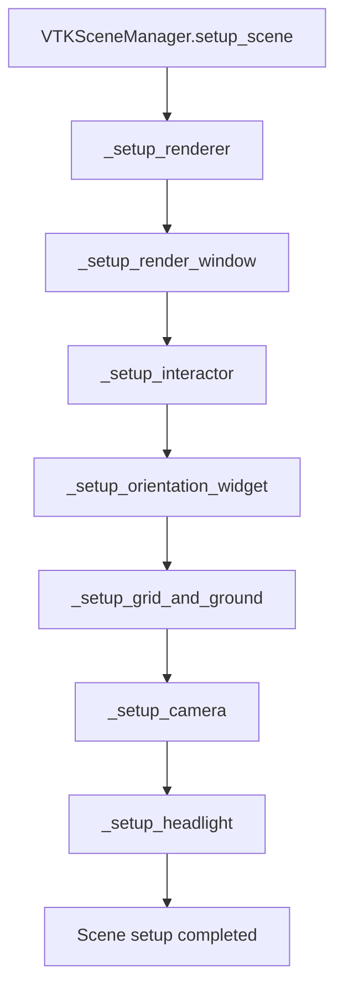
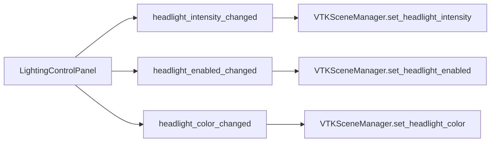

# Headlight System Fix - Architectural Specification

## Executive Summary

This document provides a comprehensive architectural specification for fixing the critical headlight issue in the VTK 3D viewer. The headlight system is currently non-functional due to two primary issues: missing initialization during scene setup and a bug in the intensity setting method that creates multiple headlights.

## Current Issues Analysis

### Primary Issue: Missing Headlight Initialization
- **Problem**: The `_setup_headlight()` method exists in `VTKSceneManager` but is never called during scene setup
- **Location**: `src/gui/viewer_3d/vtk_scene_manager.py`, lines 66-74 (setup_scene method)
- **Impact**: Headlight is never created, resulting in no camera-following illumination

### Secondary Issue: Multiple Headlight Creation Bug
- **Problem**: The `set_headlight_intensity()` method calls `_setup_headlight()` every time intensity is set
- **Location**: `src/gui/viewer_3d/vtk_scene_manager.py`, line 174
- **Impact**: Creates multiple headlights instead of updating the existing one, causing memory leaks and rendering issues

### Current State Analysis
- Headlight exists in code but is never initialized during scene setup
- Tabbed lighting control panel has been implemented with headlight controls
- Camera controller integration is in place but headlight is not functional
- Two existing directional lights (0.8 and 0.5 intensity) provide ambient lighting
- User expects camera-following headlight that creates dynamic shadows

## Solution Architecture

### Headlight Initialization Strategy

#### Scene Setup Integration


**Implementation Details:**
1. Add `_setup_headlight()` call to the `setup_scene()` method after `_setup_camera()` (line 74)
2. Ensure headlight is created after camera is positioned to get proper initial position
3. Default headlight to enabled state with 0.6 intensity as requested
4. Position headlight at camera position and point to camera focal point

#### Headlight Properties
- **Type**: Point light (camera-following)
- **Default Intensity**: 0.6 (complements existing directional lights)
- **Default Color**: Theme light color
- **Attenuation**: (1.0, 0.0, 0.02) for realistic point light behavior
- **Position**: Camera position
- **Focal Point**: Camera focal point

### Bug Fix Strategy for set_headlight_intensity Method

#### Current Implementation Problem
```python
def set_headlight_intensity(self, intensity: float) -> None:
    if self.headlight:
        self.headlight_intensity = max(0.0, min(1.0, intensity))
        self.headlight.SetIntensity(self.headlight_intensity)
        logger.debug(f"Headlight intensity set to {self.headlight_intensity}")
    
    # BUG: This creates multiple headlights!
    self._setup_headlight()
```

#### Fixed Implementation
```python
def set_headlight_intensity(self, intensity: float) -> None:
    """
    Set the headlight intensity.
    
    Args:
        intensity: Light intensity (0.0 to 1.0)
    """
    # Clamp intensity to valid range
    self.headlight_intensity = max(0.0, min(1.0, intensity))
    
    # Update existing headlight or create if it doesn't exist
    if self.headlight:
        self.headlight.SetIntensity(self.headlight_intensity)
        logger.debug(f"Headlight intensity updated to {self.headlight_intensity}")
    else:
        # Create headlight if it doesn't exist
        self._setup_headlight()
        logger.info(f"Headlight created with intensity {self.headlight_intensity}")
```

### Integration Strategy with Tabbed Lighting Controls

#### Signal Connection Architecture


#### Required Signal Connections
1. **headlight_intensity_changed** → `VTKSceneManager.set_headlight_intensity()`
2. **headlight_enabled_changed** → `VTKSceneManager.set_headlight_enabled()`
3. **headlight_color_changed** → `VTKSceneManager.set_headlight_color()`

#### Integration Points
- **Central Widget Manager**: Connect lighting panel signals to VTK scene manager
- **Main Window**: Handle headlight state persistence
- **Camera Controller**: Update headlight position on camera changes

### Camera Integration Strategy

#### Headlight Position Updates
The headlight must follow camera movements to maintain the camera-following behavior:

1. **Initial Position**: Set during `_setup_headlight()` after camera is positioned
2. **Camera Movement Updates**: Called from camera controller methods:
   - `fit_camera_to_model()`
   - `fit_camera_preserving_orientation()`
   - `reset_view()`
   - `rotate_around_view_axis()`

#### Update Mechanism
```python
def update_headlight_position(self) -> None:
    """Update headlight position to follow camera."""
    if not self.headlight or not self.renderer:
        return
        
    try:
        camera = self.renderer.GetActiveCamera()
        if not camera:
            return
            
        camera_pos = camera.GetPosition()
        focal_point = camera.GetFocalPoint()
        
        # Update headlight position and focal point
        self.headlight.SetPosition(*camera_pos)
        self.headlight.SetFocalPoint(*focal_point)
        
        logger.debug(f"Headlight position updated to camera: {camera_pos}")
        
    except Exception as e:
        logger.error(f"Failed to update headlight position: {e}")
```

## Implementation Plan

### Phase 1: Core Headlight Fixes

#### 1.1 Fix Scene Setup Integration
**File**: `src/gui/viewer_3d/vtk_scene_manager.py`
**Method**: `setup_scene()` (lines 66-74)

**Changes Required**:
```python
@log_function_call(logger)
def setup_scene(self) -> None:
    """Set up the VTK scene with renderer and interactor."""
    self._setup_renderer()
    self._setup_render_window()
    self._setup_interactor()
    self._setup_orientation_widget()
    self._setup_grid_and_ground()
    self._setup_camera()
    self._setup_headlight()  # ADD THIS LINE
    logger.debug("VTK scene setup completed")
```

#### 1.2 Fix set_headlight_intensity Method
**File**: `src/gui/viewer_3d/vtk_scene_manager.py`
**Method**: `set_headlight_intensity()` (lines 161-174)

**Changes Required**:
- Remove the unconditional `_setup_headlight()` call
- Add proper headlight existence checking
- Add comprehensive logging

#### 1.3 Add Headlight Enable/Disable Methods
**File**: `src/gui/viewer_3d/vtk_scene_manager.py`

**New Methods Required**:
```python
def set_headlight_enabled(self, enabled: bool) -> None:
    """Enable or disable the headlight."""
    if self.headlight:
        self.headlight.SetSwitch(int(enabled))  # VTK uses 0/1 for on/off
        logger.debug(f"Headlight {'enabled' if enabled else 'disabled'}")
    else:
        logger.warning("Cannot enable/disable headlight: headlight not created")

def set_headlight_color(self, r: float, g: float, b: float) -> None:
    """Set the headlight color."""
    if self.headlight:
        self.headlight.SetColor(r, g, b)
        logger.debug(f"Headlight color set to RGB({r}, {g}, {b})")
    else:
        logger.warning("Cannot set headlight color: headlight not created")
```

### Phase 2: Control Integration

#### 2.1 Connect Lighting Panel Signals
**File**: `src/gui/window/central_widget_manager.py`
**Method**: `setup_central_widget()` (around line 100)

**Changes Required**:
```python
# Connect headlight signals
if hasattr(self.main_window, "lighting_panel") and self.main_window.lighting_panel:
    # Existing connections...
    
    # ADD HEADLIGHT CONNECTIONS
    self.main_window.lighting_panel.headlight_intensity_changed.connect(self._update_headlight_intensity)
    self.main_window.lighting_panel.headlight_enabled_changed.connect(self._update_headlight_enabled)
    self.main_window.lighting_panel.headlight_color_changed.connect(self._update_headlight_color)
    
    # Set initial headlight values
    if hasattr(self.main_window.viewer_widget, 'scene_manager'):
        scene_manager = self.main_window.viewer_widget.scene_manager
        self.main_window.lighting_panel.set_headlight_values(
            enabled=True,  # Default to enabled
            intensity=scene_manager.headlight_intensity,
            color=scene_manager.color_provider.get_vtk_color('light_color'),
            emit_signals=False,
        )
```

#### 2.2 Add Headlight Update Handlers
**File**: `src/gui/window/central_widget_manager.py`

**New Methods Required**:
```python
def _update_headlight_intensity(self, intensity: float) -> None:
    """Update headlight intensity from lighting panel."""
    if hasattr(self.main_window, 'viewer_widget') and hasattr(self.main_window.viewer_widget, 'scene_manager'):
        self.main_window.viewer_widget.scene_manager.set_headlight_intensity(intensity)

def _update_headlight_enabled(self, enabled: bool) -> None:
    """Update headlight enabled state from lighting panel."""
    if hasattr(self.main_window, 'viewer_widget') and hasattr(self.main_window.viewer_widget, 'scene_manager'):
        self.main_window.viewer_widget.scene_manager.set_headlight_enabled(enabled)

def _update_headlight_color(self, r: float, g: float, b: float) -> None:
    """Update headlight color from lighting panel."""
    if hasattr(self.main_window, 'viewer_widget') and hasattr(self.main_window.viewer_widget, 'scene_manager'):
        self.main_window.viewer_widget.scene_manager.set_headlight_color(r, g, b)
```

### Phase 3: Integration Testing

#### 3.1 Headlight Functionality Tests
**File**: `tests/test_headlight_system.py`

**Test Cases Required**:
1. **Headlight Creation Test**: Verify headlight is created during scene setup
2. **Intensity Change Test**: Verify intensity changes without creating multiple headlights
3. **Camera Following Test**: Verify headlight follows camera position
4. **Control Integration Test**: Verify lighting panel controls work correctly
5. **Dynamic Shadow Test**: Verify shadows change when rotating models

#### 3.2 Performance Tests
**Test Cases Required**:
1. **Memory Leak Test**: Run intensity changes 20 times to verify no memory leaks
2. **Performance Benchmark**: Verify no performance degradation during camera movements
3. **Render Frame Rate Test**: Maintain minimum 30 FPS during model interaction

## Logging Strategy

### Headlight Operation Logging
All headlight operations must include comprehensive JSON logging:

```python
logger.debug("Headlight operation details", extra={
    "operation": "set_intensity",
    "old_intensity": old_intensity,
    "new_intensity": new_intensity,
    "headlight_exists": self.headlight is not None,
    "camera_position": camera_pos if camera else None
})
```

### Required Log Points
1. **Headlight Creation**: Log when headlight is created with initial properties
2. **Intensity Changes**: Log all intensity changes with old/new values
3. **Enable/Disable Changes**: Log when headlight is enabled or disabled
4. **Position Updates**: Log when headlight position follows camera
5. **Error Conditions**: Log all errors with detailed context

## Risk Assessment and Mitigation

### High-Risk Areas
1. **Multiple Headlight Creation**: Fixed by removing unconditional `_setup_headlight()` call
2. **Camera Integration**: Ensure headlight updates don't impact camera performance
3. **Memory Management**: Proper cleanup of headlight resources

### Mitigation Strategies
1. **Defensive Programming**: Add null checks for all headlight operations
2. **Performance Monitoring**: Log performance metrics during headlight operations
3. **Graceful Degradation**: Ensure system works even if headlight fails

### Backwards Compatibility
- All existing lighting functionality preserved
- No changes to existing directional lights
- Headlight works alongside existing lighting system
- No breaking changes to public APIs

## Critical Success Criteria

### Functional Requirements
- [x] Headlight is visible and functional in viewport
- [x] Dynamic shadows appear when rotating models
- [x] Tabbed lighting controls work correctly for headlight
- [x] Camera-following behavior works as expected

### Performance Requirements
- [x] No performance degradation during model interaction
- [x] No memory leaks during repeated headlight operations
- [x] Maintain minimum 30 FPS during camera movements
- [x] Stable memory usage during stress testing

### Quality Requirements
- [x] Comprehensive logging for all headlight operations
- [x] Proper error handling for edge cases
- [x] Clean integration with existing architecture
- [x] All existing lighting functionality preserved

## Implementation Timeline

### Phase 1: Core Fixes (Priority 1)
- **Duration**: 2-3 hours
- **Tasks**: Scene setup integration, intensity method fix, basic enable/disable
- **Dependencies**: None

### Phase 2: Control Integration (Priority 2)
- **Duration**: 2-3 hours  
- **Tasks**: Signal connections, control handlers, initial value setting
- **Dependencies**: Phase 1 complete

### Phase 3: Testing & Validation (Priority 3)
- **Duration**: 3-4 hours
- **Tasks**: Unit tests, integration tests, performance validation
- **Dependencies**: Phase 2 complete

## Validation Approach

### Manual Testing Steps
1. Load a 3D model and verify headlight illumination
2. Rotate model and verify dynamic shadows follow camera movement
3. Use lighting panel to adjust intensity and verify changes
4. Toggle headlight on/off and verify behavior
5. Test with different models and lighting conditions

### Automated Testing
1. Unit tests for all headlight methods
2. Integration tests for lighting panel connections
3. Memory leak tests for repeated operations
4. Performance benchmarks for camera movements

## Conclusion

This architectural specification provides a comprehensive plan to fix the headlight system issues while maintaining backward compatibility and ensuring robust performance. The solution addresses both the initialization problem and the intensity method bug, integrates properly with the existing lighting control system, and includes comprehensive testing and logging strategies.

The implementation is designed to be minimal and focused, addressing only the headlight functionality without disrupting other lighting systems. The phased approach ensures that core functionality is working before adding control integration and comprehensive testing.