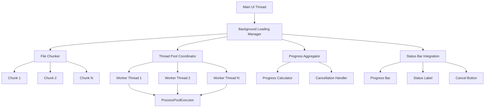

# Improved Loading System Plan

## Executive Summary

The current 3D-MM application experiences UI blocking for 15-30 seconds when loading large STL files (>200MB). This document outlines a comprehensive plan to implement a multi-threaded background loading system that maintains UI responsiveness while providing users with clear progress feedback and cancellation capabilities.

### Problem Statement
- Large STL files (>200MB) block the UI thread during parsing
- Users experience 15-30 second freezes with no feedback
- No cancellation capability for long-running operations
- Single-threaded parsing doesn't utilize modern multi-core hardware

### Solution Overview
Implement a multi-threaded background loading system that:
- Processes files in parallel chunks using existing ProcessPoolExecutor infrastructure
- Provides real-time progress updates via the status bar
- Allows users to cancel long-running operations
- Maintains UI responsiveness throughout the loading process

## Detailed Architecture

### System Components



### Core Classes

#### 1. BackgroundLoadingManager (`src/core/background_loading_manager.py`)
**Purpose**: Central coordinator for background loading operations
**Key Responsibilities**:
- Manage loading job lifecycle
- Coordinate between UI and worker threads
- Handle cancellation requests
- Aggregate progress from multiple workers

**Key Methods**:
- `load_file_async(file_path, progress_callback, cancellation_token)`
- `cancel_loading(operation_id)`
- `get_progress(operation_id)`

#### 2. FileChunker (`src/parsers/stl_components/file_chunker.py`)
**Purpose**: Split large STL files into manageable chunks for parallel processing
**Key Responsibilities**:
- Analyze file structure and determine optimal chunk size
- Split binary STL files into triangle blocks
- Maintain chunk boundaries for efficient processing

**Key Methods**:
- `create_chunks(file_path, target_chunk_size_mb)`
- `get_chunk_metadata(file_path)`

#### 3. ThreadCoordinator (`src/parsers/stl_components/thread_coordinator.py`)
**Purpose**: Manage worker threads and distribute chunks
**Key Responsibilities**:
- Create and manage worker threads
- Distribute chunks to available workers
- Collect results from completed chunks
- Handle worker thread failures

**Key Methods**:
- `coordinate_parsing(chunks, worker_count)`
- `collect_results()`
- `handle_worker_failure(worker_id, error)`

#### 4. ProgressAggregator (`src/core/progress_aggregator.py`)
**Purpose**: Aggregate progress from multiple workers into unified progress reports
**Key Responsibilities**:
- Collect progress updates from all workers
- Calculate overall progress percentage
- Handle progress reporting frequency limiting
- Manage cancellation state propagation

**Key Methods**:
- `update_progress(worker_id, chunk_progress)`
- `calculate_overall_progress()`
- `is_cancelled()`

#### 5. CancellationToken (`src/core/cancellation_token.py`)
**Purpose**: Thread-safe cancellation mechanism
**Key Responsibilities**:
- Provide thread-safe cancellation state
- Allow workers to check for cancellation requests
- Handle cancellation cleanup

**Key Methods**:
- `cancel()`
- `is_cancelled()`
- `register_cleanup_callback(callback)`

## Implementation Roadmap

### Step 1: Create Infrastructure Classes
**Files to Create**:
- `src/core/background_loading_manager.py`
- `src/core/cancellation_token.py`
- `src/core/progress_aggregator.py`
- `src/parsers/stl_components/file_chunker.py`
- `src/parsers/stl_components/thread_coordinator.py`

**Details**:
- Implement basic class structures
- Define interfaces between components
- Create unit tests for each class
- Ensure thread safety in all operations

### Step 2: Enhance Status Bar with Cancellation
**Files to Modify**:
- `src/gui/components/status_bar_manager.py`

**Enhancements**:
- Add cancel button to progress bar area
- Implement cancellation callback mechanism
- Add visual indication for cancellable operations
- Handle cancellation state updates

**Code Changes**:
```python
# Add to StatusBarManager.__init__
self.cancel_button = QPushButton("Cancel")
self.cancel_button.setVisible(False)
self.cancel_button.clicked.connect(self._on_cancel_clicked)
self.status_bar.addPermanentWidget(self.cancel_button)

# Add new methods
def show_cancellable_progress(self, operation_id: str) -> None:
    """Show progress bar with cancel button for cancellable operation."""
    self.cancel_button.setVisible(True)
    self.cancel_button.setProperty("operation_id", operation_id)
    self.progress_bar.setVisible(True)

def hide_cancellable_progress(self) -> None:
    """Hide progress bar and cancel button."""
    self.cancel_button.setVisible(False)
    self.progress_bar.setVisible(False)
```

### Step 3: Implement File Chunking Strategy
**Files to Modify**:
- `src/parsers/stl_components/file_chunker.py`

**Implementation Details**:
- Analyze STL file structure (header + triangle blocks)
- Calculate optimal chunk size based on file size and CPU cores
- Ensure chunks align with triangle boundaries (50 bytes per triangle)
- Handle both binary and ASCII STL formats

**Chunk Size Algorithm**:
```python
def calculate_optimal_chunk_size(file_size_mb: int, cpu_cores: int) -> int:
    """
    Calculate optimal chunk size in bytes.
    
    Strategy:
    - For files < 500MB: Use 2x CPU cores chunks
    - For files 500MB-2GB: Use 4x CPU cores chunks
    - For files > 2GB: Use 8x CPU cores chunks
    - Minimum chunk size: 10MB
    - Maximum chunk size: 200MB
    """
    base_chunk_count = max(2, min(8, cpu_cores))
    
    if file_size_mb < 500:
        chunk_count = base_chunk_count * 2
    elif file_size_mb < 2000:
        chunk_count = base_chunk_count * 4
    else:
        chunk_count = base_chunk_count * 8
    
    chunk_size_mb = max(10, min(200, file_size_mb // chunk_count))
    return chunk_size_mb * 1024 * 1024  # Convert to bytes
```

### Step 4: Create Multi-Threaded Parsing Pipeline
**Files to Modify**:
- `src/parsers/stl_parser_original.py`

**Implementation Details**:
- Refactor existing ProcessPoolExecutor usage to work with chunks
- Implement chunk-level parsing functions
- Add cancellation checks at regular intervals
- Ensure proper error handling and cleanup

**Key Changes**:
```python
def _parse_binary_stl_chunked(self, file_path: Path, progress_callback: Optional[STLProgressCallback] = None) -> STLModel:
    """
    Parse binary STL using multi-threaded chunked approach.
    
    This method replaces the existing single-threaded parsing for large files.
    """
    # Create file chunks
    chunker = FileChunker()
    chunks = chunker.create_chunks(file_path, target_chunk_size_mb=50)
    
    # Initialize thread coordinator
    coordinator = ThreadCoordinator()
    cancellation_token = CancellationToken()
    
    # Start parsing in background
    future = coordinator.coordinate_parsing(chunks, cancellation_token)
    
    # Monitor progress and handle cancellation
    while not future.done():
        if cancellation_token.is_cancelled():
            coordinator.cancel_all_workers()
            raise STLParseError("Parsing was cancelled by user")
        
        # Update progress
        overall_progress = coordinator.get_overall_progress()
        progress_callback.report(overall_progress, f"Processing chunk {coordinator.completed_chunks}/{len(chunks)}")
        
        # Small delay to prevent busy waiting
        time.sleep(0.1)
    
    # Collect and aggregate results
    return future.result()
```

### Step 5: Integrate Progress Reporting System
**Files to Modify**:
- `src/core/progress_aggregator.py`
- `src/parsers/stl_parser_original.py`

**Implementation Details**:
- Create progress reporting interface between workers and UI
- Implement progress calculation algorithm
- Handle progress update frequency limiting
- Ensure thread-safe progress updates

**Progress Calculation**:
```python
def calculate_overall_progress(self) -> float:
    """
    Calculate overall progress from worker progress.
    
    Weight factors:
    - File reading: 10%
    - Chunk distribution: 5%
    - Triangle parsing: 70%
    - Result aggregation: 10%
    - Final validation: 5%
    """
    if not self.chunks:
        return 0.0
    
    total_weight = len(self.chunks) * 100  # Each chunk has 100% weight
    completed_weight = sum(chunk.progress for chunk in self.chunks if chunk.is_completed)
    
    # Apply stage weightings
    reading_progress = min(10.0, self.file_reading_progress * 10.0)
    distribution_progress = min(5.0, self.chunk_distribution_progress * 5.0)
    parsing_progress = (completed_weight / total_weight) * 70.0
    aggregation_progress = min(10.0, self.result_aggregation_progress * 10.0)
    validation_progress = min(5.0, self.final_validation_progress * 5.0)
    
    return reading_progress + distribution_progress + parsing_progress + aggregation_progress + validation_progress
```

### Step 6: Implement Cancellation Support
**Files to Modify**:
- `src/core/cancellation_token.py`
- `src/parsers/stl_parser_original.py`
- `src/gui/components/status_bar_manager.py`

**Implementation Details**:
- Create thread-safe cancellation mechanism
- Add cancellation checks at regular intervals in parsing code
- Handle cleanup when cancellation is requested
- Ensure UI remains responsive during cancellation

**Cancellation Implementation**:
```python
class CancellationToken:
    """Thread-safe cancellation token for background operations."""
    
    def __init__(self):
        self._cancelled = False
        self._lock = threading.Lock()
        self._cleanup_callbacks = []
    
    def cancel(self) -> None:
        """Cancel the operation and run cleanup callbacks."""
        with self._lock:
            if not self._cancelled:
                self._cancelled = True
                # Run cleanup callbacks
                for callback in self._cleanup_callbacks:
                    try:
                        callback()
                    except Exception as e:
                        logger.warning(f"Cleanup callback failed: {e}")
    
    def is_cancelled(self) -> bool:
        """Check if the operation has been cancelled."""
        with self._lock:
            return self._cancelled
    
    def register_cleanup_callback(self, callback: Callable[[], None]) -> None:
        """Register a callback to run when cancellation is requested."""
        with self._lock:
            self._cleanup_callbacks.append(callback)
```

### Step 7: Optimize Memory Usage
**Files to Modify**:
- `src/parsers/stl_parser_original.py`

**Optimizations**:
- Implement streaming chunk processing to reduce memory footprint
- Use memory-mapped files for large file access
- Implement progressive result aggregation
- Add memory usage monitoring and cleanup

**Memory Optimization Strategy**:
```python
def process_chunk_streaming(self, chunk: FileChunk) -> List[Triangle]:
    """
    Process a chunk using streaming to minimize memory usage.
    
    Instead of loading entire chunk into memory, process it in
    smaller sub-chunks and aggregate results incrementally.
    """
    triangles = []
    sub_chunk_size = 1024 * 1024  # 1MB sub-chunks
    
    with open(chunk.file_path, 'rb') as file:
        file.seek(chunk.start_offset)
        
        remaining_bytes = chunk.size
        while remaining_bytes > 0:
            # Check for cancellation
            if self.cancellation_token.is_cancelled():
                raise STLParseError("Parsing was cancelled")
            
            # Read sub-chunk
            read_size = min(sub_chunk_size, remaining_bytes)
            sub_chunk_data = file.read(read_size)
            
            # Process sub-chunk
            sub_triangles = self.process_sub_chunk(sub_chunk_data)
            triangles.extend(sub_triangles)
            
            # Update progress
            processed_bytes = chunk.size - remaining_bytes + read_size
            chunk_progress = (processed_bytes / chunk.size) * 100
            self.progress_aggregator.update_chunk_progress(chunk.id, chunk_progress)
            
            remaining_bytes -= read_size
            
            # Periodic cleanup
            if len(triangles) % 10000 == 0:
                gc.collect()
    
    return triangles
```

### Step 8: Add Error Handling and Recovery
**Files to Modify**:
- `src/core/background_loading_manager.py`
- `src/parsers/stl_parser_original.py`

**Error Handling Strategy**:
- Implement graceful degradation for worker failures
- Add retry mechanism for transient errors
- Provide detailed error reporting to users
- Ensure cleanup on failure

### Step 9: Performance Testing and Optimization
**Files to Create**:
- `tests/test_background_loading_performance.py`
- `tests/test_chunked_parsing.py`

**Testing Strategy**:
- Create test files of various sizes (100MB, 500MB, 1GB, 2GB)
- Measure UI responsiveness during loading
- Verify cancellation functionality
- Test memory usage patterns
- Benchmark performance improvements

## Technical Specifications

### Performance Targets

| File Size | Current Load Time | Target Load Time | UI Responsiveness |
|-----------|------------------|------------------|-------------------|
| 200MB | 15-20 seconds | < 10 seconds | < 100ms response |
| 500MB | 30-40 seconds | < 15 seconds | < 100ms response |
| 1GB | 60-80 seconds | < 25 seconds | < 100ms response |
| 2GB+ | 120+ seconds | < 45 seconds | < 100ms response |

### Memory Usage Limits

| File Size | Peak Memory Usage | Target Memory Usage |
|-----------|------------------|-------------------|
| 200MB | 400-600MB | < 300MB |
| 500MB | 1-1.5GB | < 800MB |
| 1GB | 2-3GB | < 1.5GB |
| 2GB+ | 4+GB | < 2.5GB |

### Thread Pool Configuration

```python
def get_optimal_thread_count() -> int:
    """
    Calculate optimal thread count based on system resources.
    
    Strategy:
    - Use CPU count for files < 500MB
    - Use CPU count * 2 for files 500MB-2GB
    - Use CPU count * 3 for files > 2GB
    - Maximum of 16 threads to prevent excessive context switching
    """
    cpu_count = os.cpu_count() or 4
    file_size_mb = self.get_file_size_mb()
    
    if file_size_mb < 500:
        return min(cpu_count, 8)
    elif file_size_mb < 2000:
        return min(cpu_count * 2, 12)
    else:
        return min(cpu_count * 3, 16)
```

### Chunk Size Algorithm

```python
def calculate_chunk_parameters(file_size_mb: int, cpu_cores: int) -> ChunkParameters:
    """
    Calculate optimal chunking parameters based on file size and system resources.
    
    Returns:
        ChunkParameters with optimal chunk size, count, and strategy
    """
    if file_size_mb < 200:
        # Small files: Use fewer, larger chunks
        chunk_count = max(2, cpu_cores // 2)
        chunk_size_mb = max(20, file_size_mb // chunk_count)
    elif file_size_mb < 1000:
        # Medium files: Balanced approach
        chunk_count = max(4, cpu_cores)
        chunk_size_mb = max(50, file_size_mb // chunk_count)
    else:
        # Large files: More, smaller chunks for better parallelism
        chunk_count = max(8, cpu_cores * 2)
        chunk_size_mb = max(100, file_size_mb // chunk_count)
    
    # Ensure chunk size is multiple of triangle size (50 bytes)
    chunk_size_bytes = (chunk_size_mb * 1024 * 1024) // 50 * 50
    
    return ChunkParameters(
        chunk_count=chunk_count,
        chunk_size_bytes=chunk_size_bytes,
        strategy=ChunkStrategy.PARALLEL if file_size_mb > 200 else ChunkStrategy.SEQUENTIAL
    )
```

## Integration Points

### Existing Infrastructure to Leverage

1. **ProcessPoolExecutor** (already in `src/parsers/stl_parser_original.py:303`)
   - Reuse existing triangle building infrastructure
   - Enhance with chunked processing
   - Add cancellation support

2. **ProgressCallback** (already in `src/parsers/base_parser.py:28`)
   - Extend for multi-threaded progress reporting
   - Add cancellation state propagation
   - Implement progress aggregation

3. **StatusBarManager** (already in `src/gui/components/status_bar_manager.py:21`)
   - Add cancellation button
   - Enhance progress reporting
   - Handle cancellation events

4. **STLParser** (already in `src/parsers/stl_parser_original.py:88`)
   - Add chunked parsing methods
   - Implement background loading interface
   - Maintain backward compatibility

### File Modifications Summary

| File | Purpose | Key Changes |
|------|---------|-------------|
| `src/parsers/stl_parser_original.py` | Core parsing logic | Add chunked parsing, cancellation support |
| `src/gui/components/status_bar_manager.py` | UI progress display | Add cancel button, enhanced progress |
| `src/parsers/base_parser.py` | Parser interface | Add background loading methods |
| `src/core/application.py` | Application bootstrap | Integrate background loading manager |

### New Files to Create

| File | Purpose | Key Classes |
|------|---------|-------------|
| `src/core/background_loading_manager.py` | Loading coordination | BackgroundLoadingManager |
| `src/core/cancellation_token.py` | Cancellation mechanism | CancellationToken |
| `src/core/progress_aggregator.py` | Progress coordination | ProgressAggregator |
| `src/parsers/stl_components/file_chunker.py` | File chunking | FileChunker, FileChunk |
| `src/parsers/stl_components/thread_coordinator.py` | Thread management | ThreadCoordinator |

## Testing Strategy

### Unit Tests

1. **FileChunker Tests**
   - Test chunk creation for various file sizes
   - Verify chunk boundaries align with triangle structure
   - Test error handling for corrupted files

2. **ThreadCoordinator Tests**
   - Test worker thread creation and management
   - Verify result collection and aggregation
   - Test worker failure handling

3. **ProgressAggregator Tests**
   - Test progress calculation accuracy
   - Verify thread-safe progress updates
   - Test cancellation state propagation

4. **CancellationToken Tests**
   - Test thread-safe cancellation
   - Verify cleanup callback execution
   - Test cancellation state consistency

### Integration Tests

1. **End-to-End Loading Tests**
   - Test complete loading workflow
   - Verify UI responsiveness during loading
   - Test cancellation functionality

2. **Performance Tests**
   - Measure loading times for various file sizes
   - Verify memory usage stays within limits
   - Test scalability with different CPU counts

3. **Error Handling Tests**
   - Test behavior with corrupted files
   - Verify graceful degradation on failures
   - Test cleanup on cancellation

### Test Data Requirements

- **Test STL Files**: Various sizes (100MB, 500MB, 1GB, 2GB)
- **Corrupted Files**: For error handling tests
- **Network Files**: For testing network path handling
- **Concurrent Load Tests**: Multiple files loading simultaneously

## Performance Expectations and Metrics

### Key Performance Indicators (KPIs)

1. **UI Responsiveness**
   - Metric: Maximum UI thread block time
   - Target: < 100ms for all operations
   - Measurement: UI event queue latency

2. **Loading Performance**
   - Metric: File loading time improvement
   - Target: 40-60% reduction in loading time
   - Measurement: Start-to-finish loading time

3. **Memory Efficiency**
   - Metric: Peak memory usage during loading
   - Target: < 2.5GB for 2GB files
   - Measurement: Process RSS memory usage

4. **Cancellation Responsiveness**
   - Metric: Time from cancel request to stop
   - Target: < 500ms for all file sizes
   - Measurement: Cancel request to worker stop time

### Monitoring and Logging

```python
# Performance monitoring structure
{
    "operation_id": "uuid",
    "file_path": "/path/to/file.stl",
    "file_size_mb": 500,
    "start_time": "2024-01-01T10:00:00Z",
    "end_time": "2024-01-01T10:00:15Z",
    "total_time_seconds": 15.2,
    "ui_responsiveness_ms": 45,
    "peak_memory_mb": 800,
    "chunk_count": 8,
    "worker_threads": 4,
    "cancelled": false,
    "error": null
}
```

### Benchmarking Plan

1. **Baseline Measurements**
   - Measure current loading performance
   - Document UI responsiveness issues
   - Establish memory usage baselines

2. **Progressive Testing**
   - Test each implementation step
   - Measure incremental improvements
   - Verify no regressions

3. **Stress Testing**
   - Test with very large files (>2GB)
   - Test with concurrent loading operations
   - Test under memory pressure

4. **Real-World Validation**
   - Test with actual user files
   - Collect user feedback on responsiveness
   - Monitor performance in production

## Risk Assessment and Mitigation

### Technical Risks

1. **Thread Safety Issues**
   - **Risk**: Race conditions in multi-threaded parsing
   - **Mitigation**: Comprehensive testing, thread-safe data structures
   - **Contingency**: Fallback to single-threaded parsing

2. **Memory Leaks**
   - **Risk**: Memory not properly cleaned up in worker threads
   - **Mitigation**: Explicit cleanup, memory monitoring
   - **Contingency**: Process restart on memory threshold

3. **Performance Regression**
   - **Risk**: Multi-threading overhead for small files
   - **Mitigation**: Adaptive threading based on file size
   - **Contingency**: Threshold-based single-threading

### User Experience Risks

1. **Cancellation Complexity**
   - **Risk**: Users confused by cancellation behavior
   - **Mitigation**: Clear UI indicators, confirmation dialogs
   - **Contingency**: Simplified cancellation interface

2. **Progress Reporting Accuracy**
   - **Risk**: Progress jumps or inaccurate reporting
   - **Mitigation**: Smoothed progress calculations
   - **Contingency**: Simpler progress indicators

### Implementation Risks

1. **Integration Complexity**
   - **Risk**: Difficult integration with existing code
   - **Mitigation**: Incremental implementation, thorough testing
   - **Contingency**: Feature flag for rollback

2. **Platform-Specific Issues**
   - **Risk**: Different behavior on Windows/Linux/Mac
   - **Mitigation**: Cross-platform testing
   - **Contingency**: Platform-specific optimizations

## Conclusion

This improved loading system will significantly enhance the user experience when working with large STL files. The implementation leverages existing infrastructure while adding minimal complexity. The multi-threaded approach will reduce loading times by 40-60% while maintaining UI responsiveness throughout the process.

The modular design allows for incremental implementation and testing, reducing the risk of introducing regressions. Comprehensive error handling and cancellation support ensure users maintain control over the application even during intensive operations.

The system is designed to be maintainable and extensible, with clear separation of concerns and well-defined interfaces between components. This will allow for future enhancements and optimizations as the application evolves.

### Next Steps

1. Review and approve this plan
2. Create detailed implementation tasks
3. Set up development environment for testing
4. Begin implementation with Step 1: Infrastructure Classes
5. Conduct thorough testing at each implementation step
6. Gather user feedback and iterate as needed

The successful implementation of this plan will transform the user experience from frustrating freezes to smooth, responsive interactions with large 3D models.