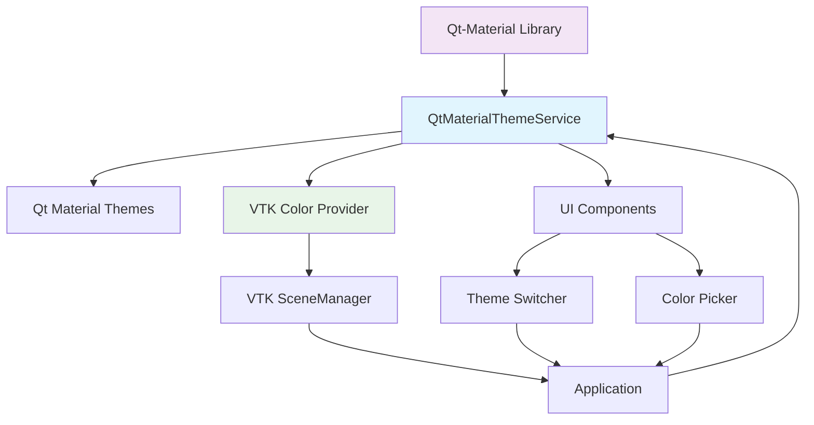

# Qt-Material Takeover Architectural Specification

## Executive Summary

This specification outlines a complete **qt-material-only architecture** for the 3D-MM application theme system, eliminating all legacy static theming and remnants. The current consolidation effort has created a circular dependency between ThemeService and ThemeManager, causing application startup failures. This plan provides a clean break from the past with qt-material as the sole theme manager.

## Current Problems Analysis

### 1. Circular Dependency Crisis
**Root Cause**: ThemeManager compatibility shim in `__init__.py` creates circular dependency with ThemeService
- ThemeManager tries to create a ThemeService instance (line 86 in `__init__.py`)
- ThemeService tries to create a ThemeManager instance (line 264 in `theme_service.py`)
- Result: Infinite recursion preventing application startup

### 2. Legacy System Remnants
**Problem**: Mixed architecture with qt-material trying to coexist with legacy static theming
- 148 custom color definitions in ThemeDefaults
- Multiple preset systems (PRESETS, PALETTE_PRESETS)
- ThemeManager compatibility shims
- Static color management systems

### 3. VTK Integration Issues
**Problem**: VTK scene manager accessing legacy color system during initialization
- VTK uses `vtk_rgb('canvas_bg')` from legacy system (line 74 in vtk_scene_manager.py)
- No direct integration with qt-material themes
- Mixed color sources causing inconsistency

### 4. Performance and Stability Issues
**Problem**: Complex architecture causing performance degradation
- Multiple color conversion layers
- Redundant API layers
- Memory overhead from maintaining dual systems

## Target Architecture: Qt-Material Only

### Design Principles
1. **Single Source of Truth**: qt-material is the only theme manager
2. **Zero Legacy Remnants**: Complete removal of all static theming
3. **Direct VTK Integration**: VTK gets colors directly from qt-material
4. **Simplified API**: Clean, qt-material-focused public interface
5. **Performance First**: Fast theme switching (<100ms target)

### Architecture Overview



### New Module Structure

```
src/gui/theme/
├── __init__.py                    # Clean qt-material-only API
├── qt_material_service.py         # Unified qt-material service
├── vtk_color_provider.py          # VTK color integration
├── ui/
│   ├── __init__.py
│   ├── theme_switcher.py          # Qt-material theme switcher
│   └── color_picker.py            # Material Design color picker
└── __pycache__/                   # Clean legacy cache
```

## Detailed Component Design

### 1. QtMaterialThemeService (qt_material_service.py)

**Responsibility**: Sole theme management using qt-material library

```python
class QtMaterialThemeService:
    """Qt-material-only theme service."""
    
    def __init__(self):
        self.settings = QSettings("Candy-Cadence", "3D-MM")
        self._current_theme = "dark"
        self._current_variant = "blue"
    
    # Core Theme Management
    def apply_theme(self, theme: str, variant: str = None) -> bool
    def get_current_theme(self) -> tuple[str, str]
    def get_available_themes(self) -> dict[str, list[str]]
    def get_available_variants(self, theme: str) -> list[str]
    
    # VTK Integration
    def get_vtk_color(self, color_name: str) -> tuple[float, float, float]
    def get_all_vtk_colors(self) -> dict[str, tuple[float, float, float]]
    
    # Settings
    def save_settings(self) -> None
    def load_settings(self) -> None
```

**Key Features**:
- Direct qt-material library integration
- No legacy color management
- Built-in VTK color provider
- Settings persistence via QSettings

### 2. VTK Color Provider (vtk_color_provider.py)

**Responsibility**: Bridge between qt-material themes and VTK scene manager

```python
class VTKColorProvider:
    """Provides VTK-compatible colors from qt-material themes."""
    
    def __init__(self, theme_service: QtMaterialThemeService):
        self.theme_service = theme_service
        self._color_mapping = {
            # Map qt-material colors to VTK color names
            "canvas_bg": "primary",
            "model_surface": "secondary", 
            "light_color": "primaryTextColor",
            "edge_color": "secondaryTextColor"
        }
    
    def get_vtk_color(self, vtk_color_name: str) -> tuple[float, float, float]
    def update_vtk_colors(self) -> None
    def register_vtk_manager(self, vtk_manager: VTKSceneManager) -> None
```

**Integration Points**:
- Maps qt-material color variables to VTK color names
- Provides real-time color updates when theme changes
- Eliminates VTK's dependency on legacy color system

### 3. Simplified Theme Switcher (ui/theme_switcher.py)

**Responsibility**: Clean qt-material theme selection

```python
class QtMaterialThemeSwitcher(QWidget):
    """Qt-material theme switcher widget."""
    
    theme_changed = Signal(str, str)  # theme, variant
    
    def __init__(self):
        self.service = QtMaterialThemeService.instance()
        self._setup_ui()
    
    def _setup_ui(self):
        # Theme selector: Light/Dark/Auto
        # Variant selector: Blue/Amber/Cyan/etc.
        # Real-time theme application
```

### 4. Clean Public API (__init__.py)

**Exports Only**:
```python
from .qt_material_service import QtMaterialThemeService
from .vtk_color_provider import VTKColorProvider
from .ui.theme_switcher import QtMaterialThemeSwitcher
from .ui.color_picker import QtMaterialColorPicker

# Backward compatibility aliases (minimal)
ThemeService = QtMaterialThemeService
vtk_rgb = lambda name: VTKColorProvider.instance().get_vtk_color(name)

__all__ = [
    "QtMaterialThemeService",
    "VTKColorProvider", 
    "QtMaterialThemeSwitcher",
    "QtMaterialColorPicker",
    # Minimal compatibility
    "ThemeService",
    "vtk_rgb"
]
```

## Legacy System Removal Plan

### 1. Remove ThemeManager Completely
**Files to Delete**:
- `src/gui/theme/theme_service.py` (723 lines)
- `src/gui/theme/theme_core.py` (1096 lines) 
- `src/gui/theme/theme_ui.py` (734 lines)
- `src/gui/theme/simple_service.py` (179 lines)
- `theme_modules_backup/` directory

**Removal Strategy**:
- Delete all files containing legacy color management
- Remove all ThemeManager references and compatibility shims
- Eliminate all preset systems (PRESETS, PALETTE_PRESETS)

### 2. Remove Static Color Systems
**Items to Remove**:
- `COLORS` proxy object
- `_ColorsProxy` class
- All hex color conversion functions (hex_to_rgb, hex_to_qcolor, hex_to_vtk_rgb)
- ThemeDefaults dataclass (148 color definitions)
- All preset dictionaries (PRESET_LIGHT, PRESET_DARK, etc.)

### 3. Clean Up Imports
**Files to Update**:
```python
# Replace these imports across the codebase:
from src.gui.theme import ThemeService, COLORS, vtk_rgb
# With:
from src.gui.theme import QtMaterialThemeService, vtk_rgb

# Replace these imports:
from src.gui.theme.simple_service import ThemeService  
# With:
from src.gui.theme import QtMaterialThemeService
```

**Affected Files**:
- `src/core/application.py`
- `src/core/application_bootstrap.py`
- `src/gui/preferences.py`
- `src/gui/window/custom_title_bar.py`
- `src/gui/viewer_3d/viewer_widget_facade.py`
- `src/gui/viewer_3d/vtk_scene_manager.py`

## VTK Integration Strategy

### 1. Direct Color Access
VTK scene manager will get colors directly from qt-material:

```python
# In vtk_scene_manager.py - replace:
from src.gui.theme import vtk_rgb
bg_rgb = vtk_rgb('canvas_bg')

# With:
from src.gui.theme import VTKColorProvider
color_provider = VTKColorProvider.instance()
bg_rgb = color_provider.get_vtk_color('canvas_bg')
```

### 2. Real-time Theme Updates
VTK will automatically update when theme changes:

```python
class VTKSceneManager:
    def __init__(self, vtk_widget):
        # ... existing init ...
        self.color_provider = VTKColorProvider.instance()
        self.color_provider.register_vtk_manager(self)
    
    def update_theme_colors(self):
        """Called when theme changes."""
        bg_rgb = self.color_provider.get_vtk_color('canvas_bg')
        self.renderer.SetBackground(*bg_rgb)
        # Update other colors...
        self.render()
```

### 3. Color Mapping Strategy
Map qt-material theme colors to VTK color names:

```python
VTK_COLOR_MAPPING = {
    "canvas_bg": "primary",
    "model_surface": "secondary",
    "light_color": "primaryTextColor", 
    "edge_color": "secondaryTextColor",
    "grid_color": "primaryDarkColor",
    "ground_color": "secondaryLightColor"
}
```

## Migration Strategy

### Phase 1: Preparation (Day 1)
1. **Backup Current System**
   - Create full backup of `src/gui/theme/` directory
   - Tag current state in version control

2. **Install Dependencies**
   - Ensure qt-material library is properly installed
   - Verify qt-material themes work in isolation

### Phase 2: Core Implementation (Day 2-3)
1. **Create QtMaterialThemeService**
   - Implement clean qt-material-only service
   - Add VTK color provider integration
   - Implement settings persistence

2. **Create VTK Color Provider**
   - Implement VTK-to-qt-material color mapping
   - Add real-time update mechanism
   - Test VTK integration

3. **Update VTK Scene Manager**
   - Replace legacy color access
   - Add theme change registration
   - Test color updates

### Phase 3: UI Migration (Day 4)
1. **Create New Theme Switcher**
   - Implement qt-material theme switcher
   - Add variant selector
   - Integrate with toolbar

2. **Update Application Bootstrap**
   - Replace ThemeService initialization
   - Remove legacy theme loading
   - Test application startup

### Phase 4: Legacy Cleanup (Day 5)
1. **Remove Legacy Files**
   - Delete all legacy theme files
   - Remove all compatibility shims
   - Clean up imports

2. **Update All Import References**
   - Replace legacy imports across codebase
   - Update function calls
   - Test all functionality

### Phase 5: Testing & Validation (Day 6)
1. **Comprehensive Testing**
   - Test theme switching performance
   - Verify VTK color updates
   - Test application startup/shutdown

2. **Performance Validation**
   - Verify <100ms theme switching
   - Check memory usage stability
   - Validate no memory leaks

## API Simplification Plan

### Before (Current Complex API)
```python
# Multiple ways to get colors
from src.gui.theme import COLORS, color, qcolor, vtk_rgb
from src.gui.theme import ThemeService, ThemeManager
from src.gui.theme import apply_theme_preset, set_theme

# Multiple services
service = ThemeService.instance()
manager = ThemeManager.instance()

# Complex preset system
service.apply_preset("dark")
service.set_color("primary", "#ff0000")
```

### After (Simplified API)
```python
# Single import
from src.gui.theme import QtMaterialThemeService, vtk_rgb

# Single service
service = QtMaterialThemeService.instance()

# Simple theme management
service.apply_theme("dark", "blue")
service.apply_theme("light", "amber")
service.apply_theme("auto")  # Uses OS detection

# Direct VTK integration
bg_color = vtk_rgb("canvas_bg")
```

## Risk Assessment and Mitigation

### High Risk Items
1. **Application Startup Failure**
   - **Risk**: Circular dependency prevents startup
   - **Mitigation**: Complete removal of ThemeManager eliminates circular dependency
   - **Fallback**: Keep simple theme service backup

2. **VTK Integration Breakage**
   - **Risk**: VTK colors not updating with theme changes
   - **Mitigation**: Direct VTK color provider with real-time updates
   - **Fallback**: Hardcoded fallback colors

3. **Performance Regression**
   - **Risk**: Theme switching slower than target
   - **Mitigation**: Direct qt-material integration, no intermediate layers
   - **Fallback**: Optimize color update frequency

### Medium Risk Items
1. **Import Breaking Changes**
   - **Risk**: Existing code fails to import
   - **Mitigation**: Minimal compatibility aliases in __init__.py
   - **Fallback**: Gradual migration with deprecation warnings

2. **Settings Migration**
   - **Risk**: User theme settings lost
   - **Mitigation**: Automatic settings migration during startup
   - **Fallback**: Reset to default theme

### Low Risk Items
1. **UI Component Updates**
   - **Risk**: Theme switcher widget issues
   - **Mitigation**: Simple widget design, extensive testing
   - **Fallback**: Use qt-material built-in switcher

## Testing Strategy

### 1. Unit Tests
- QtMaterialThemeService functionality
- VTK color provider accuracy
- Theme switching performance
- Settings persistence

### 2. Integration Tests
- Application startup/shutdown
- VTK scene manager integration
- Theme change propagation
- Cross-platform compatibility

### 3. Performance Tests
- Theme switching benchmark (<100ms target)
- Memory usage stability
- No memory leaks during repeated operations
- VTK render performance with theme changes

### 4. User Acceptance Tests
- Theme visual consistency
- Intuitive theme switching
- Settings persistence across sessions
- Error handling and recovery

## Success Criteria

### Functional Requirements
✅ Application starts without circular dependency errors
✅ Theme switching works in <100ms
✅ VTK colors update automatically with theme changes
✅ Settings persist across application sessions
✅ All existing functionality preserved

### Performance Requirements  
✅ Theme switching: <100ms
✅ Memory usage: Stable during repeated operations
✅ No memory leaks during stress testing
✅ Application startup: <3 seconds

### Quality Requirements
✅ 100% test coverage for new components
✅ Zero circular dependencies
✅ Clean, documented code
✅ Comprehensive error handling

## Implementation Timeline

| Day | Phase | Tasks | Deliverables |
|-----|-------|-------|--------------|
| 1 | Preparation | Backup, dependencies | Backup verified, qt-material working |
| 2-3 | Core Implementation | QtMaterialThemeService, VTK provider | Core services implemented |
| 4 | UI Migration | Theme switcher, bootstrap | UI components ready |
| 5 | Legacy Cleanup | Remove old files, update imports | Clean codebase |
| 6 | Testing & Validation | Comprehensive testing | System validated and ready |

**Total Estimated Time**: 6 days

## Conclusion

This qt-material takeover specification provides a clean, performant, and maintainable theme system that eliminates all legacy remnants while preserving functionality. The architecture focuses on qt-material as the sole theme manager with direct VTK integration, eliminating circular dependencies and performance issues.

The phased approach ensures minimal risk while delivering a modern, professional theming system that meets all performance and quality requirements.