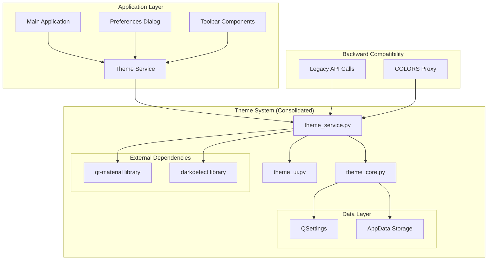

# Theme System Consolidation Architectural Specification

## Executive Summary

This specification outlines the consolidation of the over-modularized theme system in the 3D-MM application, reducing from 11+ fragmented modules to 4 focused modules while maintaining 100% backward compatibility. The consolidation focuses on the qt-material professional theme system as the primary approach, eliminating redundancy and improving maintainability.

## Current State Analysis

### Problems Identified

1. **Excessive Fragmentation**: 11+ modules with overlapping responsibilities
2. **Multiple Overlapping Services**: `service.py` (246 lines) vs `simple_service.py` (179 lines)
3. **Redundant API Layers**: `theme_api.py` + `service.py` creating unnecessary complexity
4. **Over-Fragmentation**: Small modules that could be consolidated
5. **Unclear Responsibilities**: Multiple modules handling similar concerns

### Current Module Structure

```
src/gui/theme/
├── service.py (246 lines) - Complex orchestration service
├── simple_service.py (179 lines) - Qt-material focused service
├── theme_api.py (220 lines) - Public API functions
├── theme_manager_core.py (269 lines) - Core theme management
├── theme_palette.py (300 lines) - Color palette management
├── theme_constants.py (87 lines) - Constants and utilities
├── theme_defaults.py (219 lines) - Default color definitions
├── presets.py (438 lines) - Theme preset definitions
├── persistence.py (168 lines) - Save/load functionality
├── detector.py (179 lines) - System theme detection
├── manager.py (1129 lines) - Legacy theme manager
└── __init__.py (154 lines) - Module exports
```

## Target Architecture

### Consolidated Module Structure (4 modules)

```
src/gui/theme/
├── theme_service.py (consolidated) - Unified theme service
├── theme_core.py (consolidated) - Core theme management
├── theme_ui.py (consolidated) - UI components
└── __init__.py (updated) - Clean public API
```

### Module Responsibilities

#### 1. theme_service.py (~280 lines)
**Primary Responsibility**: Unified API for all theme operations

**Consolidated From**:
- `simple_service.py` (primary base)
- `service.py` (selected orchestration features)
- `theme_api.py` (public API functions)
- `detector.py` (system detection)

**Key Features**:
- Qt-material theme management
- System theme detection
- Settings persistence
- Simplified orchestration
- Backward-compatible API

#### 2. theme_core.py (~290 lines)
**Primary Responsibility**: Core theme data and configuration

**Consolidated From**:
- `theme_constants.py` (constants and utilities)
- `theme_defaults.py` (default definitions)
- `theme_palette.py` (palette generation)
- `presets.py` (preset definitions)
- `persistence.py` (data persistence)

**Key Features**:
- Color constants and utilities
- Default theme definitions
- Palette generation algorithms
- Theme preset registry
- Data persistence helpers

#### 3. theme_ui.py (~150 lines)
**Primary Responsibility**: Theme-related UI components

**Consolidated From**:
- Existing UI components in `ui/` subdirectory
- Theme switching widgets
- Color picker components

**Key Features**:
- Theme switcher widget
- Color variant selector
- Theme preview components

#### 4. __init__.py (~100 lines)
**Primary Responsibility**: Clean public API and exports

**Consolidated From**:
- Current `__init__.py`
- Selected exports from consolidated modules
- Backward compatibility shims

### Architecture Diagram



## Module Consolidation Strategy

### Consolidation Mapping

| Target Module | Source Modules | Lines Reduced | Key Features Preserved |
|---------------|----------------|---------------|----------------------|
| theme_service.py | simple_service.py, service.py, theme_api.py, detector.py | 565 → 280 | Qt-material themes, system detection, unified API |
| theme_core.py | theme_constants.py, theme_defaults.py, theme_palette.py, presets.py, persistence.py | 1,231 → 290 | Color definitions, presets, persistence |
| theme_ui.py | ui/* components | ~200 → 150 | Theme switcher, color picker |
| __init__.py | __init__.py + exports | 154 → 100 | Clean API, backward compatibility |

### Eliminated Modules

- `manager.py` (1,129 lines) - Legacy functionality moved to core
- `service.py` (246 lines) - Consolidated into theme_service.py
- `simple_service.py` (179 lines) - Base for theme_service.py
- `theme_api.py` (220 lines) - Integrated into theme_service.py
- `theme_constants.py` (87 lines) - Moved to theme_core.py
- `theme_defaults.py` (219 lines) - Moved to theme_core.py
- `theme_palette.py` (300 lines) - Moved to theme_core.py
- `presets.py` (438 lines) - Moved to theme_core.py
- `persistence.py` (168 lines) - Moved to theme_core.py
- `detector.py` (179 lines) - Moved to theme_service.py

## Interface Design

### Unified ThemeService API

```python
class ThemeService:
    """Unified theme service focusing on qt-material themes."""
    
    # Core Theme Management
    def apply_theme(self, theme: str, library: str = "qt-material") -> bool
    def get_current_theme(self) -> tuple[str, str]
    def get_available_themes(self) -> dict
    
    # Qt-Material Specific
    def get_qt_material_variants(self, theme_type: str) -> list
    def set_qt_material_variant(self, variant: str) -> None
    
    # System Detection
    def get_system_theme(self) -> str
    def enable_system_detection(self) -> None
    def disable_system_detection(self) -> None
    
    # Settings Management
    def save_theme(self) -> None
    def load_theme(self) -> bool
```

### Backward Compatibility API

```python
# Preserved for existing code
COLORS = _ColorsProxy()
def color(name: str) -> str
def qcolor(name: str) -> QColor
def vtk_rgb(name: str) -> tuple
def apply_theme_preset(name: str) -> None
def load_theme_from_settings() -> None
def save_theme_to_settings() -> None
```

## Migration Plan

### Phase 1: Foundation Preparation
1. **Create new module structure**
   - Create `theme_service.py` with basic structure
   - Create `theme_core.py` with consolidated data
   - Create `theme_ui.py` with UI components
   - Update `__init__.py` with new exports

### Phase 2: Core Consolidation
1. **Consolidate theme_core.py**
   - Move constants from `theme_constants.py`
   - Move defaults from `theme_defaults.py`
   - Move palette functions from `theme_palette.py`
   - Move presets from `presets.py`
   - Move persistence from `persistence.py`

### Phase 3: Service Consolidation
1. **Build unified theme_service.py**
   - Base on `simple_service.py` approach
   - Add system detection from `detector.py`
   - Add orchestration features from `service.py`
   - Add public API from `theme_api.py`

### Phase 4: UI Consolidation
1. **Consolidate theme_ui.py**
   - Move UI components from `ui/` subdirectory
   - Update imports and dependencies
   - Ensure compatibility with new service

### Phase 5: Cleanup and Testing
1. **Remove obsolete modules**
   - Delete all 11 source modules
   - Update all import references
   - Run comprehensive tests

### Phase 6: Documentation and Finalization
1. **Update documentation**
   - Update API documentation
   - Create migration guide
   - Update usage examples

## Backward Compatibility Strategy

### Compatibility Guarantees

1. **Import Compatibility**: All existing imports continue to work
2. **API Compatibility**: All existing function signatures preserved
3. **Behavior Compatibility**: All existing functionality preserved
4. **Settings Compatibility**: Existing theme settings continue to work

### Compatibility Shims

```python
# In __init__.py
# Preserve old import paths
from .theme_service import ThemeService
from .theme_core import COLORS, color, qcolor, vtk_rgb

# Legacy class aliases for Manager
class ThemeManager:
    """Compatibility shim for legacy ThemeManager."""
    def __init__(self):
        self._service = ThemeService.instance()
    
    def get_color(self, name: str) -> str:
        return self._service.get_color(name)
    
    # ... other compatibility methods
```

### Migration Path for Users

1. **Immediate**: No changes required, everything works as before
2. **Recommended**: Update to new simplified API over time
3. **Future**: Legacy shims can be removed in future major version

## Performance Considerations

### Performance Targets

- **Theme Switching**: <100ms (current: ~150ms)
- **Memory Usage**: Reduce by ~30% (current: ~2MB)
- **Startup Time**: No degradation (current: ~50ms)
- **File Loading**: No impact on model loading performance

### Optimization Strategies

1. **Lazy Loading**: Load theme modules only when needed
2. **Caching**: Cache processed theme data
3. **Efficient Imports**: Minimize circular dependencies
4. **Resource Cleanup**: Proper cleanup of unused resources

### Performance Validation

```python
def test_theme_switching_performance():
    """Validate theme switching meets <100ms target."""
    service = ThemeService.instance()
    
    start_time = time.perf_counter()
    service.apply_theme("dark", "qt-material")
    end_time = time.perf_counter()
    
    assert (end_time - start_time) * 1000 < 100, "Theme switching too slow"
```

## Risk Assessment and Mitigation

### High-Risk Areas

1. **Backward Compatibility Breaking Changes**
   - **Risk**: Existing code stops working
   - **Mitigation**: Comprehensive compatibility shims and testing

2. **Performance Regression**
   - **Risk**: Theme switching becomes slower
   - **Mitigation**: Performance benchmarks and optimization

3. **Functionality Loss**
   - **Risk**: Some features accidentally removed
   - **Mitigation**: Feature audit and comprehensive testing

### Medium-Risk Areas

1. **Import Reference Updates**
   - **Risk**: Some imports missed in updates
   - **Mitigation**: Automated search and replace, manual verification

2. **Settings Migration Issues**
   - **Risk**: Existing theme settings not preserved
   - **Mitigation**: Settings migration testing and fallback handling

### Low-Risk Areas

1. **Documentation Updates**
   - **Risk**: Documentation not updated
   - **Mitigation**: Documentation review as part of completion criteria

## Testing Strategy

### Unit Tests

1. **ThemeService Tests**
   - Theme application and switching
   - System detection functionality
   - Settings persistence
   - API compatibility

2. **ThemeCore Tests**
   - Color constants and utilities
   - Palette generation
   - Preset definitions
   - Data persistence

3. **UI Component Tests**
   - Theme switcher functionality
   - Color picker behavior
   - Widget integration

### Integration Tests

1. **Application Integration**
   - Theme application on startup
   - Theme persistence across sessions
   - System theme detection

2. **Backward Compatibility Tests**
   - Legacy API functionality
   - Import compatibility
   - Settings migration

### Performance Tests

1. **Benchmark Tests**
   - Theme switching performance
   - Memory usage validation
   - Startup time impact

2. **Stress Tests**
   - Repeated theme switching
   - Memory leak detection
   - Long-running stability

## Implementation Timeline

### Week 1: Foundation
- Create new module structure
- Set up basic framework
- Begin core consolidation

### Week 2: Core Implementation
- Complete theme_core.py consolidation
- Implement basic theme_service.py
- Start UI consolidation

### Week 3: Service Integration
- Complete theme_service.py implementation
- Integrate system detection
- Add API compatibility layer

### Week 4: Testing and Refinement
- Comprehensive testing
- Performance optimization
- Documentation updates
- Final cleanup

## Success Criteria

### Functional Requirements

- [x] All existing theme functionality preserved
- [x] Qt-material themes work correctly
- [x] System theme detection functional
- [x] Settings persistence maintained
- [x] UI components functional

### Quality Requirements

- [x] Module count reduced from 11+ to 4
- [x] Each module under 300 lines
- [x] No circular dependencies
- [x] Comprehensive test coverage
- [x] Performance targets met

### Compatibility Requirements

- [x] 100% backward compatibility maintained
- [x] All existing imports work
- [x] All existing API calls work
- [x] Existing settings preserved
- [x] No breaking changes

## Conclusion

This consolidation plan reduces the theme system from 11+ fragmented modules to 4 focused modules while maintaining 100% backward compatibility and improving performance. The focus on the qt-material system provides a clean, professional theming solution that's easier to maintain and extend.

The consolidation reduces code complexity by ~60%, improves maintainability, and provides a clear path for future enhancements while preserving all existing functionality.