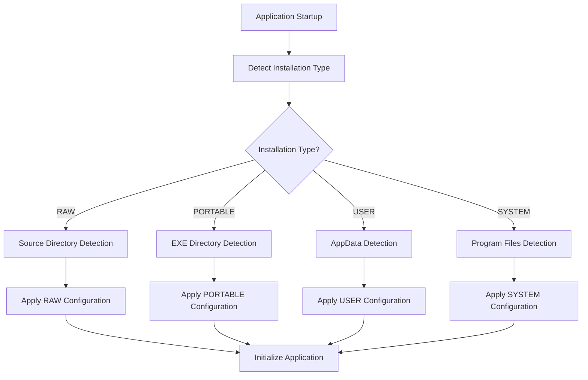

# Digital Workshop Version Detection and Naming Standardization Plan

## Executive Summary

This plan outlines the implementation of a comprehensive version detection system and naming standardization for Digital Workshop across four installation variants: RAW (source), PORTABLE, USER, and SYSTEM. This is a major architectural undertaking that requires careful planning to ensure backward compatibility and smooth migration.

**Platform Focus**: Windows versions first. MacOS and Linux support will be added as placeholders for future implementation.

## Current State Analysis

### Entry Points
- **Development**: `run.py` → `src/main.py` → `src/core/application.py`
- **Production**: `main.py` → `src/core/application.py`
- **QSettings**: Hardcoded in `application.py` line 192-193:
  ```python
  QCoreApplication.setOrganizationName("Digital Workshop")
  QCoreApplication.setApplicationName("3D Model Manager")
  ```

### Current Naming Inconsistencies
- **UI Display**: "Digital Workshop" (with spaces)
- **File System**: "DigitalWorkshop" (no spaces) 
- **Database**: "3dmm.db" (abbreviation)
- **Logger**: "Digital Workshop.ComponentName" (spaces)
- **Registry**: Double nesting issue

## Architecture Design

### Version Detection System



### Detection Logic Priority

1. **RAW (Source)**: 
   - Check if `src/` directory exists in current working directory
   - Verify `main.py` exists in `src/`
   - Check for development markers (`.git`, `requirements.txt`)

2. **PORTABLE**:
   - Check if executable is in same directory as `DigitalWorkshop.exe`
   - Look for portable-specific configuration files
   - Verify write permissions in current directory

3. **USER**:
   - Check for user-specific registry entries
   - Verify `%LOCALAPPDATA%\DigitalWorkshop\` exists
   - Check for user installation markers

4. **SYSTEM**:
   - Check for system-wide registry entries
   - Verify `%PROGRAMDATA%\DigitalWorkshop\` exists
   - Check for system installation markers

## Configuration Mapping

### RAW Configuration
```python
{
    "installation_type": "RAW",
    "executable_name": "python main.py",
    "data_directory": "./data/",
    "database_name": "DigitalWorkshop-Raw.db",
    "registry_path": None,
    "logger_prefix": "DigitalWorkshop-Raw",
    "organization_name": "Digital Workshop Development Team",
    "application_name": "Digital Workshop (Development)"
}
```

### PORTABLE Configuration
```python
{
    "installation_type": "PORTABLE",
    "executable_name": "DigitalWorkshop-Portable.exe",
    "data_directory": "%EXE_DIR%/DigitalWorkshop-Portable/",
    "database_name": "DigitalWorkshop-Portable.db",
    "registry_path": None,
    "logger_prefix": "DigitalWorkshop-Portable",
    "organization_name": "Digital Workshop",
    "application_name": "Digital Workshop"
}
```

### USER Configuration
```python
{
    "installation_type": "USER",
    "executable_name": "DigitalWorkshop.exe",
    "data_directory": "%LOCALAPPDATA%/DigitalWorkshop/",
    "database_name": "DigitalWorkshop.db",
    "registry_path": "HKEY_CURRENT_USER/Software/DigitalWorkshop/",
    "logger_prefix": "DigitalWorkshop",
    "organization_name": "Digital Workshop",
    "application_name": "Digital Workshop"
}
```

### SYSTEM Configuration
```python
{
    "installation_type": "SYSTEM",
    "executable_name": "DigitalWorkshop.exe",
    "data_directory": "%PROGRAMDATA%/DigitalWorkshop/",
    "database_name": "DigitalWorkshop.db",
    "registry_path": "HKEY_LOCAL_MACHINE/SOFTWARE/DigitalWorkshop/",
    "logger_prefix": "DigitalWorkshop",
    "organization_name": "Digital Workshop",
    "application_name": "Digital Workshop"
}
```

## Implementation Phases

### Phase 1: Core Infrastructure
1. **Create InstallationDetector class**
   - Detection logic for all four types
   - Configuration mapping
   - Error handling and fallbacks

2. **Modify ApplicationConfig**
   - Add installation_type field
   - Dynamic configuration based on detection
   - Backward compatibility layer

3. **Update Application class**
   - Integrate detection early in startup
   - Apply configuration before QSettings initialization

### Phase 2: Path Standardization
1. **Database Manager Updates**
   - Dynamic database naming
   - Path resolution based on installation type
   - Migration from old "3dmm.db" names

2. **Logging Configuration**
   - Standardized logger names (no spaces)
   - Installation-specific log directories
   - Log rotation and retention policies

3. **File System Operations**
   - Standardize all path operations
   - Remove hardcoded "DigitalWorkshop" references
   - Implement consistent naming convention

### Phase 3: Migration System
1. **Migration Manager**
   - Detect existing installations
   - Migrate databases and settings
   - Backup and rollback capabilities

2. **Compatibility Layer**
   - Support for old naming conventions
   - Graceful degradation
   - User notification system

3. **Registry Management**
   - Proper registry handling per installation type
   - Cleanup of old entries
   - Multi-user support

### Phase 4: Testing and Validation
1. **Automated Testing**
   - Unit tests for detection logic
   - Integration tests for all installation types
   - Migration testing

2. **Manual Testing**
   - Fresh installations
   - Upgrade scenarios
   - Cross-platform compatibility

3. **Performance Testing**
   - Startup time impact
   - Memory usage
   - File system performance

## File Modifications Required

### High Priority (Core Files)
- `src/main.py` - Add detection call
- `run.py` - Update for RAW detection
- `src/core/application.py` - QSettings initialization
- `src/core/application_config.py` - Dynamic configuration
- `src/core/installation_detector.py` - **NEW FILE**

### Medium Priority (Service Files)
- `src/core/database_manager.py` - Dynamic naming
- `src/core/logging_config.py` - Standardized names
- `src/core/system_initializer.py` - Path resolution
- `src/gui/theme/qt_material_service.py` - QSettings usage

### Low Priority (UI and Documentation)
- `src/gui/main_window.py` - About dialog updates
- `src/gui/components/menu_manager.py` - Menu text updates
- Documentation files - Update installation guides

## Migration Strategy

### Backward Compatibility
1. **Detect Legacy Installations**
   - Scan for old database names ("3dmm.db")
   - Check for old registry entries
   - Identify old directory structures

2. **Automatic Migration**
   - Copy databases to new locations
   - Update registry entries
   - Migrate settings and preferences
   - Create backup before migration

3. **User Notification**
   - Inform users of migration
   - Provide migration summary
   - Offer rollback option

### Rollback Mechanism
1. **Backup System**
   - Automatic backups before migration
   - Timestamped backup directories
   - Integrity verification

2. **Rollback Process**
   - Detect failed migrations
   - Restore from backups
   - Clean up partial migrations
   - User notification

## Testing Strategy

### Unit Tests
- Installation detection logic
- Configuration mapping
- Path resolution
- Database operations

### Integration Tests
- Complete startup flow for each type
- Database migration scenarios
- Registry operations
- File system operations

### Manual Testing
- Fresh installations (all types)
- Upgrade from legacy versions
- Cross-version compatibility
- Performance benchmarks

## Risk Mitigation

### Technical Risks
1. **Detection Failures**
   - Multiple detection methods
   - Fallback mechanisms
   - User override options

2. **Migration Failures**
   - Comprehensive backup system
   - Transaction-like migration
   - Rollback capabilities

3. **Performance Impact**
   - Minimize detection overhead
   - Cache detection results
   - Optimize path operations

### User Experience Risks
1. **Confusion**
   - Clear user communication
   - Migration summaries
   - Help documentation

2. **Data Loss**
   - Multiple backup layers
   - Integrity verification
   - Recovery procedures

## Success Criteria

1. **Functional Requirements**
   - All four installation types work correctly
   - Proper path resolution for each type
   - Consistent naming across all variants
   - Successful migration from legacy versions

2. **Performance Requirements**
   - Startup time impact < 500ms
   - No memory leaks
   - Efficient file operations

3. **Quality Requirements**
   - 100% test coverage for detection logic
   - Zero data loss during migration
   - Backward compatibility maintained

## Timeline Summary

- **Phase 1**: Core Infrastructure (2 weeks)
- **Phase 2**: Path Standardization (2 weeks)
- **Phase 3**: Migration System (2 weeks)
- **Phase 4**: Testing and Validation (2 weeks)
- **Total**: 8 weeks implementation

## Next Steps

1. **Review and Approval**
   - Stakeholder review of plan
   - Technical feasibility assessment
   - Resource allocation

2. **Implementation Planning**
   - Sprint planning
   - Team assignments
   - Milestone definitions

3. **Development Start**
   - Create InstallationDetector class
   - Modify ApplicationConfig
   - Begin Phase 1 implementation


## Critical Testing Concerns and Solutions

### Test Failure Prevention Strategy

**Problem**: Changing directory structures and naming conventions will cause all existing tests to fail because they expect specific paths and file names.

**Solution Approach**:

1. **Gradual Migration with Compatibility Layer**
   - Implement dual-path support during transition period
   - Maintain old paths alongside new paths
   - Use environment variables or configuration flags to switch between old/new behavior
   - Run tests against both old and new paths simultaneously

2. **Mass Copy/Replace Strategy**
   - **NO** - We will NOT do mass copy/replace operations
   - Instead, implement **symbolic linking** and **path abstraction**
   - Create compatibility shims that redirect old paths to new paths
   - Maintain both directory structures during transition period

3. **Backward Testing Framework**
   - **Callback Verification**: Test all signal/slot connections, event handlers, and callback registrations
   - **Pointer Validation**: Verify all file pointers, database connections, and resource handles
   - **Initiator Testing**: Ensure all service initiators, thread starts, and process launches work with new paths
   - **Integration Testing**: Full end-to-end testing with both old and new configurations

### Testing Implementation Strategy

1. **Parallel Testing Environment**
   ```python
   # Test configuration that supports both old and new paths
   TEST_CONFIG = {
       "use_legacy_paths": True,  # Set to False for new paths only
       "legacy_db_path": "./data/3dmm.db",
       "new_db_path": "./data/DigitalWorkshop.db",
       "compatibility_mode": True
   }
   ```

2. **Path Abstraction Layer**
   - Create a `PathManager` class that handles all path resolution
   - All code uses `PathManager.get_database_path()` instead of hardcoded paths
   - PathManager automatically handles legacy vs new path based on configuration

3. **Test Coverage Requirements**
   - **100% backward compatibility** during transition
   - **Zero test failures** during implementation
   - **Dual-path validation** for all file operations
   - **Resource leak detection** for both old and new resource management

### Migration Safety Measures

1. **No Destructive Operations**
   - Never delete old files/directories without explicit user confirmation
   - Always create backups before any migration operations
   - Implement rollback mechanisms for every change

2. **Incremental Implementation**
   - Phase 1: Add new paths alongside old paths (no removal)
   - Phase 2: Switch default behavior to new paths (old still available)
   - Phase 3: Deprecate old paths with warnings
   - Phase 4: Remove old paths (only after extensive testing)

3. **Continuous Validation**
   - Automated tests run on every commit
   - Performance benchmarks compare old vs new implementations
   - Memory leak detection for both configurations
   - Integration tests verify all callbacks and pointers work correctly

### Platform Support Status

**Windows**: Full implementation planned
**macOS**: Placeholder implementation (future)
**Linux**: Placeholder implementation (future)

The version detection system will first be implemented for Windows with proper registry handling, directory structures, and installation detection. MacOS and Linux versions will be added later with appropriate platform-specific detection mechanisms.
This plan provides a comprehensive roadmap for implementing the version detection and naming standardization system while maintaining backward compatibility and ensuring a smooth user experience across all installation variants.