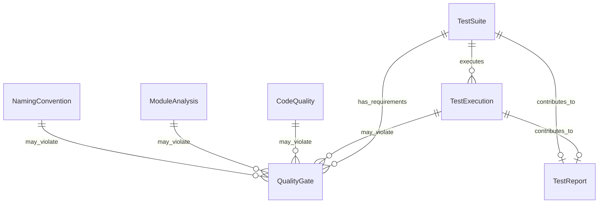

# Data Model: Comprehensive Testing System Entities

**Date**: 2025-10-31 | **Status**: Design Complete | **Phase**: Phase 1

## Overview

This document defines the core entities and data structures for the comprehensive testing system. The model is designed to support unified test execution, quality validation, module analysis, and naming convention enforcement.

## Core Entities

### 1. TestSuite Entity

**Purpose**: Unified test execution and management across all testing categories.

**Attributes**:
- `id`: Unique identifier (UUID)
- `name`: Human-readable test suite name
- `type`: Test category (unit, integration, performance, e2e, quality)
- `test_patterns`: List of file patterns to match test files
- `execution_config`: Configuration for test execution
  - `timeout_minutes`: Maximum execution time
  - `retry_count`: Number of retry attempts
  - `parallel_execution`: Enable/disable parallel execution
  - `environment_vars`: Environment variables for test execution
- `quality_gates`: Quality thresholds for pass/fail determination
  - `min_coverage`: Minimum test coverage percentage
  - `max_execution_time`: Maximum allowed execution time
  - `max_failure_rate`: Maximum allowed failure rate
- `schedule`: Execution schedule configuration
  - `frequency`: hourly, daily, weekly, on-demand
  - `cron_expression`: Custom cron expression if needed
- `status`: Current execution status
- `metrics`: Execution metrics and results
- `created_at`: Creation timestamp
- `updated_at`: Last update timestamp

**Relationships**:
- `TestSuite` → `TestExecution` (one-to-many)
- `TestSuite` → `QualityGate` (one-to-many)

### 2. TestExecution Entity

**Purpose**: Records individual test execution instances and their results.

**Attributes**:
- `id`: Unique execution identifier (UUID)
- `test_suite_id`: Reference to TestSuite
- `timestamp`: Execution start time
- `duration_seconds`: Total execution time
- `status`: Execution status (pending, running, passed, failed, timeout)
- `exit_code`: Process exit code
- `test_results`: Detailed test results
  - `tests_run`: Total number of tests executed
  - `tests_passed`: Number of passed tests
  - `tests_failed`: Number of failed tests
  - `tests_skipped`: Number of skipped tests
  - `tests_error`: Number of tests with errors
- `coverage_data`: Test coverage information
  - `overall_coverage`: Overall coverage percentage
  - `module_coverage`: Per-module coverage breakdown
  - `line_coverage`: Line-by-line coverage data
- `performance_metrics`: Performance measurement data
  - `memory_usage`: Peak memory usage (MB)
  - `cpu_usage`: Average CPU usage percentage
  - `execution_time`: Detailed timing breakdown
- `logs`: Execution logs and output
- `artifacts`: Generated test artifacts (reports, screenshots, etc.)
- `quality_score`: Calculated quality score (0-100)

**Relationships**:
- `TestExecution` → `TestSuite` (many-to-one)
- `TestExecution` → `QualityGate` (many-to-many, via violations)

### 3. CodeQuality Entity

**Purpose**: Represents code quality analysis results from linting and formatting tools.

**Attributes**:
- `id`: Unique analysis identifier (UUID)
- `target_path`: Path to analyzed code (file or directory)
- `analysis_type`: Type of quality analysis (lint, format, type_check, security)
- `tool_name`: Name of the analysis tool (pylint, black, mypy, bandit)
- `tool_version`: Version of the analysis tool
- `timestamp`: Analysis timestamp
- `overall_score`: Overall quality score (0-100)
- `issues`: List of identified issues
  - `severity`: Issue severity (error, warning, info)
  - `category`: Issue category (style, logic, security, performance)
  - `line_number`: Source line number
  - `message`: Human-readable issue description
  - `rule_id`: Tool-specific rule identifier
  - `fix_suggestion`: Suggested fix if available
- `metrics`: Quality metrics
  - `complexity`: Cyclomatic complexity
  - `maintainability_index`: Maintainability score
  - `technical_debt`: Estimated technical debt hours
  - `code_duplication`: Percentage of duplicated code
- `compliance_status`: Compliance with quality standards
- `recommendations`: List of improvement recommendations

**Relationships**:
- `CodeQuality` → `QualityGate` (many-to-many, via violations)
- `CodeQuality` → `TestExecution` (optional, for integrated analysis)

### 4. ModuleAnalysis Entity

**Purpose**: Analyzes code modules for architectural compliance and monolithic patterns.

**Attributes**:
- `id`: Unique analysis identifier (UUID)
- `module_path`: Path to the analyzed module
- `analysis_type`: Type of analysis (architecture, dependencies, complexity)
- `timestamp`: Analysis timestamp
- `module_metrics`: Module-level metrics
  - `lines_of_code`: Total lines of code
  - `cyclomatic_complexity`: Average cyclomatic complexity
  - `coupling`: Degree of coupling with other modules
  - `cohesion`: Internal cohesion measure
  - `fan_out`: Number of dependencies
  - `fan_in`: Number of modules depending on this module
- `architecture_violations`: List of architecture violations
  - `violation_type`: Type of violation (circular_dependency, high_coupling, low_cohesion)
  - `severity`: Violation severity (critical, major, minor)
  - `description`: Detailed violation description
  - `affected_components`: List of affected components
  - `suggested_fix`: Recommended remediation
- `monolithic_indicators`: Indicators of monolithic architecture
  - `large_module_size`: Flag for oversized modules
  - `multiple_responsibilities`: Flag for modules with multiple responsibilities
  - `high_complexity`: Flag for overly complex modules
  - `tight_coupling`: Flag for tightly coupled components
- `recommendations`: Architectural improvement suggestions
- `compliance_score`: Overall architectural compliance score (0-100)

**Relationships**:
- `ModuleAnalysis` → `QualityGate` (many-to-many, via violations)
- `ModuleAnalysis` → `CodeQuality` (optional, for integrated analysis)

### 5. NamingConvention Entity

**Purpose**: Validates naming conventions for files, classes, functions, and variables.

**Attributes**:
- `id`: Unique validation identifier (UUID)
- `target_path`: Path to validated code
- `convention_type`: Type of naming convention (file, class, function, variable, constant)
- `naming_rules`: Applied naming rules
  - `pattern`: Regex pattern for valid names
  - `convention`: Naming convention style (snake_case, camelCase, PascalCase, UPPER_CASE)
  - `prefix_rules`: Required prefixes
  - `suffix_rules`: Required suffixes
  - `forbidden_patterns`: Patterns that should not match
- `validation_results`: Validation results
  - `total_items`: Total number of validated items
  - `valid_items`: Number of items following conventions
  - `invalid_items`: Number of items violating conventions
  - `violations`: List of specific violations
    - `item_name`: Name of the violating item
    - `item_type`: Type of the item (class, function, variable, etc.)
    - `line_number`: Source line number
    - `violation_reason`: Reason for violation
    - `suggested_name`: Corrected name suggestion
- `compliance_percentage`: Percentage of items following conventions
- `timestamp`: Validation timestamp

**Relationships**:
- `NamingConvention` → `QualityGate` (many-to-many, via violations)

### 6. QualityGate Entity

**Purpose**: Defines and tracks quality thresholds and gate violations.

**Attributes**:
- `id`: Unique gate identifier (UUID)
- `name`: Human-readable gate name
- `gate_type`: Type of quality gate (coverage, performance, security, architecture)
- `metric_name`: Name of the monitored metric
- `threshold_value`: Threshold value for the metric
- `comparison_operator`: Comparison operator (>, <, >=, <=, ==, !=)
- `severity`: Gate violation severity (critical, major, minor)
- `enabled`: Whether the gate is currently enabled
- `description`: Detailed gate description
- `created_at`: Gate creation timestamp
- `updated_at`: Last update timestamp

**Relationships**:
- `QualityGate` → `TestSuite` (many-to-many)
- `QualityGate` → `TestExecution` (many-to-many)
- `QualityGate` → `CodeQuality` (many-to-many)
- `QualityGate` → `ModuleAnalysis` (many-to-many)
- `QualityGate` → `NamingConvention` (many-to-many)

## Supporting Entities

### 7. TestReport Entity

**Purpose**: Aggregated test execution reports for historical analysis and trending.

**Attributes**:
- `id`: Unique report identifier (UUID)
- `report_type`: Type of report (daily, weekly, monthly, custom)
- `time_period`: Report time period
- `summary`: Report summary data
  - `total_executions`: Total number of test executions
  - `success_rate`: Overall success rate percentage
  - `average_duration`: Average execution duration
  - `quality_score`: Average quality score
  - `top_failures`: Most common failure reasons
- `detailed_metrics`: Detailed metric breakdowns
- `trends`: Trend analysis data
- `generated_at`: Report generation timestamp

### 8. NotificationConfig Entity

**Purpose**: Configuration for test result notifications and alerts.

**Attributes**:
- `id`: Unique configuration identifier (UUID)
- `name`: Configuration name
- `notification_type`: Type of notification (email, webhook, slack)
- `trigger_conditions`: Conditions that trigger notifications
  - `failure_threshold`: Failure rate threshold
  - `performance_threshold`: Performance regression threshold
  - `quality_threshold`: Quality score threshold
- `recipients`: List of notification recipients
- `template`: Notification message template
- `enabled`: Whether the configuration is active
- `created_at`: Configuration creation timestamp

## Entity Relationships



## State Transitions

### TestExecution State Machine
```
PENDING → RUNNING → PASSED
    ↓         ↓
  FAILED   TIMEOUT
    ↓
  ERROR
```

### QualityGate State Machine
```
ENABLED → VIOLATED → ACKNOWLEDGED
    ↓
  DISABLED
```

## Data Validation Rules

### TestSuite Validation
- `name` must be unique and non-empty
- `timeout_minutes` must be positive
- `retry_count` must be non-negative
- `test_patterns` must contain at least one valid pattern

### TestExecution Validation
- `duration_seconds` must be non-negative
- `test_results` counts must be non-negative and consistent
- `tests_run` = `tests_passed` + `tests_failed` + `tests_skipped` + `tests_error`

### CodeQuality Validation
- `overall_score` must be between 0 and 100
- `issues` must have valid severity levels
- `metrics` values must be non-negative where applicable

### QualityGate Validation
- `threshold_value` must be numeric
- `comparison_operator` must be a valid operator
- `severity` must be one of: critical, major, minor

## Integration Points

### External Tool Integration
- **pytest**: Test execution and coverage data
- **coverage.py**: Detailed coverage analysis
- **pylint**: Code quality and style analysis
- **black**: Code formatting validation
- **mypy**: Static type checking
- **bandit**: Security vulnerability scanning

### Internal System Integration
- **Logging System**: JSON log ingestion for analysis
- **Performance Monitor**: Resource usage tracking
- **Error Handler**: Error categorization and tracking
- **Configuration System**: Dynamic configuration management

---

**Data Model Status**: ✅ Complete  
**Ready for Contract Design**: ✅ Yes  
**Next Phase**: API Contract Generation