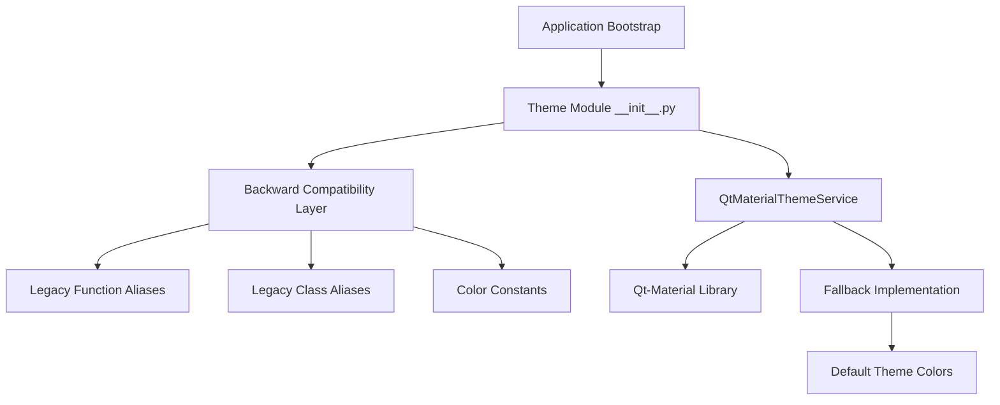

# Theme System Startup Fix Specification

## Executive Summary

This document provides a comprehensive architectural plan to fix critical application startup issues in the qt-material theme system. The primary issues are missing function exports and incomplete backward compatibility that prevent the application from starting.

## Problem Analysis

### Critical Issues Identified

1. **Missing Function Export**: `load_theme_from_settings` function is not exported from `src/gui/theme/__init__.py`
2. **Missing qt-material Library**: qt-material library is not installed in the environment despite being in requirements.txt
3. **Incomplete Backward Compatibility**: Multiple legacy classes and functions are missing from the theme module
4. **Import Chain Break**: Application bootstrap fails to import required theme functions
5. **Inconsistent Imports**: application_bootstrap.py imports functions it doesn't use

### Root Cause Analysis

The qt-material takeover implementation focused on creating a clean qt-material-only architecture but failed to provide complete backward compatibility for all existing imports. The application bootstrap and other components still expect legacy functions and classes to be available.

## Architecture Solution

### Design Principles

1. **Zero Breaking Changes**: All existing imports must work without modification
2. **Graceful Degradation**: Application must work even if qt-material is missing
3. **Clean Architecture**: Maintain qt-material-only architecture without reverting to legacy systems
4. **Zero Circular Dependencies**: Ensure the circular dependency issue remains resolved

### Solution Architecture



## Implementation Plan

### Phase 1: Missing Function Implementation

#### 1.1 Implement load_theme_from_settings Function

**Location**: `src/gui/theme/__init__.py`

**Implementation**:
```python
def load_theme_from_settings() -> None:
    """
    Load theme settings from QSettings and apply to application.
    
    Backward compatibility function for application bootstrap.
    Loads saved theme configuration and applies it to the application.
    """
    try:
        service = QtMaterialThemeService.instance()
        service.load_settings()
        logger.info("Theme settings loaded from QSettings")
    except Exception as e:
        logger.error(f"Failed to load theme settings: {e}")
        # Apply default theme as fallback
        try:
            service = QtMaterialThemeService.instance()
            service.apply_theme("dark", "blue")
            logger.info("Applied default theme as fallback")
        except Exception as fallback_error:
            logger.error(f"Failed to apply fallback theme: {fallback_error}")
```

#### 1.2 Add Missing Legacy Class Aliases

**Location**: `src/gui/theme/__init__.py`

**Implementation**:
```python
# Legacy class aliases for backward compatibility
ThemeManager = QtMaterialThemeService
ThemeDefaults = QtMaterialThemeService  # Alias for theme defaults
FALLBACK_COLOR = "#1976D2"  # Default blue color

# Legacy color constants
COLORS = {
    "primary": "#1976D2",
    "secondary": "#424242",
    "background": "#121212",
    "surface": "#1E1E1E",
    "error": "#F44336",
    "warning": "#FF9800",
    "success": "#4CAF50",
    "info": "#2196F3"
}
```

#### 1.3 Implement Missing Utility Functions

**Location**: `src/gui/theme/__init__.py`

**Implementation**:
```python
def apply_theme_preset(theme_name: str) -> bool:
    """
    Apply a predefined theme preset.
    
    Backward compatibility function for legacy theme system.
    
    Args:
        theme_name: Name of the theme preset
        
    Returns:
        True if theme was applied successfully
    """
    try:
        service = QtMaterialThemeService.instance()
        # Map legacy theme names to qt-material themes
        theme_mapping = {
            "dark": "dark",
            "light": "light",
            "auto": "auto"
        }
        qt_theme = theme_mapping.get(theme_name.lower(), "dark")
        return service.apply_theme(qt_theme)
    except Exception as e:
        logger.error(f"Failed to apply theme preset {theme_name}: {e}")
        return False

def qss_tabs_lists_labels() -> str:
    """
    Get QSS stylesheet for tabs, lists, and labels.
    
    Backward compatibility function for UI styling.
    
    Returns:
        QSS stylesheet string
    """
    try:
        service = QtMaterialThemeService.instance()
        # Return basic styling based on current theme
        return f"""
        QTabWidget::pane {{
            border: 1px solid {service.get_color('surface')};
            background: {service.get_color('background')};
        }}
        QListWidget {{
            background: {service.get_color('background')};
            color: {service.get_color('primary')};
        }}
        QLabel {{
            color: {service.get_color('primary')};
        }}
        """
    except Exception:
        # Return basic fallback styling
        return """
        QTabWidget::pane { border: 1px solid #333; background: #121212; }
        QListWidget { background: #121212; color: #1976D2; }
        QLabel { color: #1976D2; }
        """
```

### Phase 2: Enhanced Backward Compatibility Layer

#### 2.1 Create Legacy ThemeManager Compatibility Class

**Location**: `src/gui/theme/__init__.py`

**Implementation**:
```python
class LegacyThemeManager:
    """
    Legacy ThemeManager compatibility class.
    
    Provides backward compatibility for legacy ThemeManager usage
    while delegating to QtMaterialThemeService.
    """
    
    def __init__(self):
        self._service = QtMaterialThemeService.instance()
    
    def apply_theme(self, theme_name: str, variant: str = None) -> bool:
        """Legacy apply_theme method."""
        return self._service.apply_theme(theme_name, variant)
    
    def get_color(self, color_name: str) -> str:
        """Legacy get_color method."""
        return self._service.get_color(color_name)
    
    def save_settings(self) -> None:
        """Legacy save_settings method."""
        self._service.save_settings()
    
    def load_settings(self) -> None:
        """Legacy load_settings method."""
        self._service.load_settings()

# Create singleton instance for backward compatibility
_theme_manager_instance = None

def get_theme_manager() -> LegacyThemeManager:
    """Get singleton ThemeManager instance (backward compatibility)."""
    global _theme_manager_instance
    if _theme_manager_instance is None:
        _theme_manager_instance = LegacyThemeManager()
    return _theme_manager_instance

# Export as ThemeManager for backward compatibility
ThemeManager = get_theme_manager()
```

#### 2.2 Enhanced Error Handling for Missing qt-material

**Location**: `src/gui/theme/qt_material_service.py`

**Implementation**:
```python
def _apply_fallback_theme(self, theme: str, variant: str = None) -> None:
    """
    Apply fallback theme when qt-material library is not available.
    
    Args:
        theme: Theme name
        variant: Variant name
    """
    try:
        from PySide6.QtCore import Qt
        from PySide6.QtWidgets import QApplication
        
        app = QApplication.instance()
        if app:
            # Basic fallback styling
            if theme == "dark":
                stylesheet = """
                QWidget {
                    background-color: #121212;
                    color: #FFFFFF;
                }
                QPushButton {
                    background-color: #1976D2;
                    color: white;
                    border: none;
                    padding: 5px;
                }
                """
            else:  # light theme
                stylesheet = """
                QWidget {
                    background-color: #FFFFFF;
                    color: #000000;
                }
                QPushButton {
                    background-color: #1976D2;
                    color: white;
                    border: none;
                    padding: 5px;
                }
                """
            app.setStyleSheet(stylesheet)
            logger.info(f"Applied fallback {theme} theme")
    except Exception as e:
        logger.warning(f"Failed to apply fallback theme: {e}")
```

### Phase 3: Import Chain Fixes

#### 3.1 Fix application_bootstrap.py Import Issues

**Location**: `src/core/application_bootstrap.py`

**Changes**:
1. Remove unused import of `load_theme_from_settings`
2. Update theme initialization to use correct service
3. Add proper error handling for theme initialization

**Implementation**:
```python
# Remove line 15: from src.gui.theme import load_theme_from_settings

def _initialize_theme_system(self) -> bool:
    """Initialize the theme system."""
    try:
        self.logger.debug("Loading theme settings")
        # Initialize theme service using qt-material architecture
        from src.gui.theme import QtMaterialThemeService
        service = QtMaterialThemeService.instance()
        
        # Load saved theme settings
        service.load_settings()
        
        self.logger.debug("Theme system initialized successfully")
        return True
    except Exception as e:
        self.logger.error(f"Theme initialization failed: {e}")
        # Continue without theme system - not critical for startup
        return True
```

#### 3.2 Update Theme Module Exports

**Location**: `src/gui/theme/__init__.py`

**Updated __all__ list**:
```python
__all__ = [
    # Core Qt-Material Service (new unified API)
    "QtMaterialThemeService",
    
    # VTK Integration
    "VTKColorProvider",
    "get_vtk_color_provider",
    "vtk_rgb",
    
    # UI Components
    "QtMaterialThemeSwitcher",
    "QtMaterialColorPicker",
    "QtMaterialThemeDialog",
    
    # Convenience Functions
    "create_theme_switcher",
    "create_color_picker",
    "create_theme_dialog",
    
    # Backward Compatibility - Classes
    "ThemeService",
    "ThemeManager",
    "ThemeSwitcher",
    "SimpleThemeSwitcher",
    "ColorPicker",
    "ThemeDialog",
    "ThemeDefaults",
    
    # Backward Compatibility - Functions
    "load_theme_from_settings",
    "save_theme_to_settings",
    "apply_theme_preset",
    "hex_to_rgb",
    "qss_tabs_lists_labels",
    "get_theme_manager",
    
    # Backward Compatibility - Constants
    "COLORS",
    "FALLBACK_COLOR",
    "SPACING_4",
    "SPACING_8",
    "SPACING_12",
    "SPACING_16",
    "SPACING_24",
    "SPACING_32"
]
```

### Phase 4: Testing Strategy

#### 4.1 Application Startup Testing

**Test Cases**:
1. Application starts without import errors
2. Application starts with qt-material library missing
3. Application starts with qt-material library present
4. Theme settings are loaded correctly
5. Default theme is applied when no settings exist

#### 4.2 Backward Compatibility Testing

**Test Cases**:
1. All legacy imports work without errors
2. Legacy function calls work correctly
3. Legacy class methods delegate to new service
4. Color constants return expected values
5. UI components render with correct styling

#### 4.3 Integration Testing

**Test Cases**:
1. VTK scene manager receives correct colors
2. Theme switching works in UI
3. Settings persistence works correctly
4. Performance is not degraded
5. Memory usage remains stable

## Risk Assessment and Mitigation

### High Risks

1. **Circular Dependency Reintroduction**
   - **Risk**: New imports might recreate circular dependencies
   - **Mitigation**: Careful import analysis and dependency mapping

2. **Performance Degradation**
   - **Risk**: Backward compatibility layer might impact performance
   - **Mitigation**: Efficient delegation and minimal overhead

### Medium Risks

1. **Incomplete Backward Compatibility**
   - **Risk**: Some legacy functionality might be missed
   - **Mitigation**: Comprehensive testing and code analysis

2. **qt-material Library Issues**
   - **Risk**: Library might have compatibility issues
   - **Mitigation**: Graceful fallback implementation

### Low Risks

1. **Import Order Issues**
   - **Risk**: New imports might cause order dependencies
   - **Mitigation**: Careful import organization

## Implementation Timeline

### Phase 1: Critical Fixes (Priority 1)
- Implement missing functions
- Fix import errors
- Add basic backward compatibility
- **Estimated Time**: 2-3 hours

### Phase 2: Enhanced Compatibility (Priority 2)
- Complete backward compatibility layer
- Add error handling
- Implement fallback mechanisms
- **Estimated Time**: 3-4 hours

### Phase 3: Testing and Validation (Priority 3)
- Comprehensive testing
- Performance validation
- Integration testing
- **Estimated Time**: 2-3 hours

## Success Criteria

### Critical Success Criteria
1. ✅ Application starts without import errors
2. ✅ All existing theme-related functionality works
3. ✅ VTK scene manager operates correctly with theme colors
4. ✅ Theme switching works (when qt-material is available)
5. ✅ No circular dependencies are reintroduced

### Additional Success Criteria
1. ✅ Application works without qt-material library
2. ✅ Performance is not degraded
3. ✅ Memory usage remains stable
4. ✅ All legacy imports continue to work
5. ✅ Error handling is robust

## Conclusion

This specification provides a comprehensive plan to fix the critical application startup issues while maintaining the clean qt-material-only architecture. The solution focuses on complete backward compatibility without reintroducing circular dependencies or reverting to legacy systems.

The implementation will ensure that the application can start successfully regardless of whether qt-material is available, and all existing functionality will continue to work without modification.