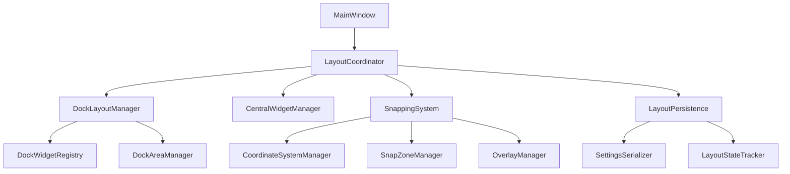
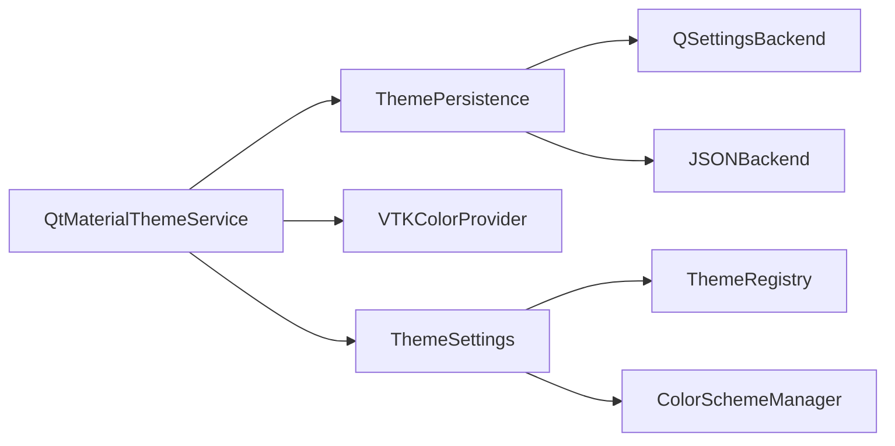

# UI Layout System Refactoring Plan

## Executive Summary

This document outlines a comprehensive refactoring plan for the UI layout system to address critical issues including monolithic architecture, widget snapping problems, theme system conflicts, VTK cleanup errors, and performance issues with timer-based layout updates.

## Current Issues Analysis

### 1. Monolithic MainWindow (1704 lines)
- **Problem**: Single massive class handling multiple responsibilities
- **Impact**: Difficult to maintain, test, and extend
- **Location**: [`src/gui/main_window.py`](src/gui/main_window.py:35)

### 2. Complex Snapping System with Performance Issues
- **Problem**: Overlay layers causing performance degradation
- **Root Cause**: Multiple coordinate systems and inefficient geometry updates
- **Location**: [`src/gui/window/dock_snapping.py`](src/gui/window/dock_snapping.py:23)

### 3. Theme System Conflicts (15+ files)
- **Problem**: Multiple overlapping theme services with persistence conflicts
- **Root Cause**: QSettings vs JSON persistence conflicts
- **Location**: [`src/gui/theme/__init__.py`](src/gui/theme/__init__.py:1)

### 4. VTK Cleanup Errors
- **Problem**: "wglMakeCurrent failed in Clean(), error: 6"
- **Root Cause**: Improper cleanup sequence during shutdown
- **Location**: [`src/gui/viewer_3d/vtk_scene_manager.py`](src/gui/viewer_3d/vtk_scene_manager.py:350)

### 5. Layout Instability
- **Problem**: 50ms timer-based updates causing performance issues
- **Root Cause**: Reactive instead of proactive layout management
- **Location**: [`src/gui/main_window.py`](src/gui/main_window.py:244)

## New Architecture Design

### 1. Modular Layout Management System



#### Key Components:

**LayoutCoordinator** (New)
- Central orchestration of all layout operations
- Event-driven architecture replacing timer-based updates
- Coordinates between different layout subsystems

**DockLayoutManager** (Enhanced from existing)
- Manages dock widget lifecycle and positioning
- Handles dock area allocation and conflicts
- Integrates with snapping system

**SnappingSystem** (Refactored)
- Unified coordinate system management
- Efficient overlay rendering with caching
- Performance-optimized snap zone detection

### 2. Widget Snapping Solution

#### Coordinate System Unification
```python
class CoordinateSystemManager:
    """Manages unified coordinate transformations across the application."""
    
    def __init__(self, main_window):
        self.main_window = main_window
        self._coordinate_cache = {}
        self._transformation_matrix = self._calculate_transformation_matrix()
    
    def screen_to_client(self, point):
        """Convert screen coordinates to client coordinates."""
        
    def client_to_dock(self, point, dock_widget):
        """Convert client coordinates to dock-local coordinates."""
        
    def get_snap_zones(self):
        """Get all available snap zones in unified coordinates."""
```

#### Performance-Optimized Snapping
```python
class SnapZoneManager:
    """High-performance snap zone detection and management."""
    
    def __init__(self):
        self._snap_zone_cache = {}
        self._spatial_index = self._build_spatial_index()
        self._last_query_result = None
    
    def find_nearest_snap_zone(self, position):
        """Find nearest snap zone using cached spatial index."""
        # Use R-tree or similar spatial data structure
        # Cache results for repeated queries
        # Implement hysteresis to prevent flickering
```

### 3. Unified Theme Management System

#### Consolidated Theme Architecture


#### Unified Persistence Layer
```python
class UnifiedThemePersistence:
    """Consolidated theme persistence supporting both QSettings and JSON."""
    
    def __init__(self):
        self.qsettings_backend = QSettingsBackend()
        self.json_backend = JSONBackend()
        self._migration_manager = ThemeMigrationManager()
    
    def save_theme(self, theme_data):
        """Save theme using preferred backend with fallback."""
        try:
            # Primary: QSettings for application settings
            self.qsettings_backend.save(theme_data)
            # Secondary: JSON for custom color schemes
            self.json_backend.save_custom_schemes(theme_data.custom_schemes)
        except Exception as e:
            self._handle_save_error(e)
    
    def load_theme(self):
        """Load theme from both backends and merge."""
        qsettings_data = self.qsettings_backend.load()
        json_data = self.json_backend.load_custom_schemes()
        return self._merge_theme_data(qsettings_data, json_data)
```

### 4. Enhanced VTK Error Handling

#### Graceful Cleanup Sequence
```python
class VTKCleanupManager:
    """Manages proper VTK resource cleanup with error handling."""
    
    def __init__(self, vtk_widget):
        self.vtk_widget = vtk_widget
        self._cleanup_handlers = []
        self._error_suppression_enabled = False
    
    def register_cleanup_handler(self, handler):
        """Register a cleanup handler for VTK resources."""
        self._cleanup_handlers.append(handler)
    
    def cleanup(self):
        """Perform cleanup in correct order with error suppression."""
        self._suppress_vtk_errors()
        try:
            # 1. Stop rendering operations
            self._stop_rendering()
            # 2. Cleanup custom resources
            self._cleanup_handlers.reverse()
            for handler in self._cleanup_handlers:
                try:
                    handler()
                except Exception as e:
                    self._log_cleanup_error(e)
            # 3. Finalize VTK components
            self._finalize_vtk_components()
        finally:
            self._restore_vtk_errors()
    
    def _suppress_vtk_errors(self):
        """Temporarily suppress VTK error output."""
        try:
            vtk.vtkObject.GlobalWarningDisplayOff()
            self._error_suppression_enabled = True
        except Exception:
            pass
    
    def _restore_vtk_errors(self):
        """Restore VTK error output."""
        try:
            vtk.vtkObject.GlobalWarningDisplayOn()
            self._error_suppression_enabled = False
        except Exception:
            pass
```

### 5. Event-Driven Layout System

#### Replace Timer-Based Updates
```python
class LayoutEventCoordinator:
    """Event-driven layout coordination replacing timer-based updates."""
    
    def __init__(self, main_window):
        self.main_window = main_window
        self._event_queue = []
        self._batch_timer = None
        self._event_handlers = {}
    
    def schedule_layout_update(self, event_type, data=None):
        """Schedule a layout update event."""
        event = LayoutEvent(event_type, data)
        self._event_queue.append(event)
        self._schedule_batch_processing()
    
    def _schedule_batch_processing(self):
        """Schedule batch processing of layout events."""
        if self._batch_timer is None:
            self._batch_timer = QTimer.singleShot(16, self._process_event_queue)  # 60fps
    
    def _process_event_queue(self):
        """Process all queued layout events in batch."""
        self._batch_timer = None
        if not self._event_queue:
            return
        
        # Group events by type for efficient processing
        grouped_events = self._group_events_by_type(self._event_queue)
        self._event_queue.clear()
        
        # Process grouped events
        for event_type, events in grouped_events.items():
            handler = self._event_handlers.get(event_type)
            if handler:
                handler(events)
```

## Migration Strategy

### Phase 1: Foundation (Week 1-2)
1. **Create new module structure**
   - Create `src/gui/layout/` directory
   - Implement basic `LayoutCoordinator` class
   - Set up event infrastructure

2. **Extract layout persistence**
   - Move layout logic from `MainWindow` to `LayoutPersistence`
   - Implement unified settings handling
   - Add migration utilities

### Phase 2: Snapping System (Week 3-4)
1. **Refactor coordinate system**
   - Implement `CoordinateSystemManager`
   - Unify coordinate transformations
   - Add comprehensive testing

2. **Optimize snap detection**
   - Implement `SnapZoneManager` with spatial indexing
   - Replace overlay system with efficient rendering
   - Add performance monitoring

### Phase 3: Theme Consolidation (Week 5-6)
1. **Unify theme persistence**
   - Implement `UnifiedThemePersistence`
   - Create migration tools for existing settings
   - Test backward compatibility

2. **Consolidate theme services**
   - Merge overlapping theme services
   - Clean up unused theme modules
   - Update all references

### Phase 4: VTK and Layout (Week 7-8)
1. **Enhance VTK cleanup**
   - Implement `VTKCleanupManager`
   - Integrate with existing VTK components
   - Test cleanup scenarios

2. **Replace timer-based system**
   - Implement `LayoutEventCoordinator`
   - Replace all timer-based updates
   - Optimize event processing

### Phase 5: Integration and Testing (Week 9-10)
1. **Integrate all components**
   - Update `MainWindow` to use new systems
   - Ensure all functionality works
   - Performance testing

2. **Comprehensive testing**
   - Unit tests for all new components
   - Integration tests for workflows
   - Performance benchmarks

## Testing Strategy

### 1. Unit Testing
- **LayoutCoordinator**: Test event handling and coordination
- **CoordinateSystemManager**: Test coordinate transformations
- **SnapZoneManager**: Test snap detection accuracy
- **UnifiedThemePersistence**: Test save/load operations
- **VTKCleanupManager**: Test cleanup sequences

### 2. Integration Testing
- **Layout workflows**: Test complete layout operations
- **Theme persistence**: Test theme save/load cycles
- **VTK integration**: Test VTK cleanup with real scenes
- **Performance**: Test under various load conditions

### 3. Performance Testing
- **Memory usage**: Monitor for memory leaks
- **Layout updates**: Measure response times
- **Snapping performance**: Test with multiple docks
- **VTK cleanup**: Verify no resource leaks

### 4. Regression Testing
- **Existing functionality**: Ensure all features work
- **Backward compatibility**: Test with existing settings
- **Edge cases**: Test unusual configurations
- **Error handling**: Verify graceful degradation

## Implementation Details

### New File Structure
```
src/gui/layout/
├── __init__.py
├── coordinator.py          # LayoutCoordinator
├── dock_manager.py         # DockLayoutManager
├── central_widget_manager.py
├── snapping/
│   ├── __init__.py
│   ├── coordinate_manager.py
│   ├── snap_zone_manager.py
│   └── overlay_manager.py
├── persistence/
│   ├── __init__.py
│   ├── layout_persistence.py
│   └── settings_serializer.py
└── events/
    ├── __init__.py
    ├── layout_event.py
    └── event_coordinator.py

src/gui/theme/
├── __init__.py             # Updated with unified API
├── unified_persistence.py  # New unified persistence
├── theme_coordinator.py    # New theme coordination
└── migration/              # Theme migration utilities
    ├── __init__.py
    └── settings_migrator.py

src/gui/vtk/
├── __init__.py
├── cleanup_manager.py      # New VTK cleanup
└── error_handler.py        # Enhanced error handling
```

### Backward Compatibility
- Maintain existing public APIs
- Provide migration utilities for settings
- Support legacy theme formats
- Graceful fallback for unsupported features

### Performance Optimizations
- Spatial indexing for snap zones
- Event batching for layout updates
- Cached coordinate transformations
- Lazy loading of overlay components

## Success Criteria

### Functional Requirements
- [ ] All existing functionality preserved
- [ ] Widget snapping works reliably
- [ ] Theme persistence is consistent
- [ ] VTK cleanup errors eliminated
- [ ] Layout is responsive during operations

### Performance Requirements
- [ ] Layout updates under 16ms (60fps)
- [ ] Snap detection under 5ms
- [ ] Memory usage stable during operations
- [ ] No timer-based layout hacks

### Quality Requirements
- [ ] All new code has unit tests
- [ ] Integration tests cover main workflows
- [ ] Performance benchmarks meet targets
- [ ] Documentation is complete

## Risk Mitigation

### Technical Risks
- **Breaking changes**: Maintain backward compatibility
- **Performance regressions**: Continuous performance monitoring
- **VTK instability**: Comprehensive testing and error handling

### Implementation Risks
- **Complexity**: Incremental implementation with testing
- **Timeline**: Buffer time for unexpected issues
- **Resources**: Clear priorities and phased approach

## Conclusion

This refactoring plan addresses all identified issues while maintaining backward compatibility and improving performance. The modular architecture will make the system more maintainable and extensible for future development.

The phased approach allows for incremental implementation with continuous testing, reducing the risk of breaking existing functionality while delivering improvements progressively.