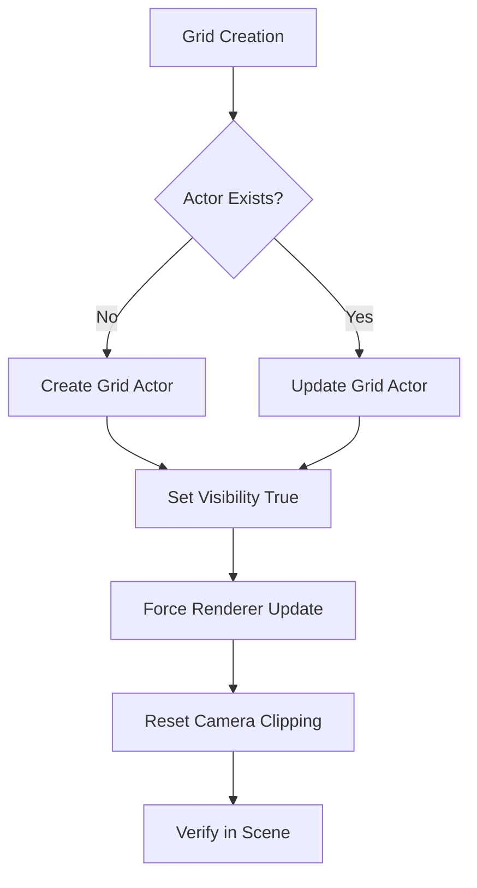
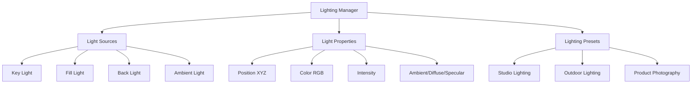
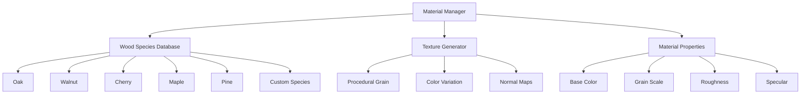

# Viewer Enhancement Plan

## Overview
This plan addresses three main viewer improvements:
1. **Grid Visibility Fix** - Resolve the missing grid issue
2. **Advanced Lighting Controls** - Full lighting parameter control
3. **Wood Material System** - Realistic wood textures with species management

## Current Issues Analysis

### Grid Visibility Problem
- Grid actor is being created but not visible
- Logging shows creation succeeds but display fails
- Possible causes: Z-order, camera clipping, or VTK rendering pipeline issue

### UI Requirements
- Remove wireframe button
- Add comprehensive lighting controls
- Add wood material picker with species management

## Architecture Design

### 1. Grid Fix Strategy


### 2. Lighting System Architecture


### 3. Material System Architecture


## Implementation Details

### Phase 1: Grid Fix (Immediate)
1. **Debug Grid Visibility**
   - Add comprehensive logging for VTK pipeline
   - Check camera clipping range
   - Verify actor is in renderer
   - Force immediate render update

2. **Grid Rendering Improvements**
   - Ensure proper Z-ordering
   - Add grid to proper render layer
   - Improve visual contrast

### Phase 2: UI Updates
1. **Remove Wireframe Button**
   - Remove from control panel layout
   - Keep backend functionality for potential future use

2. **Add Material Button**
   - Replace wireframe with material picker
   - Design material selection interface

### Phase 3: Lighting System
1. **Lighting Manager Class**
```python
class LightingManager:
    def __init__(self, renderer):
        self.renderer = renderer
        self.lights = {}
        self.presets = {}
    
    def create_light(self, name, position, color, intensity):
        # Create VTK light with full control
    
    def update_light(self, name, **properties):
        # Update light properties in real-time
    
    def apply_preset(self, preset_name):
        # Apply lighting configuration
```

2. **Lighting Control UI**
   - Position controls (X, Y, Z sliders)
   - Color picker for each light
   - Intensity sliders
   - Ambient/Diffuse/Specular ratios
   - Preset selection dropdown

### Phase 4: Material System
1. **Wood Species Database**
```python
@dataclass
class WoodSpecies:
    name: str
    base_color: Tuple[float, float, float]
    grain_color: Tuple[float, float, float]
    grain_scale: float
    roughness: float
    grain_pattern: str  # 'ring', 'straight', 'wavy'
    
class WoodMaterialManager:
    def __init__(self):
        self.species = {}
        self.textures = {}
    
    def add_species(self, species: WoodSpecies):
        # Add new wood species
    
    def generate_texture(self, species_name, size=(512, 512)):
        # Generate procedural wood texture
```

2. **Material Picker UI**
   - Species selection dropdown
   - Add custom species button
   - Preview panel with material sample
   - Grain scale slider
   - Roughness control

### Phase 5: Integration
1. **Theme System Integration**
   - Add lighting colors to theme variables
   - Material colors respect theme
   - UI styling consistent with theme

2. **Settings Persistence**
   - Save lighting configurations to settings
   - Save custom wood species to database
   - Load saved configurations on startup

## Technical Specifications

### Lighting Controls Specifications
- **Position Control**: XYZ coordinates with 0.1 precision
- **Color Control**: Full RGB color picker
- **Intensity**: 0.0 to 2.0 range
- **Material Properties**: Ambient (0.0-1.0), Diffuse (0.0-1.0), Specular (0.0-1.0)
- **Presets**: Studio, Outdoor, Product Photography

### Wood Material Specifications
- **Base Species**: Oak, Walnut, Cherry, Maple, Pine
- **Texture Resolution**: 512x512 procedural textures
- **Grain Patterns**: Ring porous, diffuse porous, straight grain
- **Custom Species**: User can add unlimited custom species
- **Material Properties**: Color, grain, roughness, specular

### Performance Requirements
- **Grid Rendering**: < 1ms update time
- **Lighting Updates**: Real-time response (< 16ms)
- **Texture Generation**: < 100ms for 512x512 textures
- **Memory Usage**: < 50MB for all textures

## File Structure Changes
```
src/gui/
├── viewer_widget_vtk.py (enhanced)
├── lighting_manager.py (new)
├── material_manager.py (new)
├── lighting_control_panel.py (new)
├── material_picker_widget.py (new)
└── wood_species_database.json (new)

src/resources/textures/
└── generated/ (runtime texture cache)

data/
└── user_materials.json (user custom species)
```

## Testing Strategy
1. **Grid Visibility Tests**
   - Verify grid appears with different model sizes
   - Test grid visibility with various camera positions
   - Performance impact assessment

2. **Lighting System Tests**
   - Real-time lighting adjustment responsiveness
   - Preset application accuracy
   - Multiple light source interaction

3. **Material System Tests**
   - Texture generation quality
   - Custom species creation and persistence
   - Material application to different model types

## Timeline Estimate
- **Phase 1** (Grid Fix): 2-3 hours
- **Phase 2** (UI Updates): 1-2 hours  
- **Phase 3** (Lighting System): 4-6 hours
- **Phase 4** (Material System): 6-8 hours
- **Phase 5** (Integration): 3-4 hours
- **Testing & Documentation**: 2-3 hours

**Total Estimated Time**: 18-26 hours

## Success Criteria
1. Grid is visible and functional with all models
2. Full lighting control with real-time updates
3. Wood material system with 5+ species and custom species support
4. All settings persist between sessions
5. Performance remains within requirements (30+ FPS)
6. Integration with existing theme system